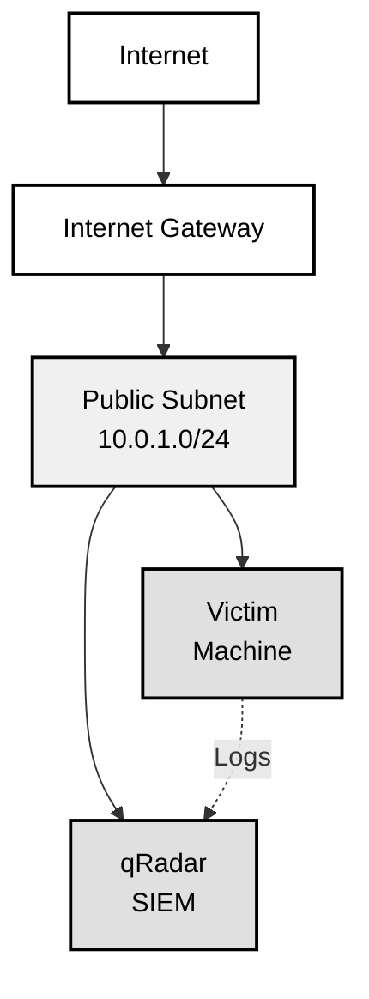
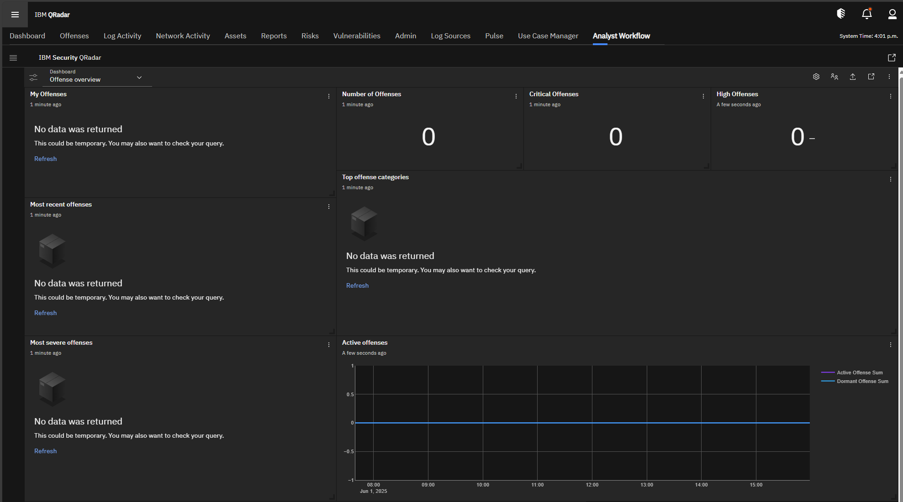

# Purple Team Lab with qRadar CE

A shoestring budget purple team lab infrastructure using AWS and Terraform, featuring IBM qRadar Community Edition 7.5 with AI-powered capabilities.

This lab assumes you have a basic understanding of AWS cli, Terraform, and Linux admin tasks. This is not a deeply technical lab, but you may find it slow going if you're not familiar with these technologies.

Remember this a lab environment and not for production use. Also, your qRadar trial license will expire in 30 days. See IBM's [qRadar Community Edition](https://www.ibm.com/community/101/qradar/ce/) for more information.

## Overview

This project creates a cost-effective purple team lab environment in AWS with:

- **qRadar Community Edition 7.5** on a t3a.2xlarge instance (8 vCPU, 32GB RAM)
- **Victim machine** on a t3.micro instance
- **Single VPC** with both instances in the same subnet
- **Security groups** restricting access to your IP address only
- **AI Integration** supporting OpenAI GPT and Claude models for enhanced red team automation

## Architecture



## Prerequisites

1. **AWS Account** with programmatic access configured
2. **Terraform** installed (version 1.0 or later)
3. **AWS CLI** configured with your credentials
4. **qRadar CE ISO** file (see IBM requirements below)

## AI API Configuration

This lab supports AI-powered red team automation using OpenAI GPT and Claude models.

### Setting Up API Keys

1. **OpenAI API Key** (optional):
   - Sign up at <https://platform.openai.com/>
   - Generate an API key at <https://platform.openai.com/api-keys>

2. **Anthropic API Key** (optional):
   - Sign up at <https://console.anthropic.com/>
   - Generate an API key in the console

3. **Add to terraform.tfvars**:

   ```hcl
   openai_api_key    = "sk-1234567890abcdef..."
   openai_model      = "gpt-4"
   anthropic_api_key = "sk-ant-1234567890abcdef..."
   claude_model      = "claude-3-sonnet-20240229"
   ```

## Quick Start

### 1. Clone and Configure

```bash
git clone <repository-url>
cd purple-team-lab
cp terraform.tfvars.example terraform.tfvars
```

Edit `terraform.tfvars` with your values:

```hcl
aws_region         = "us-east-1"
allowed_ip        = "YOUR_IP/32"  # Get your IP: curl ipinfo.io/ip
aws_profile       = "your-aws-profile"  # Optional

# Optional: AI API Configuration
openai_api_key    = "sk-1234567890abcdef..."
openai_model      = "gpt-4"
anthropic_api_key = "sk-ant-1234567890abcdef..."
claude_model      = "claude-3-sonnet-20240229"
```

### 2. IBM qRadar Requirements

**Important**: You must obtain the qRadar CE ISO file and license key before proceeding.

1. **Sign up** for IBM ID at: <https://www.ibm.com/community/101/qradar/ce/>
2. **Download** the ISO file: `750-QRADAR-QRFULL-2021.06.12.20250509154206.iso` (~5GB)
3. **Download** the license key file: `qradar_trial.license`
4. **Create files directory**: `mkdir files`
5. **Place files**: Copy both files to the `files/` directory

### 3. Deploy Infrastructure

```bash
# Initialize Terraform
terraform init

# Plan deployment
terraform plan

# Deploy (takes ~5 minutes)
terraform apply
```

### 4. Install qRadar (~1-2 hours)

After infrastructure deployment, you need to transfer the ISO and install qRadar:

```bash
# Connection info is saved to lab_connections.txt
cat lab_connections.txt

# Transfer qRadar ISO (takes ~8 minutes for 5GB file)
scp -i ~/.ssh/purple-team-key files/750-QRADAR-QRFULL-2021.06.12.20250509154206.iso ec2-user@SIEM_IP:/tmp/

# SSH to SIEM instance
ssh -i ~/.ssh/purple-team-key ec2-user@SIEM_IP

# Step 1: Prepare the system (handles reboots if needed)
./prepare_for_qradar.sh

# If the system reboots, wait ~2 minutes then SSH back and run prepare script again
# Continue until you see "System ready for qRadar installation!"

# Step 2: Run the qRadar installation (only after system is ready)
./install_qradar.sh
```

**Installation Process**:

1. **System Preparation**: The `prepare_for_qradar.sh` script verifies:
   - SELinux is properly disabled
   - `/store` volume is mounted (200GB dedicated volume)
   - Adequate disk space is available
   - If SELinux changes require a reboot, it will happen automatically

2. **qRadar Installation**: The `install_qradar.sh` script:
   - Mounts the ISO file
   - Runs the qRadar setup process
   - Includes system state verification before proceeding

Follow the qRadar installation prompts and use your license key when requested.

The installation will take quite a while. At the end, choose:

- Software installation
- "All-In-One" console
- Default
- Enter on the time and date to keep it
- Choose your time zone then city
- choose defaults for the rest
- enter passwords - Don't forget these! You'll need them to login to the qRadar web interface.

Installation will take a very long time at this point. It looks like it's stuck on "Installing DSM rpms:"

It's not, it may take 30 minutes or more to run though.

## Accessing the Lab

### qRadar SIEM

- **SSH**: `ssh -i ~/.ssh/purple-team-key ec2-user@SIEM_IP`
- **Web UI**: `https://SIEM_IP` (after qRadar installation)
- **Login**: admin/(password you set)
- **Accept the license agreement**

Welcome to your qRadar SIEM!



### Victim Machine

- **SSH**: `ssh -i ~/.ssh/purple-team-key ec2-user@VICTIM_IP`
- **RDP**: Use any RDP client to connect to `VICTIM_IP`

## Cost Estimation

- **t3a.2xlarge** (SIEM): ~$0.30/hour (~$220/month)
- **t3.micro** (Victim): ~$0.01/hour (~$7/month)
- **Storage**: ~$50/month (250GB root + 200GB /store + 30GB victim)
- **Elastic IPs**: $3.65/month
- **Total**: ~$280/month

**Budget Tip**: Stop instances when not in use to save ~85% on compute costs!

## Security Considerations

- Access is restricted to your IP address only
- All instances are in a public subnet for lab simplicity
- Change default passwords immediately
- Consider implementing additional monitoring
- Use strong SSH keys and rotate regularly

## AI Integration Features

- **OpenAI GPT Models**: For advanced red team automation and analysis
- **Claude Models**: Alternative AI provider for diverse capabilities
- **Secure Configuration**: API keys managed through Terraform variables
- **Model Selection**: Configurable model choices (GPT-4, GPT-3.5, Claude-3-Sonnet, etc.)

## Troubleshooting

### Common Issues

1. **SSH Permission Denied**

   ```bash
   chmod 400 ~/.ssh/purple-team-key
   ```

2. **qRadar Installation Fails**
   - Ensure 24GB+ RAM (t3a.2xlarge has 32GB)
   - Verify ISO file integrity
   - Check license key validity
   - **Package conflicts**: If you see "rhc" or "redhat-cloud-client-configuration" conflicts, the script automatically removes these cloud packages before installation

3. **Terraform Errors**
   - Verify AWS credentials: `aws sts get-caller-identity`
   - Check region availability for instance types
   - Ensure your IP is correctly formatted (CIDR notation)

4. **API Key Issues**
   - Verify keys are correctly set in terraform.tfvars
   - Check API quotas and billing
   - Ensure proper model names are used

### Getting Help

- Check `lab_connections.txt` for current connection info
- Review AWS Console for instance status
- Check security group rules if connections fail
- Use `terraform plan` to verify changes before applying

## Cleanup

```bash
terraform destroy
```

**Warning**: This will permanently delete all resources and data.

## Contributing

This is a portfolio/PoC project. Feel free to fork and adapt for your needs.

## License

MIT License - see LICENSE file for details.

---

*10-23 AI hacker shenanigans 🛡️*
