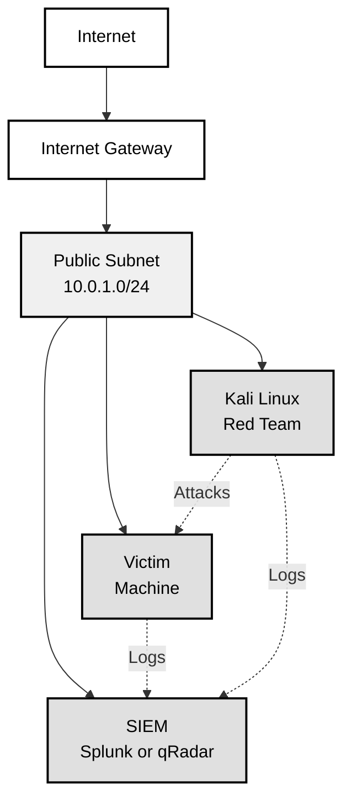
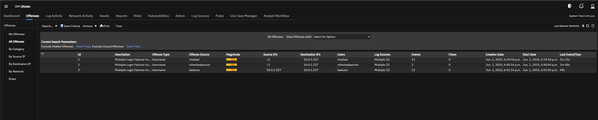

<!-- SPDX-License-Identifier: BUSL-1.1 -->

# Advanced Purple Team Lab (APTL)

> **🚧 UNDER CONSTRUCTION 🚧**  
> **⚠️ This project is actively being developed and tested**  
> **🔧 Documentation and features may change rapidly**  
> **💡 Use at your own risk - this is a proof of concept**  
> **🚨 Don't be stupid or you'll get yourself in trouble.**

---

Want unlimited personalized AI-driven purple team exercises?

A shoestring budget purple team lab infrastructure using AWS and Terraform, featuring Splunk Enterprise Security or IBM qRadar Community Edition.

Choose your preferred SIEM in `terraform.tfvars` before deployment.

This lab assumes you have basic understanding of AWS CLI, Terraform, and Linux admin tasks.

This is a lab environment, not for production use. qRadar trial license expires in 30 days. See IBM's [qRadar Community Edition](https://www.ibm.com/community/101/qradar/ce/) for more information.

And this is only the beginning... SecOps agents are coming.

## DISCLAIMER

- The author takes no responsibility for your use of this lab.
- You are solely responsible for whether you are in compliance with the laws of your jurisdiction
- You are solely responsible for following the terms and conditions of any services or applications you use.

## Overview

-This project creates a purple team lab environment in AWS with:

- Splunk Enterprise Security on a c5.4xlarge instance (default) or qRadar Community Edition 7.5 on t3a.2xlarge
- Victim machine on t3.micro instance
- Single VPC with both instances in same subnet
- Security groups restricting access to your IP address only

## Architecture



## Prerequisites

1. AWS Account with programmatic access configured
2. Terraform installed (version 1.0 or later)
3. AWS CLI configured with your credentials
4. qRadar CE ISO file (see IBM requirements below)

## Quick Start

### 1. Clone and Configure

```bash
git clone <repository-url>
cd purple-team-lab
cp terraform.tfvars.example terraform.tfvars
```

Edit `terraform.tfvars`:

```hcl
aws_region    = "us-east-1"
allowed_ip    = "YOUR_IP/32"  # Get your IP: curl ipinfo.io/ip
aws_profile   = "your-aws-profile"  # Optional
```

### 2a. Prepare for Splunk (default)

If you selected Splunk as your SIEM, no files are needed ahead of time.
The instance ships with an `install_splunk.sh` script that downloads the
Splunk installer for you.

### 2b. Get qRadar Files

You must obtain the qRadar CE ISO file and license key before proceeding.

1. Sign up for IBM ID at: <https://www.ibm.com/community/101/qradar/ce/>
2. Download ISO file: `750-QRADAR-QRFULL-2021.06.12.20250509154206.iso` (~5GB)
3. Download license key file: `qradar_trial.license`
4. Create files directory: `mkdir files`
5. Place both files in the `files/` directory

### 3. Deploy Infrastructure

```bash
terraform init
terraform plan
terraform apply
```

### 4a. Install Splunk

If you chose Splunk, connect to the SIEM instance and run the install script:

```bash
# Connection info is saved to lab_connections.txt
cat lab_connections.txt

# SSH to SIEM instance
ssh -i ~/.ssh/purple-team-key ec2-user@SIEM_IP

# Run the installer - the process that creates this file can take ~5 mins to complete after the instance is ready
./install_splunk.sh
```

The script downloads the Splunk RPM then asks if you want to start the
installation. Answer `y` when ready and **set a secure admin password**.

After Splunk starts, configure log reception:

```bash
# Configure TCP/UDP inputs for victim logs (prompts for password)
./configure_splunk_inputs.sh
```

Connect to Splunk at http://SIEM_IP:8000 and login with the credentials you set.

### 4b. Install qRadar

After infrastructure deployment:

```bash
# Connection info is saved to lab_connections.txt
cat lab_connections.txt

# Transfer qRadar ISO (~8 minutes for 5GB file)
scp -i ~/.ssh/purple-team-key files/750-QRADAR-QRFULL-2021.06.12.20250509154206.iso ec2-user@SIEM_IP:/tmp/

# SSH to SIEM instance
ssh -i ~/.ssh/purple-team-key ec2-user@SIEM_IP

# Step 1: Prepare system (handles reboots if needed) - take ~15 mins to complete after the instance is ready
./prepare_for_qradar.sh

# If system reboots, wait ~2 minutes then SSH back and run prepare script again
# Continue until you see "System ready for qRadar installation!"

# Step 2: Install qRadar (only after system is ready)
./install_qradar.sh
```

Installation takes 1-2 hours. Choose:

- Software installation
- "All-In-One" console  
- Default settings
- Your timezone and city
- Set passwords (don't forget them)

Installation appears stuck on "Installing DSM rpms:" but it's working. Takes 30+ minutes.

### 4c. Configure qRadar for Red Team Logging

After qRadar installation is complete, configure it to properly separate red team activities from victim logs:

```bash
# SSH to qRadar instance
ssh -i ~/.ssh/purple-team-key ec2-user@SIEM_IP

# Run the configuration guide
./configure_qradar_logsources.sh
```

This script provides step-by-step instructions for:

1. **Creating Red Team Log Source**: Separates Kali logs from victim logs
2. **Setting Up Custom Properties**:
   - `RedTeamActivity` - Type of red team activity (commands/network/auth)
   - `RedTeamCommand` - Actual command executed  
   - `RedTeamTarget` - Target of the activity
3. **Configuring Log Parsing**: Extract red team metadata from logs
4. **Verifying Setup**: Ensure red team logs are properly categorized

**Manual Steps Required in qRadar Console:**

- Navigate to Admin > Data Sources > Log Sources
- Create "APTL-Kali-RedTeam" log source
- Set up custom properties for red team activity classification
- Configure parsing rules for red team log extraction

This provides equivalent functionality to Splunk's `keplerops-aptl-redteam` index, allowing you to:

- Filter logs by red team vs victim activity
- Search for specific attack types and commands
- Correlate red team actions with SIEM detections

## Accessing the Lab

### SIEM Access

- SSH: `ssh -i ~/.ssh/purple-team-key ec2-user@SIEM_IP`
- Web UI: `https://SIEM_IP` (after installation)
- Login: admin/(password you set)

### Victim Machine

- SSH: `ssh -i ~/.ssh/purple-team-key ec2-user@VICTIM_IP`
- RDP: Use any RDP client to connect to `VICTIM_IP`

### Kali Linux Red Team

- SSH: `ssh -i ~/.ssh/purple-team-key kali@KALI_IP`

## Kali Red Team MCP

MCP server provides AI agents with controlled access to Kali tools and lab targets.

```bash
cd red_team/kali_mcp
npm run build
```

**Cursor Setup** - Create `.cursor/mcp.json` in project root:

```json
{
    "mcpServers": {
        "kali-red-team": {
            "command": "node",
            "args": ["./red_team/kali_mcp/build/index.js"],
            "cwd": "."
        }
    }
}
```

**Cline Setup** - Add to Cline MCP settings:

```json
"kali-red-team": {
    "command": "node",
    "args": ["./red_team/kali_mcp/build/index.js"],
    "cwd": "<your-path-to>/aptl"
}
```

Available tools:

- `kali_info` - Get lab instance information
- `run_command` - Execute commands on lab targets

Usage: Connect through MCP-enabled AI clients (Claude, Cline).

## Log Forwarding

The victim machine automatically forwards logs to the selected SIEM. No manual configuration required.

### Verify Log Forwarding

1. Check the SIEM log activity page
2. Filter by Source IP = your victim machine IP
3. Generate test events:

```bash
# SSH to victim machine
ssh -i ~/.ssh/purple-team-key ec2-user@VICTIM_IP

# Run test event generator
./generate_test_events.sh
```

## Purple Team Exercises

### Basic Security Event Testing

```bash
# SSH to victim machine and run:

# 1. Authentication events
ssh nonexistentuser@localhost
sudo ls /etc/shadow

# 2. Automated event simulation
./generate_test_events.sh

# 3. Network activity
telnet google.com 80
nc -zv localhost 22

# 4. Custom attack scenarios
logger -p security.alert "MALWARE: Suspicious file access detected"
logger -p security.warning "LATERAL_MOVEMENT: SMB connection to domain controller"
```

### Available Scripts

```bash
./check_siem_connection.sh        # Verify connectivity
./generate_test_events.sh         # Generate diverse security events
./simulate_brute_force.sh         # Trigger authentication offense
./simulate_lateral_movement.sh    # APT-style attack simulation
./simulate_mitre_attack.sh T1110  # Specific MITRE ATT&CK techniques
```

### MITRE ATT&CK Techniques

Available techniques:

- T1078 - Valid Accounts
- T1110 - Brute Force  
- T1021 - Remote Services
- T1055 - Process Injection
- T1003 - OS Credential Dumping
- T1562 - Impair Defenses

Example: `./simulate_mitre_attack.sh T1110`

Have fun!



## AI Red Teaming

### Automated Red Team Agent

No red team around? You can use AI coding assistants like **Cline** or **Cursor** as an AI red team agent:

1. **SSH Access**: Give your AI agent the SSH connection details from `lab_connections.txt`
2. **Explain the Lab**: Give the AI a quick overview of the lab, it's purpose, and that you have permission to attack the victim machine. Because you do. Right?
3. **Red Team Mission**: Ask the AI to:
   - SSH into the victim machine
   - Enumerate the system and find vulnerabilities
   - Install common pentesting tools
   - Execute attack scenarios autonomously
   - Explain how the attack works and what you should see in the SIEM

4. **Example AI Prompts**:

   ```text
   "SSH into the victim machine and perform a basic privilege escalation assessment"
   "Set up a persistent backdoor and test if it's detected by the SIEM"
   "Simulate a data exfiltration scenario using common attack tools"
   "Perform automated vulnerability scanning and exploitation"
   ```

5. **Benefits**:
   - Easy set up
   - Endless personalization
   - On the spot tutoring
   - Masters' level system knowledge
   - AI adapts tactics based on what it discovers
   - Won't judge your SIEM query fails!

This creates a true **autonomous red team vs. blue team** scenario where AI attacks while you monitor and tune your defenses in the SIEM.

## Roadmap

### 🔜 Coming Soon (v1.1)

- **Splunk Integration**: Alternative SIEM option alongside qRadar
- ✅ **Kali MCP**: Kali Linux Model Context Protocol integration for better AI red teaming
- **Victim Machine Presets**: Windows, Linux, web apps, etc
- **Suggested Exercises**: AI-driven exercises based on what you've done
- **Challenges with Pre-Seeded SIEM Data**: Set piece challenges to practice your SIEM skills

### 🎯 Future Releases

- Additional SIEM platforms (Elastic Security, Wazuh)
- Windows victim machines
- Container-based deployments
- Automated report generation

## Cost Estimation

- SIEM
  - c5.4xlarge (Splunk SIEM): ~$496/month OR
  - t3a.2xlarge (qRadar SIEM): ~$220/month
- t3.micro (Victim): ~$7/month
- t3.micro (Kali Linux): ~$7/month
- Storage: ~$50/month (250GB root + 200GB /store + 30GB victim)
- Elastic IPs: $3.65/month
- Total: ~$290/month

Stop instances when not in use to save ~85% on compute costs.

## Security Considerations

- Access restricted to your IP address only
- All instances in public subnet for lab simplicity
- Change default passwords immediately
- Use strong SSH keys and rotate regularly

## Cleanup

```bash
terraform destroy
```

This will permanently delete all resources and data.

## Troubleshooting

See [troubleshooting.md](troubleshooting.md) for detailed troubleshooting steps.

## Changelog

See [CHANGELOG.md](CHANGELOG.md) for version history and release notes.

## Contributing

This is an early stage demo project. Feel free to fork and adapt for your personal needs.

For consulting, enterprise licensing, or other inquiries, contact me at [brad@keplerops.com](mailto:brad@keplerops.com).

## License

BUSL-1.1

---

*10-23 AI hacker shenanigans 🚓*
