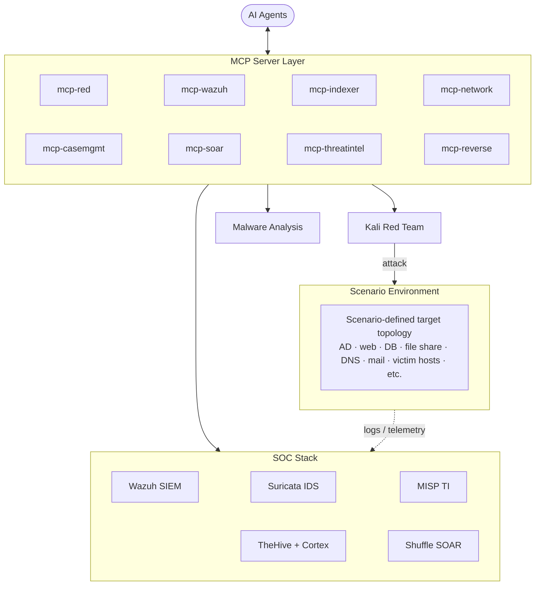

[](https://sonarcloud.io/summary/new_code?id=Brad-Edwards_aptl)

🎤 **Accepted to [Black Hat USA Arsenal 2026](https://blackhat.com/us-26/arsenal/schedule/#aptl-advanced-purple-team-labs-52322), [SecTor Arsenal 2026](https://blackhat.com/sector/arsenal/schedule/index.html#aptl-advanced-purple-team-labs-54785), and SecTor 2026 Briefings.** Live Arsenal demos at both conferences, plus the SecTor Briefing talk **APTL for Agentic Purple Teaming**.

# APTL—Advanced Purple Team Lab

**Purple-team lab where AI agents drive the red and blue sides against an enterprise target stack.**

One `aptl lab start` brings up: a fictional company's infrastructure (AD, web, DB, file share, DNS, mail), a Kali red-team box, a SOC stack (Wazuh + Suricata + MISP + TheHive + Cortex + Shuffle), a malware-analysis container, and MCP servers giving AI agents programmatic control over all of it. Scenarios are [ACES SDL](docs/sdl/index.md) documents, selectable at startup; the Compose topology is realized from the nodes the scenario declares rather than a fixed preset, and each run captures a telemetry archive.

**Use cases:** autonomous cyber-operations research, purple-team training, AI threat-actor assessment.

## Status

**🚧 Active development. Not for production. Not hardened.** This lab gives AI agents access to real penetration-testing tools and runs intentionally vulnerable services. Container escapes and other security issues are possible—keep it on a host you can rebuild and a network you control. Always monitor red-team agents during scenarios.

## Quick Start

Install the released CLI and materialize a lab, no clone required:

```bash
pipx install aptl-labs          # the released CLI, isolated in its own environment
aptl lab init my-lab            # materialize the lab assets into ./my-lab
cd my-lab
aptl lab start
```

`aptl lab init <dir>` copies the bundled lab assets (the Compose topology,
scenarios, config templates, and container build contexts) out of the
installed package into `<dir>`, which becomes your lab project directory. The
published wheel ships those assets, so a PyPI install alone can run a lab.
[pipx](https://pipx.pypa.io/) installs the CLI into its own virtualenv, so the
system-`pip` block on modern Debian/Ubuntu/WSL2 hosts
([PEP 668](https://peps.python.org/pep-0668/)) never applies. Install pipx with
`sudo apt install pipx` if you do not have it.

To run from source instead (for development), clone the repo and use a
virtualenv editable install (the `python3 -m venv` step needs `python3-venv` on
Debian/Ubuntu). The checkout is itself the project directory, so no `lab init`
is needed:

```bash
git clone https://github.com/Brad-Edwards/aptl.git
cd aptl
python3 -m venv .venv && source .venv/bin/activate
pip install -e .
aptl lab start
```

`aptl lab start` creates `.env` automatically when it is missing and replaces
template placeholder values with lab credentials that match the running
containers. The startup output points to `.env` for passwords and tokens. Run
`aptl lab info` later to reprint the same access summary.

By default it boots the full `techvault-operational` scenario. List the catalog
and start a smaller curated topology with:

```bash
aptl lab scenarios                                   # list startup scenarios
aptl lab start --scenario techvault-attacker-target  # or --scenario-path <file>
```

See [Scenarios](#scenarios) for the catalog.

Once it's up:

| Surface | URL / command |
|---|---|
| Wazuh Dashboard | <https://localhost:443> (`admin` / your `INDEXER_PASSWORD` from `.env`) |
| Victim shell | `aptl container shell aptl-victim` |
| Kali shell | `aptl container shell aptl-kali` |
| Reverse engineering SSH | `ssh -i ~/.ssh/aptl_lab_key labadmin@localhost -p 2027` |

Lifecycle:

```bash
aptl lab status   # running containers
aptl lab info     # URLs, usernames, and .env credential references
aptl lab stop     # graceful stop
aptl lab stop -v  # ⚠ destroys all lab data (Wazuh indexes, MISP, TheHive, configs)
aptl kill         # emergency: kill MCP server processes
aptl kill -c      # emergency: kill MCP processes AND all lab containers
```

## Requirements

- Docker + Docker Compose + Docker Buildx
- Python 3.11+
- RAM: 8 GB runs the smaller curated scenarios; the full `techvault-operational` stack needs more than 20 GB
- 20 GB+ disk
- Linux, macOS, or Windows with Docker Desktop/WSL2
- Open ports: 443, 2027, 8443, 9000, 9001, 9200, 55000 (and the rest of the published ports in `docker-compose.yml`)

## Architecture


```mermaid
flowchart TD
    AI([AI Agents])

    subgraph MCP[MCP Server Layer]
        direction LR
        m1[mcp-red] ~~~ m2[mcp-wazuh] ~~~ m3[mcp-indexer] ~~~ m4[mcp-network]
        m5[mcp-casemgmt] ~~~ m6[mcp-soar] ~~~ m7[mcp-threatintel] ~~~ m8[mcp-reverse]
    end

    Kali[Kali Red Team]
    Reverse[Malware Analysis]

    subgraph Scenario[Scenario Environment]
        Targets[Scenario-defined target topology<br/>AD · web · DB · file share · DNS · mail · victim hosts · etc.]
    end

    subgraph SOC[SOC Stack]
        direction LR
        S1[Wazuh SIEM] ~~~ S2[Suricata IDS] ~~~ S3[MISP TI]
        S4[TheHive + Cortex] ~~~ S5[Shuffle SOAR]
    end

    AI <--> MCP
    MCP --> Kali
    MCP --> SOC
    MCP --> Reverse

    Kali -->|attack| Scenario
    Scenario -.->|logs / telemetry| SOC
```

The scenario environment is whatever the SDL scenario defines. The default `techvault-operational` topology (AD, web, DB, file share, DNS, mail, victims) is one shape, and [other scenarios](#scenarios) compose different ones. Component-by-component breakdown: [docs/architecture/index.md](docs/architecture/index.md).

## Scenarios

Scenarios are [ACES SDL](docs/sdl/index.md) documents under `scenarios/`. `aptl lab scenarios` lists the catalog; `aptl lab start --scenario <id>` (or `--scenario-path <file>`) selects one. The Compose profiles that come up are **realized from the nodes the SDL declares**—the topology follows the scenario's content, including dependency closure, rather than a preset keyed off its name.

The catalog ships the operational default plus four curated slices:

| Scenario id | Boots | Omits |
|---|---|---|
| `techvault-operational` | Full TechVault stack (default) | — |
| `techvault-attacker-target` | Kali + one monitored victim + Wazuh core + observability | Enterprise web tier, wider SOC stack |
| `techvault-enterprise-web` | Vulnerable webapp + DB + AD + Wazuh core + observability | Red-team apparatus, wider SOC stack |
| `techvault-defensive-min` | Wazuh manager / indexer / dashboard + observability | Attacker and enterprise components, wider SOC stack |
| `techvault-observability-core` | OTEL collector + Tempo + Grafana | Everything else—the smallest bounded surface |

Authoring and selection details: [SDL Reference](docs/sdl/index.md) · [Curated TechVault Variants](docs/sdl/techvault-curated-variants.md).

## AI Agents (MCP)

Build the MCP servers:

```bash
./mcp/build-all-mcps.sh
```

Point your AI client (Claude Code, Cursor, Cline) at the entry points under `./mcp/<server>/build/index.js`. Full setup: [MCP Integration](docs/components/mcp-integration.md).

Smoke-test the wiring once the lab is up:

- Red side: ask the agent *"Use kali_info to show me the lab network"*
- Blue side: ask the agent *"Use wazuh_query_alerts to show me recent alerts"*

## Optional: Web UI

Localhost-only web UI for lab control and scenario runs.

```bash
pip install -e ".[web]"        # in the same .venv from Quick Start
aptl web serve                 # API server
cd web && npm install && npm run dev   # frontend (separate terminal)
```

Access at <http://localhost:5173> (dev) or <http://localhost:3000> (prod). The API container needs the host Docker socket; do not expose to untrusted networks.

## Documentation

**Getting started:** [Installation](docs/getting-started/installation.md) · [Prerequisites](docs/getting-started/prerequisites.md) · [Quick Start Guide](docs/getting-started/quick-start.md)

**Architecture:** [Overview](docs/architecture/index.md) · [Networking](docs/architecture/networking.md) · [Enterprise Infrastructure](docs/architecture/enterprise-infrastructure.md)

**Components:** [Wazuh SIEM](docs/components/wazuh-siem.md) · [Kali Red Team](docs/components/kali-redteam.md) · [Victim Containers](docs/components/victim-containers.md) · [Reverse Engineering](docs/components/reverse-engineering-container.md) · [MCP Integration](docs/components/mcp-integration.md) · [Default Defensive Posture](docs/components/default-defensive-posture.md)

**Scenarios & SDL:** [SDL Reference](docs/sdl/index.md) · [Curated TechVault Variants](docs/sdl/techvault-curated-variants.md) · [SOC Architecture Spec](docs/specs/soc-feature-spec.md)

**Reference:** [TechVault Scenario Overview](docs/reference/techvault-scenario-overview.md) · [TechVault Company Profile](docs/reference/techvault-company-profile.md) · [TechVault OSINT Readiness](docs/reference/techvault-osint-readiness.md) · [Container Template Guide](docs/containers/victim-template-guide.md)

**Ops:** [Troubleshooting](docs/troubleshooting/) · [Smoke Test Plan](docs/testing/smoke-test-plan.md)

## Ethics & Disclaimers

APTL uses commodity services and basic integrations. AI agents get Kali access—no enhancements to their latent capabilities beyond that. **No red-team enhancements will be added to this public repository.** An autonomous cyber-operations range is under development as a separate project.

You are responsible for following all applicable laws. The author takes no responsibility for your use of this lab. The repository contains intentional **test credentials** (covered by `.gitguardian.yaml`) for lab functionality—dummy values for educational use, not production secrets.

## License

MIT

---

*10-23 AI hacker shenanigans 🚓*
