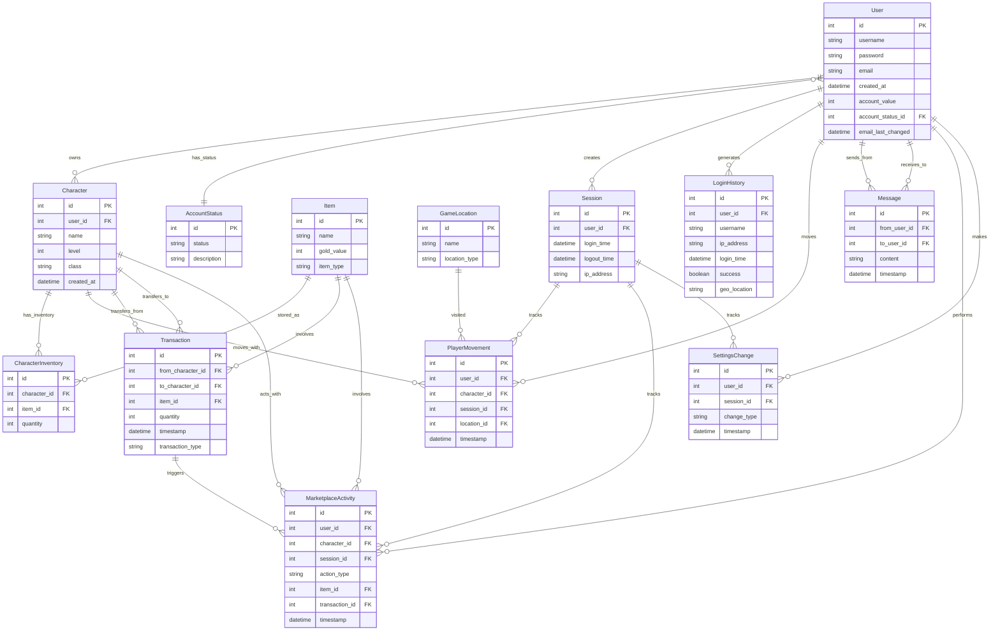

# Gaming Server Database Schema

## Entity Relationship Diagram

```mermaid
erDiagram
    AccountStatus {
        int id PK
        string status
        string description
    }
    
    User {
        int id PK
        string username
        string password
        string email
        datetime created_at
        int account_value
        int account_status_id FK
        datetime email_last_changed
    }
    
    Character {
        int id PK
        int user_id FK
        string name
        int level
        string class
        datetime created_at
    }
    
    Item {
        int id PK
        string name
        int gold_value
        string item_type
    }
    
    CharacterInventory {
        int id PK
        int character_id FK
        int item_id FK
        int quantity
    }
    
    GameLocation {
        int id PK
        string name
        string location_type
    }
    
    Session {
        int id PK
        int user_id FK
        datetime login_time
        datetime logout_time
        string ip_address
    }
    
    LoginHistory {
        int id PK
        int user_id FK
        string username
        string ip_address
        datetime login_time
        boolean success
        string geo_location
    }
    
    PlayerMovement {
        int id PK
        int user_id FK
        int character_id FK
        int session_id FK
        int location_id FK
        datetime timestamp
    }
    
    Transaction {
        int id PK
        int from_character_id FK
        int to_character_id FK
        int item_id FK
        int quantity
        datetime timestamp
        string transaction_type
    }
    
    MarketplaceActivity {
        int id PK
        int user_id FK
        int character_id FK
        int session_id FK
        string action_type
        int item_id FK
        int transaction_id FK
        datetime timestamp
    }
    
    Message {
        int id PK
        int from_user_id FK
        int to_user_id FK
        string content
        datetime timestamp
    }
    
    SettingsChange {
        int id PK
        int user_id FK
        int session_id FK
        string change_type
        datetime timestamp
    }
    
    %% Relationships
    User ||--o{ Character : owns
    User }o--|| AccountStatus : has_status
    User ||--o{ Session : creates
    User ||--o{ LoginHistory : generates
    User ||--o{ PlayerMovement : moves
    User ||--o{ Message : sends_from
    User ||--o{ Message : receives_to
    User ||--o{ MarketplaceActivity : performs
    User ||--o{ SettingsChange : makes
    
    Character ||--o{ CharacterInventory : has_inventory
    Character ||--o{ PlayerMovement : moves_with
    Character ||--o{ Transaction : transfers_from
    Character ||--o{ Transaction : transfers_to
    Character ||--o{ MarketplaceActivity : acts_with
    
    Item ||--o{ CharacterInventory : stored_as
    Item ||--o{ Transaction : involves
    Item ||--o{ MarketplaceActivity : involves
    
    GameLocation ||--o{ PlayerMovement : visited
    
    Session ||--o{ PlayerMovement : tracks
    Session ||--o{ MarketplaceActivity : tracks
    Session ||--o{ SettingsChange : tracks
    
    Transaction ||--o{ MarketplaceActivity : triggers
```
