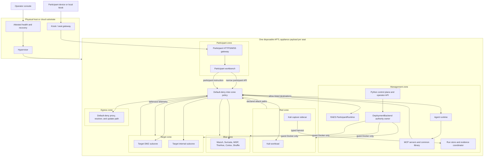
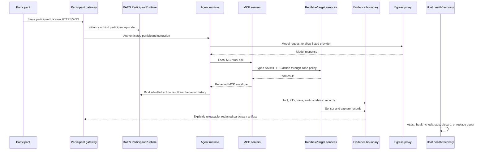

# ADR-049: Sealed, Disposable Lab Appliance Delivery Boundary

## Status

accepted

## Date

2026-07-25

## Context

APTL's historical delivery model places Docker, the Python control plane, MCP
servers, and the external agent process on a developer's physical host. Lab
services publish to host loopback, the web API mounts the host Docker socket,
and several SOC services hold that socket directly. This is an acceptable
trusted-development posture, but it is not a supported boundary for workshops,
classrooms, research participants, or hosted seats where participant input,
Kali root, model output, and the venue LAN are untrusted.

Later decisions already provide most of the internal contracts that a safer
delivery model needs:

- ADR-013, ADR-023, and ADR-037 keep lifecycle, inventory, and container
  interaction behind `DeploymentBackend`.
- ADR-025, ADR-028, ADR-029, and ADR-034 own strict config, generated state,
  secret handling, and TLS trust.
- ADR-033, ADR-041, ADR-042, ADR-044, and the evidence package own capture,
  tamper boundaries, reproducibility, and persistence.
- ADR-035 through ADR-048 make RAES contracts and APTL's image-free,
  Docker-based realization pipeline authoritative.
- ADR-039 and the BFF/session implementation protect a trusted operator web
  control plane, but that API still grants guest-Docker authority and is not a
  participant authorization surface.
- `AptlParticipantRuntime` already implements the RAES participant episode and
  action contracts. It is a runtime contract, not an agent installer or a
  participant-facing shell API.

The missing decision is the outer delivery boundary. Moving a few processes
into containers, publishing fewer host ports, or calling the current hosted
workshop fallback an appliance would leave the same authority paths in place.

### Terminology

This ADR uses **appliance payload** for the signed, versioned guest system that
contains APTL. This is distinct from the forbidden per-node **appliance image**
in ADR-048. The outer guest may be a VM while APTL nodes inside it remain
Docker-based, generic-base, placement-realized nodes. The VM is a delivery and
containment envelope, not a RAES node-realization backend.

## Decision

The supported participant delivery boundary is one sealed, disposable
appliance per seat. A hardware-virtualized VM is the reference boundary. An
alternative is conforming only if its isolation, device, network, reset,
artifact-integrity, and operator-recovery properties are demonstrated to be at
least equivalent; a container, namespace, Docker daemon, user account, or
shared multi-seat host process is not equivalent.

Trusted developer-local execution may remain available as an explicitly
developer-only mode. It is not the workshop, classroom, research-participant,
or hosted product shape and must not be used as evidence that the participant
boundary is safe.

### Topology

Every named zone is a distinct enforced network and policy domain inside the
guest. The target DMZ and internal networks remain separate subzones under the
target trust domain. A Docker network name alone is not enforcement: routing
and firewall policy must be default-deny, and an ordinary workload must not
become an implicit router merely because it is multi-homed. DNS, telemetry,
inspection, and control traffic cross zones through narrow gateways, proxies,
or tap/collector paths with explicit flow policy.

ADR-006's four networks remain historical topology input, but they do not meet
the participant appliance contract. In particular, `aptl-security` currently
conflates blue, management, observability, and egress authority, while
multi-homed Kali, DNS, Wazuh, and Suricata instances blur routing policy. The
participant form must separate those concerns without changing RAES-authored
scenario identity or inventing a second scenario schema.

### Data flow

The physical host does not participate in the agent-to-MCP-to-lab flow. It
does not receive model credentials, MCP config, Docker access, lab service
ports, raw evidence, or guest secrets through normal operation. An explicit,
classified evidence export is the only exception. Local hypervisor NAT may
transport approved guest traffic, but egress authorization is enforced in the
appliance and may be further restricted upstream.

### Same payload, two supported forms

The local and hosted forms use the same signed appliance payload and the same
participant web UX:

| Property | Supported local appliance | Supported hosted per-seat appliance |
| --- | --- | --- |
| Payload | The released guest payload, verified by manifest and digest | The same released payload and digest; provider wrapping may add only attested boot metadata |
| Isolation | One VM per participant on the participant's machine | One VM per participant seat; no shared guest Docker daemon or shared APTL control plane |
| Ingress | Kiosk or browser to a loopback-only participant endpoint | Authenticated seat gateway to the same participant endpoint over TLS |
| UX and routes | Same built assets, route set, workflow, and wire contracts | Same built assets, route set, workflow, and wire contracts |
| Secrets | Entered or injected after boot into guest-only secret state | Short-lived seat/model credentials injected after boot into guest-only secret state |
| Reset | Discard and recreate the guest from the released payload | Terminate and recreate the seat from the released payload |
| Upgrade | Replace the guest with a newly signed payload | Replace the seat with the same newly signed payload |

Hypervisor, cloud-image, seat-claim, ingress-TLS, and health adapters are
delivery-envelope details. They must not select different Compose files,
scenario definitions, MCP tools, frontend bundles, API DTOs, or credential
semantics. Black Hat, another event, and ordinary local use differ by operator
policy and deployment metadata, never by a source fork or event profile.

The extensibility seam is one versioned appliance-envelope contract containing
only payload identity, delivery form, participant ingress, health/recovery
adapter, secret-bootstrap channel, egress policy reference, resource limits,
and evidence-export sink. It composes the existing `AptlConfig`, RAES, MCP,
API, and runstore contracts; it does not replace or mirror them.

## Explicit contracts

### Physical-host contract

The host is limited to kiosk/seat-gateway, hypervisor, attested health, and
recovery duties.

| Testable invariant | Required result |
| --- | --- |
| Process and package inventory | No host APTL CLI runtime, agent runtime, MCP server, scenario service, or host Docker requirement for the participant payload |
| Listener inventory | Local form exposes only the loopback participant endpoint and a non-participant health channel; hosted form exposes only the authenticated seat gateway and health channel |
| Filesystem and device sharing | No shared folders, guest-root mounts, Docker sockets, clipboard, drag-and-drop, USB/device passthrough, or writable host paths into the guest |
| Secret and evidence scan | No model credentials, `.env` values, private keys, session tokens, raw captures, or run archives persist on the host through normal operation |
| Network reachability | The host and venue LAN cannot address red, blue, target, management, Docker, SSH, SOC, or observability endpoints directly |
| Recovery authorization | Normal actions are inspect safe health, start, stop, discard, recreate, and explicitly export an approved artifact |
| Break-glass behavior | Interactive operator console access is authenticated and audited, marks the seat tainted, and requires guest replacement before participant reuse |

The health channel exposes payload identity, lifecycle state, resource
pressure, and coarse readiness only. It must not become a shell, Docker proxy,
generic file API, service-port tunnel, secret viewer, or raw-log endpoint.

### Appliance-guest contract

| Testable invariant | Required result |
| --- | --- |
| Payload integrity | Booted release identity and critical files match the signed appliance manifest; an unverifiable payload fails closed |
| Seat scope | One participant seat owns one appliance instance and one guest Docker daemon |
| Runtime placement | Docker/Compose, the Python control plane, web services, agent runtime, and every MCP server run inside the guest |
| Agent separation | Agent and MCP processes run in the management zone and never inside Kali or another scenario workload |
| Zone isolation | Participant, management, red, blue, target, and egress networks are distinct and live tests prove the allowed-flow matrix and denied paths |
| Participant API | Participant ingress mounts only participant routes backed by RAES participant/runtime and narrow read projections; operator lifecycle, Docker, kill, config mutation, arbitrary terminal, and raw evidence routes are absent |
| Operator API | The ADR-039 API remains management-only, keeps BFF/session/CSRF/Host/WebSocket controls, and is not reachable from participant, red, blue, target, egress, or venue networks |
| Docker authority | No participant-reachable workload receives raw `/var/run/docker.sock`; a scenario node may receive it only under the exact, same-node, host-root-equivalent RAES orchestration-authority exception defined by the [issue #949 preflight](../architecture/issue-949-orborus-control-authority-preflight.md). Guest-Docker authority otherwise stays with the smallest management owner and existing typed `DeploymentBackend` operations. |
| Secret placement | Model and operator credentials exist only in management-zone secret state, are short-lived where supported, and are absent from Kali, target, blue, images, snapshots, argv, URLs, logs, and evidence |
| Evidence placement | Runstore, correlation state, and authoritative evidence sinks are management-owned; raw capture crosses into participant or operator surfaces only through an explicit classified export |
| Reset | Security reset destroys the whole guest and all mutable disks, volumes, secrets, sessions, and unexported evidence; `docker compose down -v` is not a participant security reset |
| Upgrade | Upgrade replaces the immutable payload; in-place guest drift is unsupported |

An episode reset from `AptlParticipantRuntime`, a scenario reset, a container
restart, and a guest security reset are four different concepts. They must not
share one `reset` flag, status value, or success claim.

### Allowed-flow contract

The policy is default-deny. The following are the broad allowed classes; every
concrete port and destination remains declarative and testable.

| Source | Destination | Allowed purpose |
| --- | --- | --- |
| Host/seat gateway | Participant zone | Participant HTTPS/WSS only |
| Host recovery | Guest health adapter | Attestation, coarse health, power, discard, and replacement |
| Participant zone | Management zone | Narrow participant/runtime requests and releasable artifact download |
| Management zone | Red/blue/target | Existing typed MCP, API, SSH, deployment, observation, and harvest contracts |
| Management zone | Egress zone | Model providers, signed updates, time, and explicitly approved external dependencies |
| Red zone | Target subzones | Scenario-declared attack paths |
| Target subzones | Blue zone | Declared defensive telemetry and sensor paths |
| Blue zone | Target subzones | Declared observation and response paths |
| Any zone | Any other zone | Denied unless an admitted contract declares a narrower flow |

Kali has no path to management, participant, blue control interfaces, evidence
storage, Docker authority, or general internet egress. Blue does not receive
red-side privileged capture through the SIEM; ADR-033 non-contamination
remains binding.

## Threat model

| Threat | Assumption | Required boundary response |
| --- | --- | --- |
| Participant compromise | Participant browser state and participant account may be fully controlled; submitted text and model-directed actions are hostile | Participant ingress has no operator routes or generic command/Docker surface. Session compromise is confined to that seat and guest. |
| Kali root | The participant or agent may obtain passwordless root inside Kali | Kali has no Docker socket, management interface, secret mount, evidence mount, shared PID namespace, host device, or egress path. ADR-041/042 capture ownership remains outside Kali's authority. |
| Docker socket holders | Current web, Shuffle, Orborus, and Cortex socket mounts confer guest-root-equivalent authority | The supported participant payload has no raw socket mounts outside the smallest management owner. Existing consumers must use fixed service-specific operations or have socket-dependent features disabled; loopback and container auth are not mitigations. |
| Model credentials | Prompt injection, malicious tools, process inspection, logs, captures, or exports may try to recover provider credentials | Credentials are injected after boot, held only by the management-zone agent path, never sent to MCP tools, and protected by shared redaction plus destination allow-listing. Reset revokes or destroys them. |
| Venue LAN access | The local network is hostile and may scan, spoof, intercept, or exhaust endpoints | Local ingress is loopback-only with no bridged lab NIC. Hosted ingress is authenticated TLS through a seat gateway. Lab, health, Docker, SSH, SOC, and observability ports are not venue-reachable. |
| Guest escape | A malicious kernel, container, device, or hypervisor interaction may attempt to reach the physical host | Use a maintained hardware-virtualization boundary, minimal virtual devices, no shared filesystem/clipboard/device passthrough, resource limits, signed payloads, and prompt guest replacement on anomaly. This ADR does not claim escape is impossible. |
| Operator recovery | Recovery access can bypass ordinary participant controls or expose evidence and secrets | Recovery is a separate authenticated, audited channel with narrow actions. Break-glass console use taints the seat and forces replacement before reuse. |
| Blue or target compromise | Deliberately vulnerable services or analysis tools may be compromised | They remain separate from management, participant, egress, and Docker authority; inter-zone flows are explicit and evidence sinks are management-owned. |
| Cross-seat attack | One hosted participant may attack another seat or shared operator infrastructure | Seats share no guest network, Docker daemon, mutable disk, secrets, or participant session. Upstream controls rate-limit and isolate seat ingress and egress. |

## Credentials, evidence, capture, reset, upgrade, and recovery

### Credentials

- Appliance build artifacts contain no participant, model, operator, API, SSH
  private, or service runtime credentials.
- Durable non-secret settings continue through `AptlConfig`. Existing lab
  secrets continue through `load_dotenv`, `EnvVars`, placeholder checks,
  generated config, and service-specific strict env settings. Do not widen the
  Wazuh-oriented `EnvVars` into an appliance settings bag.
- Appliance bootstrap secrets need one narrow typed parser at the management
  boundary. Secret values are delivered through a guest-only channel and
  written to ignored, owner-only, atomic state when persistence is required.
- Model credentials are not copied to `.mcp.json`, MCP
  `docker-lab-config.json`, Compose command lines, frontend assets, URLs,
  terminal prefills, evidence manifests, or support bundles.
- A local participant supplies credentials after boot; a hosted operator may
  inject short-lived seat-scoped credentials. Both paths produce the same
  guest-side secret shape and lifecycle.

### Evidence and capture

- `RunStorageBackend`, `LocalRunStore`, the evidence coordinator/content store,
  RAES evidence contracts, `RangeSnapshot.to_dict()`, and ADR-044 remain the
  canonical persistence and reproducibility surfaces.
- MCP tool records, MCP-side PTY, Kali sidecar capture, OTel data, SOC evidence,
  and scenario evidence retain their distinct meanings and existing
  correlation identities. Do not collapse them into an "appliance log."
- Structured persistence crosses the shared Python or TypeScript redaction
  boundary. Raw pcap, PTY, audit, and opaque evidence remain explicitly
  classified raw artifacts; they are not made safe by naming them logs.
- Evidence storage is guest management state, never a host bind mount. A
  participant can receive only an explicitly releasable projection. Operator
  export is explicit, authenticated, bounded, checksummed, and records payload
  and run identity.
- Reset destroys unexported evidence. Export-before-reset is an operator policy
  choice, not an implicit host synchronization side effect.

### Reset, upgrade, and recovery

- A guest replacement is the only operation that re-establishes the supported
  participant trust boundary after compromise.
- `aptl lab stop -v`, RAES episode reset/restart, and scenario reprovisioning
  remain useful inner lifecycle operations but do not claim to remove guest
  persistence, guest-root compromise, or hypervisor-facing state.
- Releases are immutable and versioned. Upgrade creates a replacement guest
  from a signed payload and re-runs the same conformance proof. Mutable state is
  migrated only through an explicit, versioned, validated import contract;
  importing an old guest disk wholesale is not an upgrade.
- Normal operator recovery is power-cycle, health inspection, export of an
  approved artifact, discard, and recreate. Manual repair inside a participant
  guest is a development/debug action and taints that guest.

## Migration of existing contracts

The appliance moves existing contracts across an outer boundary; it does not
fork or replace them.

| Existing contract | Appliance treatment |
| --- | --- |
| RAES parse/compile/plan/admission and ADR-046/048 realization | Unchanged inside the guest. The outer VM is not a RAES node provider or an appliance-image escape hatch. |
| `docker-compose.yml` and dynamic realization | Continue as guest-Docker mechanics. Participant topology must come from admitted RAES realization, while retained Compose remains reference/runtime support per ADR-048. |
| `DeploymentBackend` | Remains the only lifecycle, inventory, and container-interaction boundary. In participant mode it targets the guest daemon only. Do not add a "VM deployment backend" for inner lab nodes. |
| Python CLI/core | Runs in the management zone. Thin CLI/API adapters continue to call core services and existing result envelopes. |
| Operator web UI/API | Reuses FastAPI assembly, Pydantic projections, BFF/session/CSRF/Host/auth, terminal allow-list, and known-host verification, but is management-only. |
| Participant UX | Reuses the Svelte component system and wire projections where semantically identical. Participant mutations bind to RAES `ParticipantRuntime`; they do not expose operator routes under a role flag. |
| MCP servers | All run inside management, reuse `aptl-mcp-common`, JSON Schema handlers, endpoint/TLS validation, SSH sessions, telemetry, capture, and redaction. MCP config points to guest-internal endpoints, not physical-host loopback. |
| Scenario and participant contracts | Use RAES contracts directly. No appliance-specific scenario, participant, action, episode, or evidence DTO mirrors. |
| Run storage and export | Stay behind `RunStorageBackend` and evidence contracts on a management-owned guest volume. Appliance export packages already-safe/classified artifacts. |
| Lifecycle policy | ADR-045 may request inner teardown, but seat TTL and security reset are outer guest-replacement policy and must not be reported as equivalent. |

The participant gateway and operator control plane may share code and response
types, but they are separate route assemblies and network listeners. A runtime
role check on the existing all-powerful API is not an adequate reachability
boundary.

## Cross-cutting layers and canonical incumbents

| Layer | Required passage and canonical owner |
| --- | --- |
| Appliance identity | A narrow signed payload manifest validates version, digest, compatible envelope version, policy version, and build provenance before boot is accepted. It must not mirror `AptlConfig`, RAES SDL, backend manifests, or run manifests. |
| RAES validation | Scenario and participant inputs continue through RAES parsing, semantic validation, planning/admission, `RuntimeTarget`, backend-manifest conformance, operation receipt/status, `RuntimeSnapshot`, and `AptlParticipantRuntime`. |
| First-party config | `src/aptl/core/config.py`, `AptlConfig`, and ADR-025 remain strict with `extra="forbid"`. Delivery metadata does not become a pass-through `aptl.json` dictionary. |
| Environment binding | `src/aptl/core/env.py`, `contains_placeholder()`, `WebAuthSettings.from_env()`, and service-local parse-then-validate settings are the patterns. Missing, empty, malformed, or placeholder secrets fail closed without echoing values. |
| Generated artifacts | ADR-028/034 containment, no-follow/symlink rejection, atomic writes, restrictive modes, source/generated ownership, and read-only mounts apply inside the guest. |
| API authentication | `src/aptl/api/main.py`, `deps.py`, `session.py`, `middleware/bff.py`, terminal routing, and ADR-039/040 own Host, CSRF, session, bearer, origin, WebSocket, allow-list, and SSH host-key gates. Participant route assembly adds no bypass. |
| MCP ingress and transport | `mcp/aptl-mcp-common` owns config env substitution, tool JSON Schemas, handler assertions, endpoint URL validation, TLS/CA policy, SSH session lifecycle, error envelopes, telemetry, capture, and TypeScript redaction. |
| Deployment authority | `DeploymentBackend`, `DockerComposeBackend`, typed methods, project-label scoping, argv-list subprocesses, and bounded timeouts remain canonical. Any service-specific Docker mediation must expose fixed, typed operations, never generic argv or Docker API passthrough. |
| Network policy | Admitted RAES realization and the existing network-realization models supply scenario topology; generated/runtime Compose mechanics enforce it and are never parsed as an authority. One signed platform policy owns participant, management, and egress placement plus the default-deny flow matrix without mirroring red/blue/target scenario topology. |
| Secret handling and OS exposure | ADR-029, `redact()` parity, `curl_safe`, ignored generated state, and restrictive file modes apply. Secrets do not enter argv, URLs, shell strings, Compose healthchecks, static assets, exception text, or raw support logs. |
| Persistence and capture | `RunStorageBackend`, `LocalRunStore`, evidence coordinator/content store, `RangeSnapshot.to_dict()`, ADR-033/041/042/044, and exporter packaging remain canonical. No second appliance evidence database or archive schema. |
| Logging and observability | `get_logger()`, ADR-012 OTel, common MCP telemetry, diagnostic codes, counts, safe identities, and digests only. Participant and host health never expose raw tool results, credentials, command lines, or evidence bytes. |
| Error envelopes | Reuse `LabResult`, `LabStatus`, `StartupOutcome`, `StartupDiagnostic`, `BackendTimeoutError`, FastAPI's narrow HTTP errors/Pydantic responses, WebSocket errors, MCP `SSHError`/tool results, RAES `Diagnostic` and operation status. Do not add an appliance-wide exception hierarchy. |
| Lifecycle | `core.lab` keeps its flat `_step_*` orchestration and ADR-030 readiness classification. ADR-045 owns inner policy ticks. The outer envelope reports separate seat lifecycle and trust/taint state. |
| Repository gates | `.ground-control.yaml`, `.gc/plan-rules.md`, Compose/static security tests, Python pytest, MCP vitest, web vitest, pre-commit, clean-lab validation, and RAES static/live gates remain the completion authorities. |

### Whole-repository scope

Follow-on changes are expected to reconcile, rather than bypass, these
canonical surfaces:

- `docker-compose.yml`, `aptl.json`, `.env.example`, `.mcp.json.example`, and
  every MCP `docker-lab-config.json`;
- `src/aptl/core/{config,env,lab,lab_types,endpoints,host_ports,lifecycle_policy,runstore,telemetry}.py`,
  `src/aptl/core/deployment/`, `src/aptl/core/evidence/`, and
  `src/aptl/backends/`;
- `src/aptl/api/`, `web/src/lib/{api,bff,session,types}.ts`, Svelte route
  assemblies, and existing API/web tests;
- `mcp/aptl-mcp-common/` plus every dependent MCP build and test;
- Kali/capture, SOC, target, OTel, and web container definitions and their
  capabilities, devices, mounts, healthchecks, and network memberships;
- `docs/deployment.md`, workshop and recovery runbooks, architecture topology,
  security guidance, and the Ground Control boundary declarations.

## Arsenal milestone controls

The following controls are required before any local or hosted form is called a
supported participant appliance:

| Control | Required proof |
| --- | --- |
| APP-001 Payload identity | Reproducible versioned payload, signed manifest, digest verification, dependency/image inventory, and fail-closed tamper test |
| APP-002 Seat and host isolation | One appliance per seat; the physical-host contract passes process, listener, filesystem-sharing, device, secret, evidence, and reachability checks |
| APP-003 Zone enforcement | Six distinct policy domains, target subzones, default-deny flow matrix, static topology checks, and live positive/negative reachability proof |
| APP-004 Participant/operator separation | Participant listener has only participant routes; operator API is management-only; BFF/auth/session/CSRF/Host/WebSocket controls remain intact |
| APP-005 Agent, MCP, and credential placement | Agent and all MCPs run in management, off Kali; model credentials are guest-only, short-lived where possible, redacted, and egress-scoped |
| APP-006 Docker authority reduction | The smallest management owner retains guest-Docker authority through `DeploymentBackend`; no raw socket reaches participant-reachable or scenario workloads; socket-dependent optional features use fixed service-specific operations or stay disabled |
| APP-007 Venue and egress containment | Local loopback-only ingress, hosted authenticated TLS ingress, no bridged lab NIC, default-deny egress, destination policy, DNS policy, and resource/rate limits |
| APP-008 Evidence and capture boundary | Management-owned storage, ADR-041/042 Kali-root isolation, classified export, redaction parity, checksums, quota handling, and no normal host synchronization |
| APP-009 Reset, upgrade, and recovery | Cold replacement destroys mutable seat state; signed replacement upgrade; coarse health; audited break-glass taint; recovery drills prove no manual in-guest repair is required |
| APP-010 Form parity | Local and hosted conformance reports name the same payload digest, UI build, route contract, RAES/backend manifests, scenarios, MCP tools, and participant workflow |

An implementation issue is reconciled only when it names the APP controls it
changes or proves, identifies the canonical incumbents it reuses, and states
whether its acceptance test is static, unit, integration, live, or operator
drill evidence. An issue that adds an event-specific Compose file, UI, image,
credential path, or hosted-only workflow conflicts with this ADR.

### Explicitly deferred hardening

These are valuable but are not conditions for the first supported Arsenal
milestone unless a required control cannot otherwise be met:

- confidential computing, remote measured boot, virtual TPM sealing, and
  hardware-backed participant attestation;
- microVM-per-zone or VM-per-node isolation inside the appliance;
- multi-user seats, RBAC, SSO/OIDC, delegated operator roles, or shared-team
  collaboration;
- high availability, live migration, rolling in-place upgrade, and preservation
  of a compromised guest for continued participant use;
- general internet access from Kali or targets and arbitrary participant-owned
  egress policy;
- complete anti-evasion or anti-denial-of-service guarantees after Kali root;
- safe enablement of optional SOC features that cannot operate without broad
  Docker authority;
- automated raw-evidence declassification or semantic redaction of arbitrary
  pcap and binary evidence;
- formal proof that the selected hypervisor has no guest-escape
  vulnerabilities.

Deferred work must not be simulated by weakening a required control. For
example, an unsafe Docker-socket-dependent feature stays disabled instead of
being called safe because the socket is inside the guest.

## Follow-on issue reconciliation

| Existing work | Reconciliation |
| --- | --- |
| Issue #819 | This ADR is the authoritative delivery decision and APP control set. |
| Issue #557 / DSL-010 participant runtime | Keep the published RAES participant contracts and `AptlParticipantRuntime`. Remove the installed physical-host agent assumption: participant runtime, agent, and MCP processes belong in guest management. Episode reset remains distinct from appliance reset. |
| Issue #541 / trusted local operator web UI | Reuse the UI component system, API projections, BFF/session/auth, and control-plane services. Do not expose the operator route assembly to participants or treat the existing single operator token as participant authorization. |
| ADR-001 | Superseded only for supported participant delivery. Trusted developer-local Compose may remain; participant forms put that same Docker-based runtime inside the appliance. |
| ADR-006 | Superseded for the participant trust topology. Its red/DMZ/internal semantics remain useful inputs, but management, blue, participant, and egress must be distinct enforced zones. |
| ADR-013/023/037 | Remain authoritative inside the guest. The VM envelope is not a new inner deployment provider. |
| ADR-039/040 | Remain authoritative for the management-only operator web/terminal surface and supply reusable browser/security controls. They do not authorize participant access. |
| ADR-041/042 | Remain authoritative for Kali-root capture isolation and sidecar-owned PTY evidence. Appliance isolation does not weaken them. |
| ADR-045 | Remains authoritative for inner lab TTL/idle scheduling. Outer seat expiry and cold replacement are separate envelope policy. |
| ADR-048 | Remains authoritative. A delivery VM does not permit pre-baked RAES node appliance images or a libvirt node backend. |
| Workshop playbook and emergency hosted runbook | Transitional developer-host/fleet procedures are not appliance conformance evidence. They must be replaced or clearly marked legacy before participant delivery is advertised as supported. |

All Black Hat/Arsenal follow-on issues must be reconciled against this table
and APP-001 through APP-010 before implementation proceeds. Unknown future
issues default to no authority to weaken the boundary.

## Acceptance evidence

| Acceptance criterion | Decision evidence |
| --- | --- |
| Accepted ADR with topology and data flow | The accepted status, topology flowchart, and data-flow sequence define the participant delivery boundary and its authority paths. |
| Complete threat model | The threat-model table covers participant compromise, Kali root, Docker socket holders, model credentials, venue LAN access, guest escape, operator recovery, blue/target compromise, and cross-seat attack. |
| Explicit host and guest contracts | The physical-host and appliance-guest tables state independently testable invariants for processes, listeners, files, devices, secrets, networks, APIs, Docker authority, evidence, reset, and upgrade. |
| Local and hosted payload parity | The supported-forms table requires the same signed payload digest, participant UX, routes, scenarios, MCP tools, wire contracts, and guest-side credential lifecycle. |
| Follow-on reconciliation | The reconciliation table binds issues #557 and #541, prior ADRs, and future Arsenal issues to this decision and APP-001 through APP-010 before implementation proceeds. |

## Consequences

### Positive

- Participant compromise, Kali root, and current container escape risk stop at
  a disposable guest rather than the participant's physical host.
- Local and hosted delivery share one payload, UX, scenario contract, and
  conformance surface.
- Existing Compose, RAES, MCP, web, lifecycle, evidence, and error contracts
  remain reusable inside a clearer outer boundary.
- Cold replacement gives reset and recovery a testable security meaning.
- Black Hat is a milestone for the product delivery model, not a source fork.

### Negative

- The supported participant form requires hardware virtualization, an appliance
  build/release path, more memory and disk, and platform-specific launch
  adapters.
- Existing loopback assumptions, static ports, multi-homed services, raw Docker
  socket mounts, and host-run MCP paths cannot be carried into the supported
  participant form unchanged.
- Separate participant and operator route assemblies add deliberate product
  surface discipline even when they reuse the same code and DTOs.
- Evidence export and operator recovery become explicit workflows rather than
  convenient host filesystem access.

### Risks

- Calling the VM itself "safe" could hide unsafe guest-internal authority
  paths. The APP controls therefore require internal zone, API, socket, secret,
  and evidence proof as well as guest isolation.
- Hypervisor-specific wrappers may drift and create local/hosted behavioral
  differences. Payload identity and form-parity reports must fail on drift.
- Management-zone compromise can still confer guest-wide authority. Its
  ingress, secrets, Docker broker, and egress are high-value control-plane
  surfaces and must remain narrow.
- Disabling unsafe socket-dependent SOC features may reduce workshop
  capability until bounded mediation exists. That is preferable to silently
  shipping guest-root authority.
- Resource pressure can turn isolation into denial of service. Per-seat limits,
  health, and recovery must report pressure without exposing internal detail.

## Non-goals

- Do not implement the appliance, build pipeline, launcher, hosted fleet, or
  milestone controls in this ADR.
- Do not migrate APTL nodes from Docker to libvirt, Kubernetes, or per-node VMs.
- Do not replace RAES SDL, backend manifests, participant contracts,
  `AptlConfig`, MCP config, API DTOs, run manifests, or evidence schemas.
- Do not turn `AptlParticipantRuntime` into an agent orchestrator or add an
  in-repo model loop merely to relocate a supported external agent runtime.
- Do not make the participant UX a general operator console, Docker frontend,
  arbitrary terminal, or raw-evidence browser.
- Do not preserve a compromised guest through in-place repair, upgrade, or
  reset.
- Do not promise safe multi-tenant sharing inside one guest or Docker daemon.
- Do not grant Kali or targets internet access merely because model access
  requires egress.
- Do not turn host health/recovery into an alternate control plane.

## Anti-patterns

- Shipping a Black Hat-specific branch, Compose file, frontend, scenario, image,
  or credential bundle.
- Calling Docker Desktop, a container, a namespace, an unprivileged user, or a
  shared hosted Linux account the appliance boundary.
- Running the agent or MCP servers on the physical host or inside Kali.
- Exposing the existing operator API to participants and adding route-level role
  checks around guest-root operations.
- Treating CORS, loopback, TLS, a login page, container auth, or a VM boundary
  as a substitute for authorization and Docker-authority reduction.
- Mounting raw Docker sockets into participant-reachable, red, blue, target,
  egress, capture, or observability workloads.
- Creating a generic Docker API/argv proxy and calling it least privilege.
- Treating multi-homing as firewall policy or making DNS, Suricata, Wazuh, or
  Kali an implicit inter-zone router.
- Duplicating RAES participant/action/evidence DTOs, API response types, MCP
  config schemas, redaction policies, ID validators, run layouts, readiness
  taxonomies, exception hierarchies, or workflow state machines.
- Putting secrets in images, cloud-init/user-data logs, process argv, URLs,
  browser storage beyond the existing scoped session contract, Compose command
  strings, healthchecks, static assets, exception text, or support bundles.
- Host bind-mounting `.aptl`, run archives, evidence, Docker state, or guest
  secrets for convenience.
- Calling episode reset, Compose volume deletion, snapshot rollback, guest
  replacement, and upgrade the same operation.
- Parsing `docker-compose.yml` as a second topology authority or encoding zone
  membership in an appliance-only schema instead of admitted realization and
  canonical deployment models.

## References

- GitHub issue #819
- GitHub issues #557 and #541
- [ADR-001](adr-001-docker-compose-deployment.md)
- [ADR-006](adr-006-four-network-segmentation.md)
- [ADR-013](adr-013-deployment-abstraction.md)
- [ADR-023](adr-023-container-interaction-in-deployment-backend.md)
- [ADR-025](adr-025-strict-first-party-config-schema.md)
- [ADR-029](adr-029-control-plane-secret-handling.md)
- [ADR-033](adr-033-agent-reasoning-trace-boundary.md)
- [ADR-037](adr-037-docker-compose-backend-cohesion.md)
- [ADR-039](adr-039-web-control-plane-authentication.md)
- [ADR-041](adr-041-kali-capture-sidecar-ownership-boundary.md)
- [ADR-042](adr-042-sidecar-owned-pty-master.md)
- [ADR-044](adr-044-raes-aligned-run-reproducibility-record.md)
- [ADR-045](adr-045-ephemeral-lifecycle-policy-enforcement.md)
- [ADR-047](adr-047-raes-experiment-admission-and-trial-plan-boundary.md)
- [ADR-048](adr-048-image-free-placement-realization.md)
