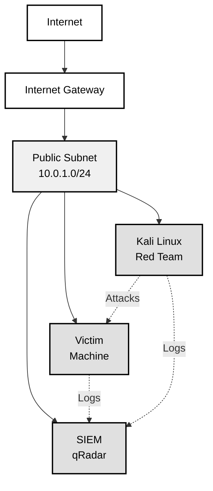
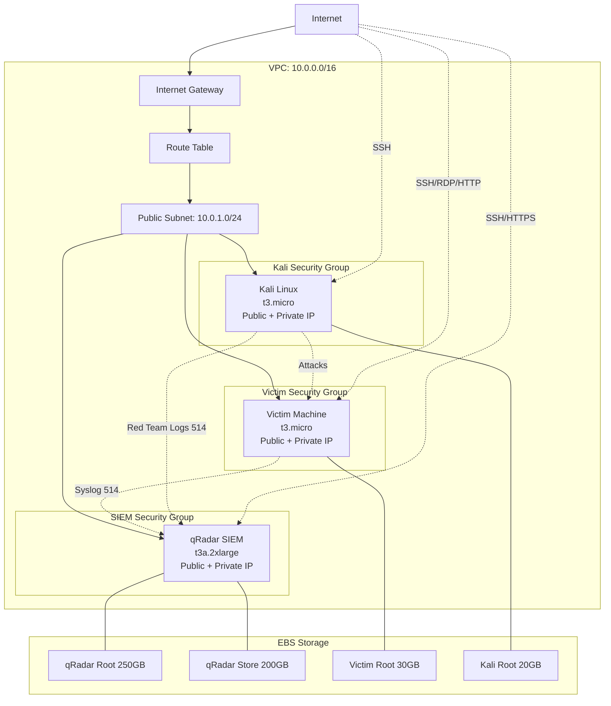
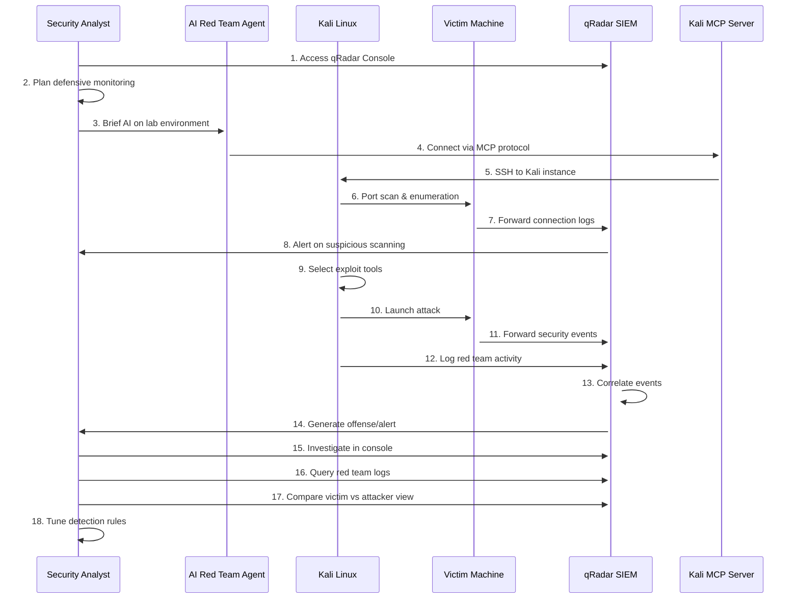
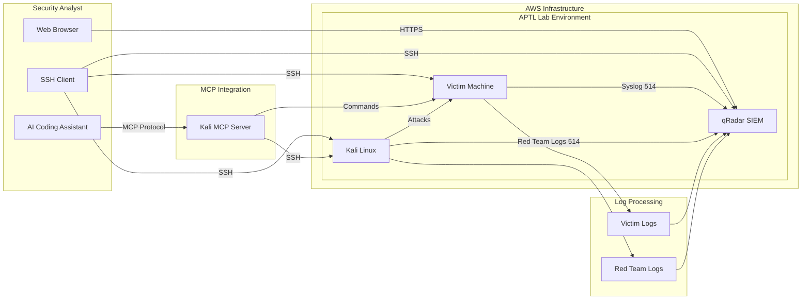

# Architecture

## Overview

APTL creates a purple team lab environment in AWS with:

- qRadar Community Edition 7.5 on t3a.2xlarge instance
- Victim machine on t3.micro instance
- Kali Linux red team instance on t3.micro instance
- Single VPC with all instances in same subnet
- Security groups restricting access to your IP address only

## Network Diagram

## Infrastructure Components

### VPC and Networking

- **VPC**: 10.0.0.0/16 CIDR block
- **Public Subnet**: 10.0.1.0/24
- **Internet Gateway**: Provides internet access
- **Route Table**: Routes traffic to internet gateway
- **Security Groups**: Restrict access by IP and port

### Instance Details

#### qRadar SIEM (t3a.2xlarge)
- **Purpose**: IBM qRadar Community Edition SIEM
- **OS**: Amazon Linux 2
- **Storage**: 250GB root + 200GB /store partition
- **Ports**: 22 (SSH), 443 (HTTPS), 514 (Syslog)
- **Features**:
  - Log collection and analysis
  - Security event correlation
  - Offense management
  - Custom properties for red team logging

#### Victim Machine (t3.micro)
- **Purpose**: Target for red team activities
- **OS**: Amazon Linux 2
- **Storage**: 30GB root volume
- **Ports**: 22 (SSH), 3389 (RDP)
- **Features**:
  - Automatic log forwarding to SIEM
  - Test event generators
  - Vulnerable services for testing

#### Kali Linux Red Team (t3.micro)
- **Purpose**: Red team attack platform
- **OS**: Kali Linux
- **Storage**: 30GB root volume
- **Ports**: 22 (SSH)
- **Features**:
  - Pre-installed penetration testing tools
  - MCP server for AI integration
  - Red team activity logging

### Security Groups

#### SIEM Security Group
- **SSH (22)**: Your IP only
- **HTTPS (443)**: Your IP only
- **Syslog (514)**: Internal subnet only

#### Victim Security Group
- **SSH (22)**: Your IP + Kali instance
- **RDP (3389)**: Your IP + Kali instance
- **All Ports**: From Kali instance (for attack simulation)

#### Kali Security Group
- **SSH (22)**: Your IP only
- **Outbound**: All traffic (for red team activities)

## Data Flow

### Log Forwarding

1. **Victim Machine**: Generates system and application logs
2. **rsyslog**: Forwards logs to qRadar via UDP 514
3. **qRadar**: Receives, parses, and analyzes logs
4. **Alerts**: Generated based on correlation rules

### Red Team Activities

1. **Kali Instance**: Executes attacks against victim
2. **Activity Logging**: Commands logged with metadata
3. **SIEM Integration**: Red team logs sent to qRadar
4. **Correlation**: Red team actions correlated with detections

### AI Integration

1. **MCP Server**: Provides controlled access to Kali tools
2. **AI Agents**: Execute red team activities via MCP
3. **Safety Controls**: Validate targets and filter commands
4. **Logging**: All AI actions logged for analysis

## Detailed Network Topology

## Terraform Modules

### Bootstrap Module
- **Purpose**: Creates S3 backend for state management
- **Components**: S3 bucket with versioning and encryption
- **Security**: Unique UUID-based naming

### Network Module
- **Purpose**: VPC, subnets, and networking infrastructure
- **Components**: VPC, IGW, route tables, security groups
- **Features**: Configurable CIDR blocks and access controls

### SIEM Module
- **Purpose**: qRadar SIEM deployment
- **Components**: EC2 instance, EBS volumes, scripts
- **Features**: Automated preparation and installation scripts

### Victim Module
- **Purpose**: Target machine deployment
- **Components**: EC2 instance, log forwarding configuration
- **Features**: Test event generators and vulnerable services

### Kali Module
- **Purpose**: Red team platform deployment
- **Components**: EC2 instance, penetration testing tools
- **Features**: MCP server and red team logging

## Purple Team Scenario Workflow

## Component Interaction Diagram

