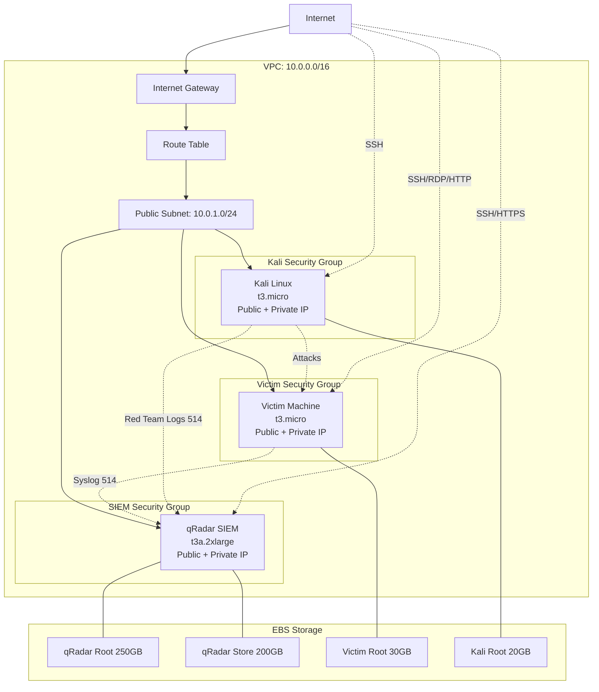
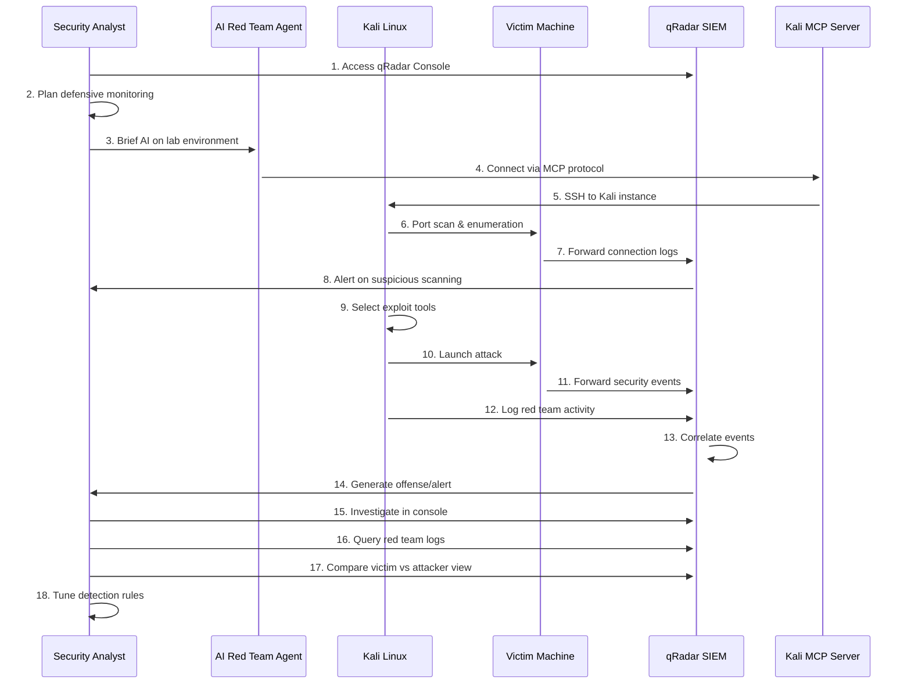
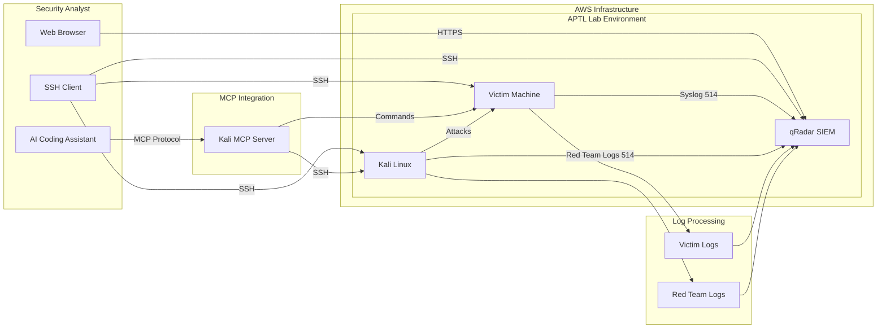

# APTL Architecture Documentation

## Network Topology

```mermaid
flowchart TB
    Internet[Internet] --> IGW[Internet Gateway]
    
    subgraph VPC["VPC: 10.0.0.0/16"]
        IGW --> RT[Route Table]
        RT --> PubSub[Public Subnet: 10.0.1.0/24]
        
        subgraph SIEMSSG["SIEM Security Group"]
            SIEM[qRadar SIEM<br/>t3a.2xlarge<br/>Public + Private IP]
        end
        
        subgraph VICTIMSG["Victim Security Group"]
            VICTIM[Victim Machine<br/>t3.micro<br/>Public + Private IP]
        end
        
        subgraph KALISG["Kali Security Group"]
            KALI[Kali Linux<br/>t3.micro<br/>Public + Private IP]
        end
        
        PubSub --> SIEM
        PubSub --> VICTIM
        PubSub --> KALI
    end
    
    subgraph Storage["EBS Storage"]
        SIEMROOT[qRadar Root 250GB]
        SIEMSTORE[qRadar Store 200GB]
        VICTIMROOT[Victim Root 30GB]
        KALIROOT[Kali Root 20GB]
    end
    
    VICTIM -.->|Syslog 514| SIEM
    KALI -.->|Red Team Logs 514| SIEM
    KALI -.->|Attacks| VICTIM
    
    Internet -.->|SSH/HTTPS| SIEM
    Internet -.->|SSH/RDP/HTTP| VICTIM
    Internet -.->|SSH| KALI
    
    SIEM --- SIEMROOT
    SIEM --- SIEMSTORE
    VICTIM --- VICTIMROOT
    KALI --- KALIROOT
```

## Purple Team Scenario Workflow

```mermaid
sequenceDiagram
    participant User as Security Analyst
    participant AI as AI Red Team Agent
    participant Kali as Kali Linux
    participant Victim as Victim Machine
    participant SIEM as qRadar SIEM
    participant MCP as Kali MCP Server
    
    User->>+SIEM: 1. Access qRadar Console
    User->>User: 2. Plan defensive monitoring
    
    User->>+AI: 3. Brief AI on lab environment
    AI->>+MCP: 4. Connect via MCP protocol
    MCP->>+Kali: 5. SSH to Kali instance
    
    Kali->>+Victim: 6. Port scan & enumeration
    Victim->>+SIEM: 7. Forward connection logs
    SIEM->>User: 8. Alert on suspicious scanning
    
    Kali->>Kali: 9. Select exploit tools
    Kali->>+Victim: 10. Launch attack
    Victim->>+SIEM: 11. Forward security events
    Kali->>+SIEM: 12. Log red team activity
    
    SIEM->>SIEM: 13. Correlate events
    SIEM->>User: 14. Generate offense/alert
    User->>SIEM: 15. Investigate in console
    
    User->>SIEM: 16. Query red team logs
    User->>SIEM: 17. Compare victim vs attacker view
    User->>User: 18. Tune detection rules
```

## Component Interaction Diagram

```mermaid
flowchart LR
    subgraph UserGroup["Security Analyst"]
        Browser[Web Browser]
        SSHClient[SSH Client]
        IDE[AI Coding Assistant]
    end
    
    subgraph AWS["AWS Infrastructure"]
        subgraph Lab["APTL Lab Environment"]
            SIEM[qRadar SIEM]
            VICTIM[Victim Machine]
            KALI[Kali Linux]
        end
    end
    
    subgraph MCPLayer["MCP Integration"]
        MCPServer[Kali MCP Server]
    end
    
    subgraph LogProcessing["Log Processing"]
        VictimLogs[Victim Logs]
        RedTeamLogs[Red Team Logs]
    end
    
    Browser -->|HTTPS| SIEM
    SSHClient -->|SSH| SIEM
    SSHClient -->|SSH| VICTIM
    SSHClient -->|SSH| KALI
    
    IDE -->|MCP Protocol| MCPServer
    MCPServer -->|SSH| KALI
    MCPServer -->|Commands| VICTIM
    
    VICTIM -->|Syslog 514| SIEM
    KALI -->|Red Team Logs 514| SIEM
    KALI -->|Attacks| VICTIM
    
    VICTIM --> VictimLogs
    KALI --> RedTeamLogs
    VictimLogs --> SIEM
    RedTeamLogs --> SIEM
```
