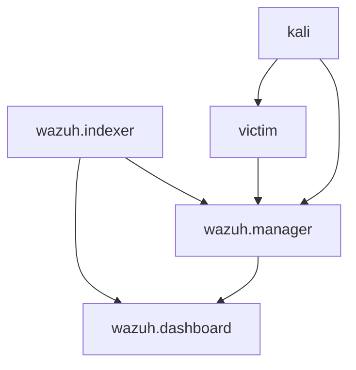

# Docker Compose Configuration

This document explains the Docker Compose configuration that orchestrates the APTL lab environment.

## Service Overview

The lab consists of five main services defined in `docker-compose.yml`:

```yaml
services:
  wazuh.manager:     # SIEM backend
  wazuh.indexer:     # Data storage  
  wazuh.dashboard:   # Web interface
  victim:            # Target system
  kali:              # Red team platform
```

## Wazuh Manager

The central SIEM component that processes logs and detects security events.

```yaml
wazuh.manager:
  image: wazuh/wazuh-manager:4.12.0
  hostname: wazuh.manager
  restart: always
  ports:
    - "1514:1514"    # Agent communication
    - "1515:1515"    # Agent enrollment  
    - "514:514/udp"  # Syslog
    - "55000:55000"  # API
  networks:
    aptl-network:
      ipv4_address: 172.20.0.10
```

### Key Features

- **Log Collection**: Receives logs via syslog (port 514)
- **Event Processing**: Real-time analysis and correlation
- **API Access**: Management API on port 55000
- **Agent Support**: Handles Wazuh agents (ports 1514/1515)

### Volume Mounts

```yaml
volumes:
  - wazuh_api_configuration:/var/ossec/api/configuration
  - wazuh_etc:/var/ossec/etc
  - wazuh_logs:/var/ossec/logs
  - wazuh_queue:/var/ossec/queue
```

Persistent volumes maintain SIEM configuration and data across restarts.

### SSL Certificates

```yaml
volumes:
  - ./config/wazuh_indexer_ssl_certs/root-ca-manager.pem:/etc/ssl/root-ca.pem
  - ./config/wazuh_indexer_ssl_certs/wazuh.manager.pem:/etc/ssl/filebeat.pem
  - ./config/wazuh_indexer_ssl_certs/wazuh.manager-key.pem:/etc/ssl/filebeat.key
```

SSL certificates enable secure communication with Wazuh Indexer.

## Wazuh Indexer

OpenSearch-based data storage for security events and logs.

```yaml
wazuh.indexer:
  image: wazuh/wazuh-indexer:4.12.0
  hostname: wazuh.indexer
  restart: always
  ports:
    - "9200:9200"    # OpenSearch API
  environment:
    - "OPENSEARCH_JAVA_OPTS=-Xms1g -Xmx1g"
  networks:
    aptl-network:
      ipv4_address: 172.20.0.12
```

### Resource Configuration

- **Memory**: 1GB heap size (configurable via OPENSEARCH_JAVA_OPTS)
- **Storage**: Persistent volume for data retention
- **ulimits**: Configured for optimal OpenSearch performance

### Security Configuration

```yaml
volumes:
  - ./config/wazuh_indexer/wazuh.indexer.yml:/usr/share/wazuh-indexer/opensearch.yml
  - ./config/wazuh_indexer/internal_users.yml:/usr/share/wazuh-indexer/opensearch-security/internal_users.yml
```

Custom configuration files define security settings and user authentication.

## Wazuh Dashboard

Web-based interface for security operations and analysis.

```yaml
wazuh.dashboard:
  image: wazuh/wazuh-dashboard:4.12.0
  hostname: wazuh.dashboard
  restart: always
  ports:
    - 443:5601       # HTTPS web interface
  environment:
    - INDEXER_USERNAME=admin
    - INDEXER_PASSWORD=SecretPassword
    - API_USERNAME=wazuh-wui
    - API_PASSWORD=MyS3cr37P450r.*-
  networks:
    aptl-network:
      ipv4_address: 172.20.0.11
```

### Access Configuration

- **Web Interface**: https://localhost:443
- **Default Login**: admin / SecretPassword
- **SSL Enabled**: Uses SSL certificates for HTTPS

### Dependencies

```yaml
depends_on:
  - wazuh.indexer
links:
  - wazuh.indexer:wazuh.indexer
  - wazuh.manager:wazuh.manager
```

Dashboard requires both Indexer and Manager to be running.

## Victim Container

Target system for red team activities and security testing.

```yaml
victim:
  build:
    context: ./containers/victim
    dockerfile: Dockerfile
  container_name: aptl-victim
  hostname: victim-host
  restart: unless-stopped
  ports:
    - "2022:22"      # SSH access
    - "8080:80"      # HTTP service
    - "2121:21"      # FTP service
  environment:
    - SIEM_IP=172.20.0.10
    - LABADMIN_SSH_KEY_FILE=/keys/aptl_lab_key.pub
  networks:
    aptl-network:
      ipv4_address: 172.20.0.20
```

### Build Configuration

The victim container is built from a custom Dockerfile:

```dockerfile
FROM rockylinux:9
# Installs SSH, HTTP, FTP services
# Configures log forwarding to SIEM
# Sets up lab admin user
```

### Service Ports

- **SSH (22→2022)**: Remote access for administration and testing
- **HTTP (80→8080)**: Web service for web-based attacks
- **FTP (21→2121)**: File transfer service (often misconfigured)

### System Configuration

```yaml
cap_add:
  - SYS_ADMIN        # Required for systemd
security_opt:
  - seccomp:unconfined
tmpfs:
  - /run
  - /tmp
```

Configuration allows systemd services to run properly in container.

## Kali Container

Red team platform with penetration testing tools.

```yaml
kali:
  build:
    context: ./containers/kali
    dockerfile: Dockerfile
  container_name: aptl-kali
  hostname: kali-redteam
  restart: unless-stopped
  ports:
    - "2023:22"      # SSH access for MCP
  environment:
    - SIEM_IP=172.20.0.10
    - VICTIM_IP=172.20.0.20
  networks:
    aptl-network:
      ipv4_address: 172.20.0.30
```

### Build Configuration

Based on official Kali Linux with additional tools:

```dockerfile
FROM kalilinux/kali-last-release:latest
# Updates package repository
# Installs penetration testing tools
# Configures red team logging
# Sets up MCP integration
```

### Network Capabilities

```yaml
cap_add:
  - NET_RAW          # Packet capture tools
  - NET_ADMIN        # Network manipulation
```

Special capabilities enable network-based testing tools.

### Dependencies

```yaml
depends_on:
  - victim
```

Ensures victim container is available before starting red team activities.

## Networking Configuration

### Custom Bridge Network

```yaml
networks:
  aptl-network:
    driver: bridge
    ipam:
      config:
        - subnet: 172.20.0.0/16
          gateway: 172.20.0.1
```

Isolated network contains all lab traffic and prevents external access.

### Static IP Assignment

Each container receives a predictable IP address:

- **wazuh.manager**: 172.20.0.10
- **wazuh.dashboard**: 172.20.0.11
- **wazuh.indexer**: 172.20.0.12
- **victim**: 172.20.0.20
- **kali**: 172.20.0.30

## Volume Management

### Named Volumes

```yaml
volumes:
  # Wazuh persistent data
  wazuh_api_configuration:
  wazuh_etc:
  wazuh_logs:
  wazuh_queue:
  wazuh_var_multigroups:
  wazuh_integrations:
  wazuh_active_response:
  wazuh_agentless:
  wazuh_wodles:
  filebeat_etc:
  filebeat_var:
  wazuh-indexer-data:
  wazuh-dashboard-config:
  wazuh-dashboard-custom:
  
  # Application volumes
  victim_logs:
  kali_operations:
```

Named volumes provide persistence while maintaining isolation.

### Host Mounts

```yaml
volumes:
  - /sys/fs/cgroup:/sys/fs/cgroup:rw    # systemd support
  - ./keys:/keys:ro                     # SSH keys
  - ./config/wazuh_cluster/wazuh_manager.conf:/wazuh-config-mount/etc/ossec.conf
```

Selective host mounts provide necessary configuration and system access.

## Environment Variables

### Common Variables

| Variable | Purpose | Example |
|----------|---------|---------|
| `SIEM_IP` | Wazuh Manager address | `172.20.0.10` |
| `VICTIM_IP` | Target system address | `172.20.0.20` |
| `LABADMIN_SSH_KEY_FILE` | SSH key location | `/keys/aptl_lab_key.pub` |

### Wazuh-Specific Variables

| Variable | Purpose | Default |
|----------|---------|---------|
| `INDEXER_USERNAME` | OpenSearch user | `admin` |
| `INDEXER_PASSWORD` | OpenSearch password | `SecretPassword` |
| `API_USERNAME` | Wazuh API user | `wazuh-wui` |
| `API_PASSWORD` | Wazuh API password | `MyS3cr37P450r.*-` |

## Service Dependencies



Dependencies ensure proper startup order and service availability.

## Resource Requirements

### Minimum System Resources

- **CPU**: 4 cores
- **Memory**: 8GB RAM
- **Storage**: 20GB disk space
- **Network**: Docker bridge networking

### Container Resource Allocation

| Container | CPU | Memory | Storage |
|-----------|-----|--------|---------|
| wazuh.manager | 1-2 cores | 1-2GB | 5GB |
| wazuh.indexer | 1-2 cores | 2-4GB | 10GB |
| wazuh.dashboard | 0.5-1 core | 512MB-1GB | 1GB |
| victim | 0.5-1 core | 512MB-1GB | 2GB |
| kali | 1-2 cores | 1-2GB | 5GB |

## Configuration Customization

### Custom Wazuh Rules

```yaml
volumes:
  - ./custom/rules:/var/ossec/etc/rules/custom:ro
```

Mount custom detection rules for specific scenarios.

### Additional Services

Add new services to the compose file:

```yaml
services:
  database:
    image: mysql:8.0
    environment:
      MYSQL_ROOT_PASSWORD: vulnerable123
    networks:
      aptl-network:
        ipv4_address: 172.20.0.40
```

### Environment-Specific Configuration

Use `.env` files for environment-specific settings:

```bash
# .env file
WAZUH_VERSION=4.12.0
VICTIM_IMAGE=aptl-victim:latest
CUSTOM_RULES_PATH=./custom/rules
```

## Health Checks

### Service Health Monitoring

```yaml
healthcheck:
  test: ["CMD-SHELL", "curl -f http://localhost:55000 || exit 1"]
  interval: 30s
  timeout: 10s
  retries: 3
```

Built-in health checks ensure services are responding correctly.

### Dependency Health

```yaml
depends_on:
  wazuh.indexer:
    condition: service_healthy
```

Wait for dependencies to be healthy before starting dependent services.

## Next Steps

- **[Networking](networking.md)** - Detailed network configuration
- **[Components](../components/)** - Individual service documentation
- **[Deployment](../deployment/)** - Deployment and management