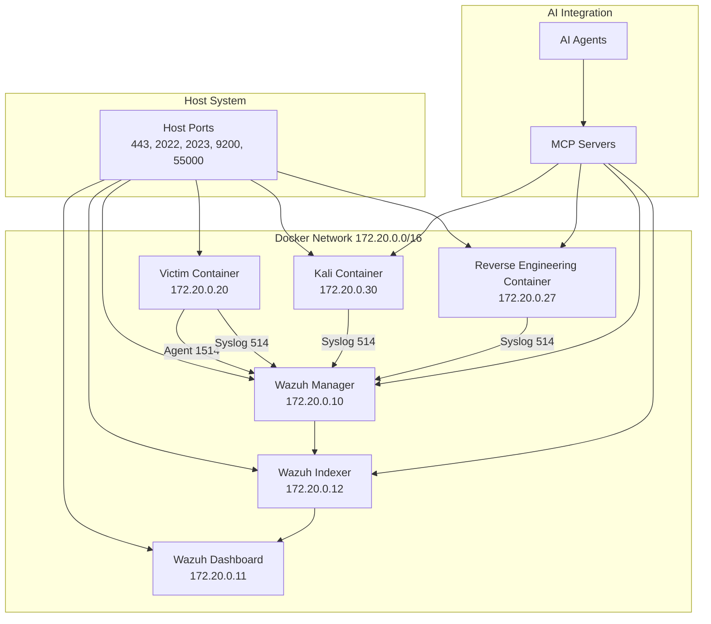

# Lab Architecture

## Network Topology

## Container Layout

| Container | IP | Purpose |
|-----------|----|---------|
| wazuh.manager | 172.20.0.10 | Log processing, rules, alerts |
| wazuh.dashboard | 172.20.0.11 | Web interface |
| wazuh.indexer | 172.20.0.12 | OpenSearch data storage |
| victim | 172.20.0.20 | Target system with monitoring |
| kali | 172.20.0.30 | Attack platform |
| reverse | 172.20.0.27 | Reverse engineering |

## Ports

| Host | Container | Service |
|------|-----------|---------|
| 443 | dashboard:5601 | Wazuh web UI |
| 2022 | victim:22 | Victim SSH |
| 2023 | kali:22 | Kali SSH |
| 9200 | indexer:9200 | OpenSearch API |
| 55000 | manager:55000 | Wazuh API |
| 2027 | reverse:22 | Reverse engineering SSH |

## Data Flow

1. **Victim** sends logs via:
   - Wazuh agent → Manager (port 1514)
   - rsyslog → Manager (port 514)
2. **Kali** sends logs → Manager (syslog port 514)
3. Manager processes logs → Indexer (storage)
4. Dashboard queries Indexer → Web UI
5. MCP server controls Kali via SSH
6. MCP server controls Reverse Engineering via SSH

## Components

**Wazuh SIEM:**

- Manager: Log processing, rules, alerts
- Indexer: OpenSearch data storage  
- Dashboard: Web interface

**Lab Environment:**

- Victim: Rocky Linux, SSH, Wazuh agent, Falco eBPF monitoring
- Kali: Attack tools, MCP integration
- Network: Isolated 172.20.0.0/16
- Reverse Engineering: Reverse engineering tools, MCP integration
