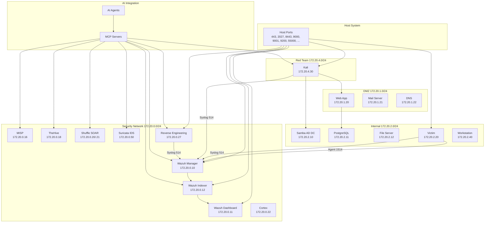

# Lab Architecture

## Network Topology

```mermaid
flowchart TD
    subgraph "Host System"
        H[Host Ports<br/>443, 2027, 8443, 9000, 9001, 9200, 55000, ...]
    end

    subgraph "Security Network 172.20.0.0/24"
        WM[Wazuh Manager<br/>172.20.0.10]
        WD[Wazuh Dashboard<br/>172.20.0.11]
        WI[Wazuh Indexer<br/>172.20.0.12]
        MISP[MISP<br/>172.20.0.16]
        TH[TheHive<br/>172.20.0.18]
        SHUF[Shuffle SOAR<br/>172.20.0.20/.21]
        CTX[Cortex<br/>172.20.0.22]
        SUR[Suricata IDS<br/>172.20.0.50]
        R[Reverse Engineering<br/>172.20.0.27]
    end

    subgraph "DMZ 172.20.1.0/24"
        WA[Web App<br/>172.20.1.20]
        MAIL[Mail Server<br/>172.20.1.21]
        DNS[DNS<br/>172.20.1.22]
    end

    subgraph "Internal 172.20.2.0/24"
        AD[Samba AD DC<br/>172.20.2.10]
        DB[PostgreSQL<br/>172.20.2.11]
        FS[File Server<br/>172.20.2.12]
        V[Victim<br/>172.20.2.20]
        WS[Workstation<br/>172.20.2.40]
    end

    subgraph "Red Team 172.20.4.0/24"
        K[Kali<br/>172.20.4.30]
    end

    H --> WD
    H --> V
    H --> K
    H --> WI
    H --> WM
    H --> R
    V --> |Agent 1514| WM
    V --> |Syslog 514| WM
    K --> |Syslog 514| WM
    WM --> WI
    WI --> WD
    R --> |Syslog 514| WM
    K --> WA
    K --> AD
    WA --> DB

    subgraph "AI Integration"
        MCP[MCP Servers]
        AI[AI Agents]
    end

    AI --> MCP
    MCP --> K
    MCP --> WM
    MCP --> WI
    MCP --> R
    MCP --> MISP
    MCP --> TH
    MCP --> SHUF
    MCP --> SUR
```

## Container Layout

| Container | Networks | Primary IP | Purpose |
|-----------|-----------|------------|---------|
| aptl-wazuh-manager | security, dmz, internal | 172.20.0.10 | Log processing, rules, alerts |
| aptl-wazuh-dashboard | security | 172.20.0.11 | Web interface |
| aptl-wazuh-indexer | security | 172.20.0.12 | OpenSearch data storage |
| aptl-suricata | security, dmz, internal | 172.20.0.50 | Network IDS |
| aptl-misp | security | 172.20.0.16 | Threat intelligence |
| aptl-thehive | security | 172.20.0.18 | Case management |
| aptl-cortex | security | 172.20.0.22 | Automated enrichment |
| aptl-shuffle-backend | security | 172.20.0.20 | SOAR backend |
| aptl-shuffle-frontend | security | 172.20.0.21 | SOAR frontend |
| aptl-webapp | dmz, internal | 172.20.1.20 | Vulnerable web app |
| aptl-mailserver | dmz, internal | 172.20.1.21 | Email server |
| aptl-dns | dmz, internal, security | 172.20.1.22 | DNS server |
| aptl-ad | internal | 172.20.2.10 | Samba AD domain controller |
| aptl-db | internal | 172.20.2.11 | PostgreSQL database |
| aptl-fileshare | internal | 172.20.2.12 | Samba file server |
| aptl-victim | internal | 172.20.2.20 | Rocky Linux target |
| aptl-workstation | internal | 172.20.2.40 | Developer workstation |
| aptl-kali | redteam, dmz, internal | 172.20.4.30 | Attack platform |
| aptl-reverse | security | 172.20.0.27 | Reverse engineering |

## Ports

| Host | Container | Service |
|------|-----------|---------|
| 443 | aptl-wazuh-dashboard:5601 | Wazuh web UI |
| 514/udp, 1514, 1515 | aptl-wazuh-manager | Syslog + agent enrollment |
| 2027 | aptl-reverse:22 | Reverse engineering SSH |
| 3443, 3001 | aptl-shuffle-frontend | Shuffle SOAR UI |
| 8080 | aptl-webapp:8080 | TechVault web app |
| 8443 | aptl-misp:443 | MISP UI |
| 9000 | aptl-thehive:9000 | TheHive UI |
| 9001 | aptl-cortex:9001 | Cortex UI |
| 9200 | aptl-wazuh-indexer:9200 | OpenSearch API |
| 55000 | aptl-wazuh-manager:55000 | Wazuh API |

The victim and kali containers publish no host ports; use
`aptl container shell aptl-victim` / `aptl container shell aptl-kali`.

## Data Flow

1. **Victim** sends logs via:
   - Wazuh agent → Manager (port 1514)
   - rsyslog → Manager (port 514)
2. **Kali** sends logs → Manager (syslog port 514)
3. **Enterprise containers** send logs → Manager (syslog)
4. Manager processes logs → Indexer (storage)
5. Dashboard queries Indexer → Web UI
6. Suricata taps network traffic → Eve JSON → Wazuh
7. MCP servers control containers via SSH and APIs

## Components

**Wazuh SIEM:**

- Manager: Log processing, rules, alerts
- Indexer: OpenSearch data storage
- Dashboard: Web interface

**Enterprise Infrastructure:**

- Samba AD DC: Identity, Kerberos, LDAP
- PostgreSQL: Application database
- Web app: Vulnerable TechVault portal
- File server: Department shares with planted data
- Mail server: Postfix + Dovecot
- DNS: Bind9, internal resolution

**SOC Stack:**

- Suricata: Network IDS on all zones
- MISP: Threat intelligence and IOC feeds
- TheHive + Cortex: Case management and enrichment
- Shuffle: SOAR playbooks

**Lab Environment:**

- Victim: Rocky Linux, SSH, Wazuh agent, Falco eBPF monitoring
- Kali: Attack tools, MCP integration
- Reverse Engineering: Binary analysis tools, MCP integration

## Preflights

- [DEP-008 Self-Contained Lab Assets](dep-008-self-contained-lab-assets-preflight.md)
- [RNG-001 Ephemeral Environments](rng-001-ephemeral-environments-preflight.md)
- [DEP-003 Ephemeral Lifecycle Policy](dep-003-ephemeral-lifecycle-preflight.md)
- [GRC Boundary Surface Vocabulary](grc-boundary-surface-vocabulary-preflight.md)
- [Issue #677 Certificate Producer Ownership](issue-677-cert-producer-ownership-preflight.md)
- [OBS-002 Correlation Identity And Clock Context](obs-002-correlation-identity-clock-preflight.md)
- [EXP-010 Capture Admission And Evidence Acquisition](exp-010-capture-admission-evidence-preflight.md)
