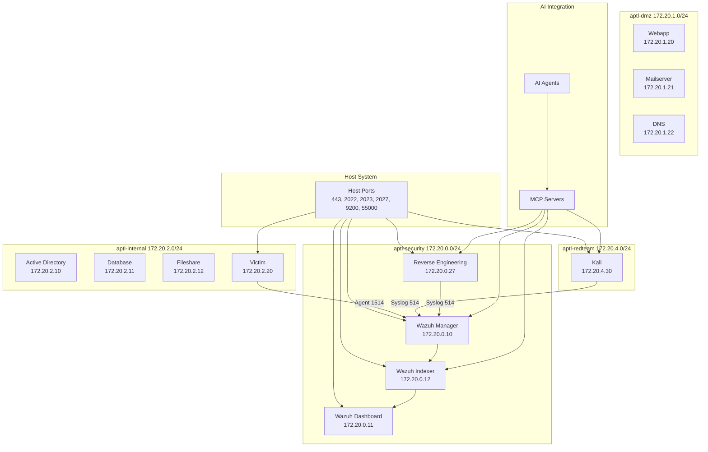

# Lab Architecture

## Network Topology

The lab uses four isolated Docker networks, each serving a different security zone:

```mermaid
flowchart TD
    subgraph "Host System"
        H[Host Ports<br/>443, 2022, 2023, 2027, 9200, 55000]
    end

    subgraph "aptl-security 172.20.0.0/24"
        WM[Wazuh Manager<br/>172.20.0.10]
        WD[Wazuh Dashboard<br/>172.20.0.11]
        WI[Wazuh Indexer<br/>172.20.0.12]
        RE[Reverse Engineering<br/>172.20.0.27]
    end

    subgraph "aptl-dmz 172.20.1.0/24"
        WA[Webapp<br/>172.20.1.20]
        MS[Mailserver<br/>172.20.1.21]
        DNS[DNS<br/>172.20.1.22]
    end

    subgraph "aptl-internal 172.20.2.0/24"
        AD[Active Directory<br/>172.20.2.10]
        DB[Database<br/>172.20.2.11]
        FS[Fileshare<br/>172.20.2.12]
        V[Victim<br/>172.20.2.20]
    end

    subgraph "aptl-redteam 172.20.4.0/24"
        K[Kali<br/>172.20.4.30]
    end

    H --> WD
    H --> V
    H --> K
    H --> WI
    H --> WM
    H --> RE
    V --> |Agent 1514| WM
    K --> |Syslog 514| WM
    RE --> |Syslog 514| WM
    WM --> WI
    WI --> WD

    subgraph "AI Integration"
        MCP[MCP Servers]
        AI[AI Agents]
    end

    AI --> MCP
    MCP --> K
    MCP --> WM
    MCP --> WI
    MCP --> RE
```

The Wazuh Manager bridges multiple networks (security, DMZ, internal) so all containers can forward logs to it. Kali bridges the redteam, DMZ, and internal networks to reach targets.

## Networks

| Network | Subnet | Purpose |
|---------|--------|---------|
| aptl-security | 172.20.0.0/24 | Wazuh SIEM stack, SOC tools, reverse engineering |
| aptl-dmz | 172.20.1.0/24 | Public-facing enterprise services |
| aptl-internal | 172.20.2.0/24 | Internal enterprise services, victim |
| aptl-redteam | 172.20.4.0/24 | Kali red team |

## Core Containers

| Container | Network(s) | IP(s) | Profile |
|-----------|-----------|-------|---------|
| wazuh.manager | security, dmz, internal | 172.20.0.10, 172.20.1.10, 172.20.2.30 | wazuh |
| wazuh.indexer | security | 172.20.0.12 | wazuh |
| wazuh.dashboard | security | 172.20.0.11 | wazuh |
| victim | internal | 172.20.2.20 | victim |
| kali | redteam, dmz, internal | 172.20.4.30, 172.20.1.30, 172.20.2.35 | kali |
| reverse | security | 172.20.0.27 | reverse |

## Host Port Mappings

| Host Port | Container | Service |
|-----------|-----------|---------|
| 443 | dashboard:5601 | Wazuh web UI |
| 2022 | victim:22 | Victim SSH |
| 2023 | kali:22 | Kali SSH |
| 2027 | reverse:22 | Reverse engineering SSH |
| 9200 | indexer:9200 | OpenSearch API |
| 55000 | manager:55000 | Wazuh API |

## Docker Compose Profiles

Containers are organized into profiles. Only enabled profiles start when you run `aptl lab start` or `start-lab.sh`.

| Profile | Containers |
|---------|-----------|
| wazuh | wazuh.manager, wazuh.indexer, wazuh.dashboard |
| victim | victim |
| kali | kali |
| reverse | reverse |
| enterprise | webapp, ad, db |
| soc | suricata, misp, thehive, shuffle, cortex (+ supporting containers) |
| mail | mailserver |
| dns | dns |
| fileshare | fileshare |

Enable/disable profiles in `aptl.json`. The `wazuh`, `victim`, and `kali` profiles are enabled by default.

## Data Flow

1. **Victim** sends logs → Wazuh Manager (agent port 1514, syslog port 514)
2. **Kali** sends logs → Wazuh Manager (syslog port 514)
3. **Reverse** sends logs → Wazuh Manager (syslog port 514)
4. Manager processes logs → Indexer (OpenSearch storage)
5. Dashboard queries Indexer → Web UI
6. MCP servers control containers via SSH and query SIEM via APIs
