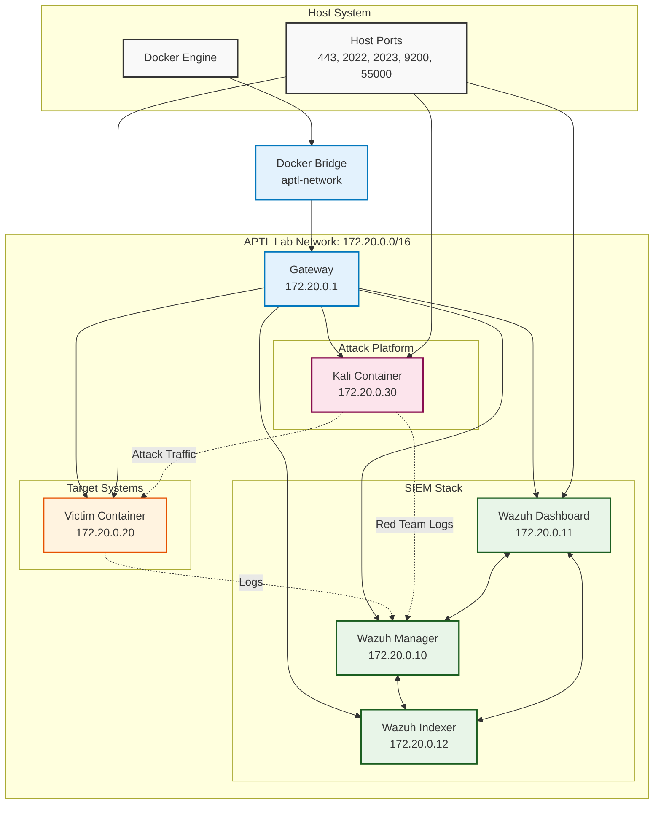
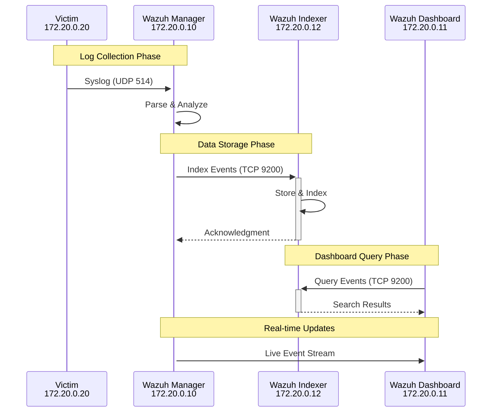
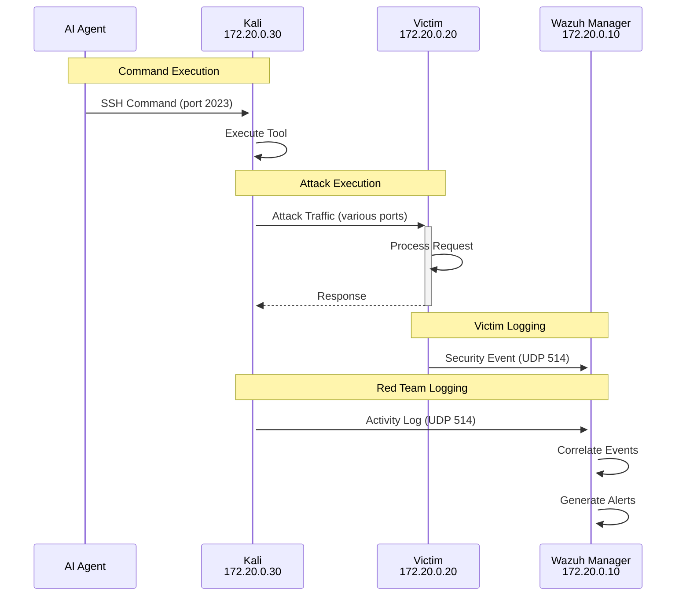

# Network Architecture

APTL uses a carefully designed Docker networking architecture that provides isolation, realistic communication patterns, and comprehensive monitoring capabilities. This document details the network topology, traffic flows, and security boundaries within the lab environment.

## Network Overview

The lab environment runs on a custom Docker bridge network that isolates all lab traffic from the host system and external networks while enabling realistic attack scenarios and comprehensive logging.

### Network Topology



## Network Configuration

### Docker Bridge Network

The lab uses a custom Docker bridge network with specific configuration:

```yaml
# docker-compose.yml network configuration
networks:
  aptl-network:
    driver: bridge
    ipam:
      config:
        - subnet: 172.20.0.0/16
          gateway: 172.20.0.1
```

### Network Parameters

| Parameter | Value | Purpose |
|-----------|-------|---------|
| **Network Name** | aptl-network | Isolation from other Docker networks |
| **Subnet** | 172.20.0.0/16 | Large address space for expansion |
| **Gateway** | 172.20.0.1 | Docker-managed gateway |
| **Driver** | bridge | Standard Docker networking |
| **MTU** | 1500 | Standard Ethernet MTU |

### IP Address Allocation

Static IP addresses ensure predictable network behavior:

| Container | IP Address | Hostname | Purpose |
|-----------|------------|----------|---------|
| Wazuh Manager | 172.20.0.10 | wazuh.manager | SIEM backend, log processing |
| Wazuh Dashboard | 172.20.0.11 | wazuh.dashboard | Web interface |
| Wazuh Indexer | 172.20.0.12 | wazuh.indexer | Data storage |
| Victim Container | 172.20.0.20 | victim-host | Attack target |
| Juice Shop Container | 172.20.0.21 | juice-shop | OWASP Juice Shop |
| Kali Container | 172.20.0.30 | kali-redteam | Attack platform |

### Reserved Address Ranges

```
172.20.0.1      - Docker gateway
172.20.0.2-9    - Reserved for infrastructure
172.20.0.10-19  - SIEM stack
172.20.0.20-29  - Victim systems
172.20.0.30-39  - Attack platforms
172.20.0.40-49  - Future expansion (databases, etc.)
172.20.0.50+    - Dynamic allocation
```

## Port Mappings

### Host-to-Container Port Forwarding

External access to lab services through host port mapping:

| Host Port | Container | Container Port | Service | Protocol |
|-----------|-----------|----------------|---------|----------|
| 443 | wazuh.dashboard | 5601 | Wazuh Dashboard | HTTPS |
| 2022 | victim | 22 | Victim SSH | SSH |
| 2024 | juice-shop | 22 | Juice Shop SSH | SSH |
| 3000 | juice-shop | 3000 | Juice Shop Web | HTTP |
| 2023 | kali | 22 | Kali SSH | SSH |
| 9200 | wazuh.indexer | 9200 | OpenSearch API | HTTPS |
| 55000 | wazuh.manager | 55000 | Wazuh API | HTTPS |

### Container-to-Container Communication

Internal communication uses container IP addresses and default ports:

```bash
# Examples of internal communication
curl http://172.20.0.20:80        # Kali → Victim HTTP
curl http://172.20.0.21:3000      # Kali → Juice Shop web
ssh labadmin@172.20.0.20          # Kali → Victim SSH
logger -h 172.20.0.10 "message"   # Victim → Wazuh syslog
curl https://172.20.0.12:9200     # Dashboard → Indexer API
```

## Service Discovery

### DNS Resolution

Docker provides automatic DNS resolution for container names:

```bash
# Containers can reach each other by hostname
ping wazuh.manager      # Resolves to 172.20.0.10
curl http://victim-host  # Resolves to 172.20.0.20
ssh kali-redteam        # Resolves to 172.20.0.30
```

### Service Ports

Each container exposes specific services on standard ports:

#### Wazuh Manager (172.20.0.10)
```
514/udp     - Syslog (log collection)
1514/tcp    - Wazuh agent registration
1515/tcp    - Wazuh agent communication
55000/tcp   - Wazuh API
```

#### Wazuh Dashboard (172.20.0.11)
```
5601/tcp    - Wazuh Dashboard web interface
```

#### Wazuh Indexer (172.20.0.12)
```
9200/tcp    - OpenSearch API
9300/tcp    - OpenSearch cluster communication
```

#### Victim Container (172.20.0.20)
```
22/tcp      - SSH service
80/tcp      - HTTP service (Apache)
21/tcp      - FTP service (vsftpd)
```

#### Kali Container (172.20.0.30)
```
22/tcp      - SSH service
```

## Traffic Flow Analysis

### Log Traffic Patterns



### Attack Traffic Patterns



## Network Security

### Traffic Isolation

The Docker bridge network provides complete isolation from external networks:

```bash
# Container cannot reach external networks
ping 8.8.8.8          # Will fail from containers
curl google.com        # Will fail from containers

# Host system remains accessible
curl localhost:443     # Wazuh Dashboard via host port
ssh localhost -p 2022  # Victim via host port
```

### Internal Communication Security

Communication between containers is unencrypted by default but isolated:

```bash
# Unencrypted internal communication (acceptable for lab)
curl http://172.20.0.20:80     # HTTP traffic
nc 172.20.0.10 514             # Syslog traffic

# Encrypted communication where configured
curl https://172.20.0.12:9200  # OpenSearch with SSL
ssh 172.20.0.20               # SSH with key authentication
```

### Firewall Rules

Docker automatically manages iptables rules for the bridge network:

```bash
# Docker-managed rules (example)
-A DOCKER -d 172.20.0.10/32 ! -i aptl-network -o aptl-network -p tcp --dport 55000 -j ACCEPT
-A DOCKER -d 172.20.0.11/32 ! -i aptl-network -o aptl-network -p tcp --dport 5601 -j ACCEPT
-A DOCKER -d 172.20.0.20/32 ! -i aptl-network -o aptl-network -p tcp --dport 22 -j ACCEPT
-A DOCKER -d 172.20.0.30/32 ! -i aptl-network -o aptl-network -p tcp --dport 22 -j ACCEPT
```

## Network Monitoring

### Traffic Analysis

Monitor network traffic patterns for both attack and defense analysis:

```bash
# Container-level network monitoring
docker exec aptl-kali tcpdump -i eth0 'host 172.20.0.20'
docker exec aptl-victim tcpdump -i eth0 'port 514'

# Host-level monitoring
tcpdump -i docker0 'net 172.20.0.0/16'

# Connection tracking
docker exec aptl-kali netstat -an | grep 172.20.0.20
docker exec aptl-victim netstat -an | grep ESTABLISHED
```

### Network Statistics

Gather network performance and utilization data:

```bash
# Container network statistics
docker stats --format "table {{.Container}}\t{{.NetIO}}"

# Interface statistics
docker exec aptl-kali cat /sys/class/net/eth0/statistics/rx_bytes
docker exec aptl-victim cat /sys/class/net/eth0/statistics/tx_packets
```

### Bandwidth Monitoring

Track bandwidth usage during attack scenarios:

```bash
# Monitor network interface utilization
docker exec aptl-kali iftop -i eth0
docker exec aptl-victim iftop -i eth0

# Historical bandwidth data
docker exec aptl-kali vnstat -i eth0
```

## Network Performance

### Latency Characteristics

Internal network latency is minimal due to bridge networking:

```bash
# Measure internal network latency
docker exec aptl-kali ping -c 10 172.20.0.20
# Typical results: ~0.1ms average

# Measure host-to-container latency
ping -c 10 localhost -p 2022
# Typical results: ~0.5ms average
```

### Throughput Testing

Network throughput within the lab environment:

```bash
# Container-to-container throughput
docker exec aptl-kali iperf3 -c 172.20.0.20 -p 5001 &
docker exec aptl-victim iperf3 -s -p 5001

# Host-to-container throughput
iperf3 -c localhost -p 2022 &
docker exec aptl-victim iperf3 -s -p 2022
```

### Connection Limits

Docker bridge networks have generous connection limits suitable for lab use:

```bash
# Check current connection counts
docker exec aptl-kali ss -s | grep TCP
docker exec aptl-victim ss -s | grep TCP

# Monitor connection establishment rate
docker exec aptl-kali ss -i | grep -c ESTAB
```

## Advanced Networking

### Network Segmentation

Future expansions can add network segmentation:

```yaml
# Example: Multiple network segments
networks:
  dmz-network:
    subnet: 172.20.1.0/24
  internal-network:
    subnet: 172.20.2.0/24
  management-network:
    subnet: 172.20.3.0/24
```

### Traffic Shaping

Simulate network conditions for realistic testing:

```bash
# Add network delay (example)
docker exec aptl-kali tc qdisc add dev eth0 root netem delay 100ms

# Add packet loss
docker exec aptl-victim tc qdisc add dev eth0 root netem loss 1%

# Limit bandwidth
docker exec aptl-kali tc qdisc add dev eth0 root handle 1: htb default 30
docker exec aptl-kali tc class add dev eth0 parent 1: classid 1:1 htb rate 10mbit
```

### Load Balancing

Future multi-instance deployments can use load balancing:

```yaml
# Example: Load balanced victim containers
services:
  victim-lb:
    image: nginx:alpine
    ports:
      - "8080:80"
    depends_on:
      - victim-1
      - victim-2
      - victim-3
```

## Troubleshooting Network Issues

### Common Network Problems

1. **Container Cannot Reach Other Containers**
   ```bash
   # Check network connectivity
   docker exec aptl-kali ping 172.20.0.20
   
   # Verify network configuration
   docker network inspect aptl_aptl-network
   
   # Check container network interfaces
   docker exec aptl-kali ip addr show
   ```

2. **Port Mapping Issues**
   ```bash
   # Verify port mappings
   docker compose ps
   docker port aptl-victim
   
   # Check host port availability
   netstat -tlnp | grep -E "(443|2022|2023|9200|55000)"
   
   # Test port connectivity
   telnet localhost 2022
   ```

3. **DNS Resolution Problems**
   ```bash
   # Test DNS resolution
   docker exec aptl-kali nslookup victim-host
   docker exec aptl-kali getent hosts wazuh.manager
   
   # Check DNS configuration
   docker exec aptl-kali cat /etc/resolv.conf
   ```

### Network Debugging Tools

```bash
# Network connectivity testing
docker exec aptl-kali nc -zv 172.20.0.20 22    # TCP connectivity
docker exec aptl-kali nc -u 172.20.0.10 514    # UDP connectivity

# Network routing
docker exec aptl-kali ip route show
docker exec aptl-kali traceroute 172.20.0.20

# Network interface status
docker exec aptl-kali ip link show
docker exec aptl-kali ethtool eth0

# ARP table inspection
docker exec aptl-kali arp -a
docker exec aptl-kali ip neigh show
```

### Performance Diagnostics

```bash
# Network performance analysis
docker exec aptl-kali ss -i | head -20    # Connection statistics
docker exec aptl-kali cat /proc/net/netstat  # Network statistics

# Container network overhead
docker exec aptl-kali cat /proc/net/dev    # Interface statistics
docker exec aptl-kali cat /sys/class/net/eth0/statistics/rx_packets
```

## Security Considerations

### Network Attack Surface

The lab network is designed to minimize attack surface while enabling realistic scenarios:

- **No External Access**: Containers cannot reach external networks
- **Isolated Environment**: Complete isolation from production networks  
- **Controlled Exposure**: Only specific ports exposed to host system
- **Monitoring**: All network traffic can be monitored and logged

### Purple Team Network Security

Network design supports both red team operations and blue team monitoring:

- **Realistic Traffic Patterns**: Network behavior mirrors real environments
- **Comprehensive Logging**: All significant network events captured
- **Attack Simulation**: Network allows realistic attack techniques
- **Defense Testing**: Blue team can implement and test network defenses

## Best Practices

### Network Design

1. **Use Static IPs**: Predictable addressing for consistent scenarios
2. **Document Everything**: Maintain clear network documentation
3. **Monitor Traffic**: Implement comprehensive network monitoring
4. **Test Connectivity**: Regular connectivity testing between components

### Operational Practices

1. **Regular Health Checks**: Monitor network performance and connectivity
2. **Log Analysis**: Regular analysis of network logs for anomalies
3. **Backup Configurations**: Maintain backups of network configurations
4. **Update Documentation**: Keep network documentation current

### Security Practices

1. **Least Privilege**: Only expose necessary ports and services
2. **Regular Monitoring**: Continuous monitoring of network traffic
3. **Incident Response**: Procedures for network security incidents
4. **Recovery Planning**: Network recovery and restoration procedures

## Next Steps

- **[Docker Compose](docker-compose.md)** - Service configuration details
- **[Components](../components/)** - Individual component documentation
- **[Troubleshooting](../troubleshooting/)** - Network troubleshooting guides