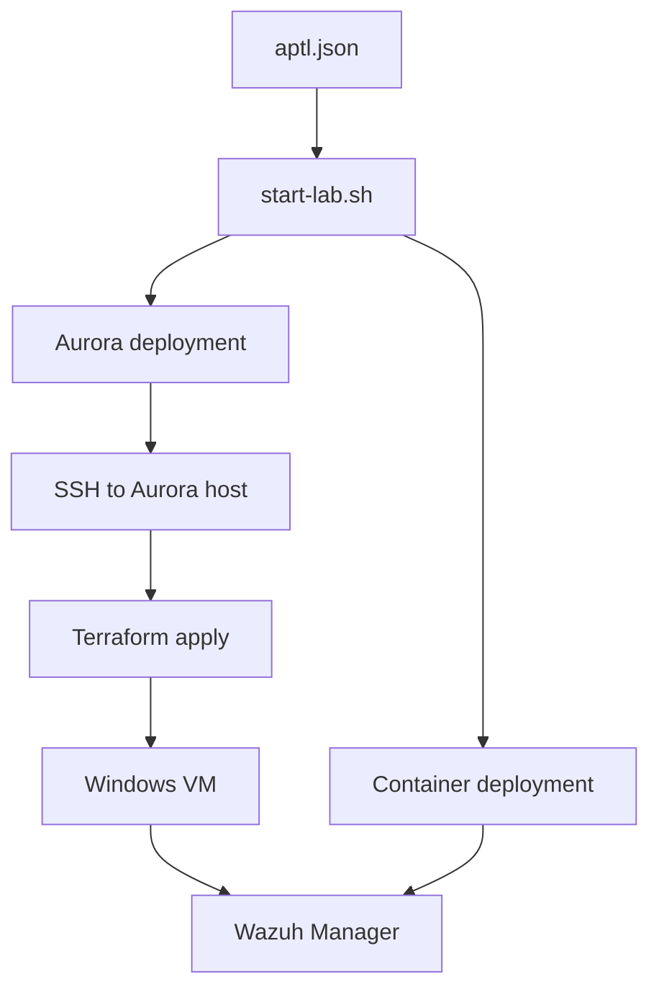
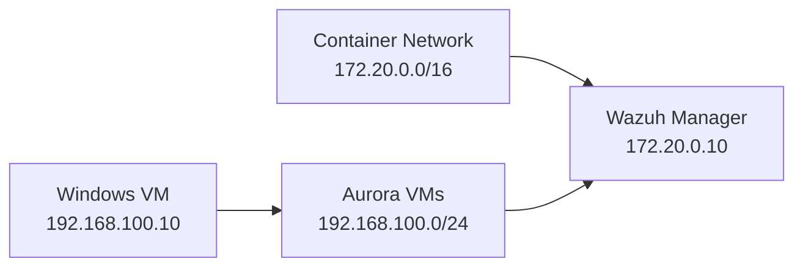

# Aurora VM Infrastructure

Aurora extends APTL with full VMs on dedicated hardware for EDR testing.

## Architecture

Aurora deploys VMs via Terraform to remote KVM host. VMs connect to existing Wazuh SIEM.



## Configuration

Add to `aptl.json`:
```json
"aurora": {
    "config": {
        "host": "192.168.1.72",
        "user": "vmadmin", 
        "key": "~/.ssh/id_rsa"
    },
    "vms": {
        "windows-victim": false
    }
}
```

## Network Topology



## Deployment

Aurora VMs deploy when any `aurora.vms.*` is `true`:

1. SSH connectivity check
2. Terraform deployment of enabled VMs
3. VM network configuration to reach Wazuh
4. Connection info added to `lab_connections.txt`

## Components

- `aurora/scripts/` - Deployment automation
- `aurora/terraform/` - VM infrastructure definitions  
- `aurora/mcp/` - MCP server for VM management

## Requirements

- Aurora host with KVM/libvirt/Terraform
- SSH key authentication to Aurora
- Network routing between VM and container networks