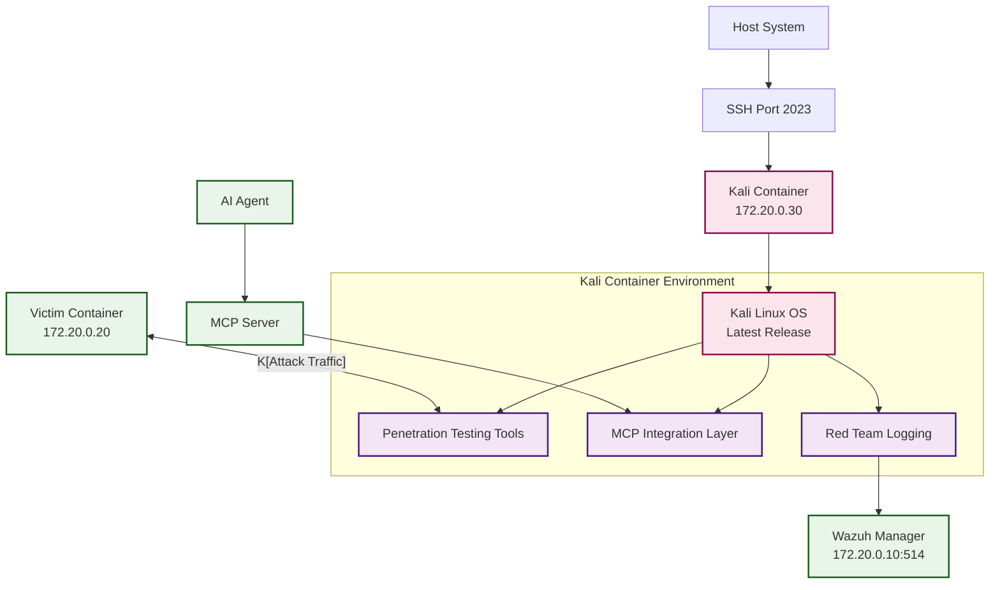

# Kali Red Team Platform

The Kali Linux container in APTL serves as a comprehensive penetration testing and red team platform. It provides a realistic attack environment with full access to industry-standard security tools while maintaining complete isolation within the Docker lab network.

## Overview

The Kali container is built from the latest official Kali Linux image and includes a comprehensive suite of penetration testing tools. It's specifically configured for purple team operations with structured logging and MCP integration for AI-driven red team activities.

### Key Features

- **Latest Kali Linux**: Based on official kalilinux/kali-last-release image
- **Full Tool Suite**: Complete penetration testing toolkit pre-installed
- **AI Integration**: Model Context Protocol (MCP) server integration
- **Structured Logging**: All red team activities logged for blue team analysis
- **Network Isolation**: Contained within Docker lab network
- **SSH Access**: Secure shell access for manual and automated operations

## Container Architecture



## Container Configuration

### Base Image

The Kali container is built from the official Kali Linux Docker image:

```dockerfile
FROM kalilinux/kali-last-release:latest

# Update package repositories
RUN apt-get update && apt-get -y upgrade

# Install essential tools
RUN apt-get install -y \
    kali-tools-top10 \
    openssh-server \
    curl \
    wget \
    python3 \
    python3-pip \
    netcat \
    nmap \
    nikto \
    gobuster \
    hydra \
    metasploit-framework \
    sqlmap \
    && apt-get clean
```

### System Configuration

#### SSH Service Setup

SSH is configured for both manual access and MCP server automation:

```bash
# SSH configuration for Kali container
Port 22
PasswordAuthentication no
PubkeyAuthentication yes
PermitRootLogin no
ClientAliveInterval 300
UseDNS no
```

**Security Features:**
- SSH key-only authentication
- Non-root access (kali user)
- Connection keep-alive for automation
- DNS lookup disabled for faster connections

#### User Configuration

The container runs with a dedicated `kali` user:

```bash
# Primary user for red team operations
kali:x:1000:1000:Kali Linux User:/home/kali:/bin/bash

# SSH key authentication configured
/home/kali/.ssh/authorized_keys (from host key)
```

### Tool Categories

#### Reconnaissance Tools

Network and service discovery capabilities:

- **nmap**: Network discovery and port scanning
- **masscan**: High-speed port scanner
- **gobuster**: Directory and subdomain enumeration
- **nikto**: Web vulnerability scanner
- **whatweb**: Website technology identifier

```bash
# Example reconnaissance commands
nmap -sV -sC 172.20.0.20
gobuster dir -u http://172.20.0.20 -w /usr/share/wordlists/dirbuster/directory-list-2.3-medium.txt
nikto -h http://172.20.0.20
```

#### Exploitation Tools

Vulnerability exploitation and penetration:

- **metasploit-framework**: Comprehensive exploitation platform
- **sqlmap**: SQL injection testing tool
- **hydra**: Network authentication cracker
- **john**: Password cracking tool
- **hashcat**: Advanced password recovery

```bash
# Example exploitation commands
msfconsole
sqlmap -u "http://172.20.0.20/login.php" --dbs
hydra -l admin -P /usr/share/wordlists/rockyou.txt ssh://172.20.0.20
```

#### Post-Exploitation Tools

Persistence and lateral movement:

- **netcat**: Network utility for backdoors
- **socat**: Advanced network relay
- **python3**: Scripting and payload development
- **git**: Version control for custom tools

#### Web Application Testing

Specialized web security tools:

- **burpsuite**: Web application security testing (community edition)
- **owasp-zap**: Web application security scanner
- **wpscan**: WordPress vulnerability scanner
- **dirb**: Web content scanner

## Network Configuration

### Container Networking

- **Internal IP**: 172.20.0.30 (static assignment)
- **Network**: aptl_aptl-network (Docker bridge)
- **SSH Access**: Host port 2023 → Container port 22

### Target Access

The Kali container has direct network access to all lab targets:

| Target | IP Address | Services | Common Ports |
|--------|------------|----------|--------------|
| Victim Container | 172.20.0.20 | SSH, HTTP, FTP | 22, 80, 21 |
| Wazuh Manager | 172.20.0.10 | SIEM, API | 1514, 55000 |
| Wazuh Dashboard | 172.20.0.11 | Web Interface | 5601 |
| Wazuh Indexer | 172.20.0.12 | Search API | 9200 |

### Firewall Configuration

The container has unrestricted outbound access within the lab network:

```bash
# Network connectivity testing
ping 172.20.0.20    # Victim container
nc -zv 172.20.0.20 22    # SSH port check
curl http://172.20.0.20  # HTTP service test
```

## Red Team Logging

### Structured Activity Logging

All red team activities are automatically logged with structured data:

```bash
#!/bin/bash
# Red team logging script (/home/kali/redteam_logging.sh)

log_activity() {
    local activity="$1"
    local tool="$2"
    local target="$3"
    local success="$4"
    
    logger -p local0.info -t "APTL-RedTeam" \
        "Activity: $activity | Tool: $tool | Target: $target | Success: $success | User: $(whoami) | Time: $(date -Iseconds)"
}

# Usage examples:
log_activity "port_scan" "nmap" "172.20.0.20" "true"
log_activity "web_scan" "gobuster" "172.20.0.20" "false"
log_activity "ssh_brute" "hydra" "172.20.0.20" "true"
```

### Log Format

Red team logs follow a structured format for SIEM analysis:

```json
{
  "timestamp": "2024-01-15T10:30:00Z",
  "source": "kali-redteam",
  "source_ip": "172.20.0.30",
  "activity_type": "reconnaissance",
  "tool_used": "nmap",
  "target_ip": "172.20.0.20",
  "target_service": "ssh",
  "success": true,
  "command": "nmap -sV -p 22 172.20.0.20",
  "user": "kali"
}
```

### SIEM Integration

Logs are forwarded to Wazuh Manager via rsyslog:

```bash
# /etc/rsyslog.d/90-redteam.conf
local0.*    @@172.20.0.10:514

# Custom log routing for red team activities
:syslogtag, contains, "APTL-RedTeam" @@172.20.0.10:514
```

## MCP Integration

### Model Context Protocol Setup

The MCP server provides AI agents with controlled SSH access to lab containers:

```typescript
// MCP server tool definitions
const tools = [
  {
    name: "kali_info",
    description: "Get information about the Kali Linux instance in the lab",
    inputSchema: {
      type: "object",
      properties: {}
    }
  },
  {
    name: "run_command", 
    description: "Execute a command on a target instance in the lab",
    inputSchema: {
      type: "object",
      properties: {
        target: { type: "string", description: "Target IP address or hostname" },
        command: { type: "string", description: "Command to execute" },
        username: { type: "string", description: "SSH username (optional)", default: "kali" }
      },
      required: ["target", "command"]
    }
  }
];
```

### AI Agent Commands

AI agents execute commands via SSH to lab containers:

```typescript
// Example AI-driven commands via MCP
await mcp.run_command("172.20.0.20", "nmap -sV 172.20.0.20", "kali");
await mcp.run_command("172.20.0.20", "gobuster dir -u http://172.20.0.20 -w /usr/share/wordlists/common.txt", "labadmin");
await mcp.kali_info();
```

### Safety Controls

MCP integration includes safety controls:

- **SSH Key Management**: Automatic credential selection for targets
- **Target Validation**: Commands validated against lab configuration
- **Connection Management**: Automated SSH connection handling  
- **Error Handling**: Proper error reporting for failed commands

## Access Methods

### Manual SSH Access

Direct SSH access for hands-on red team operations:

```bash
# SSH from host to Kali container
ssh -i ~/.ssh/aptl_lab_key kali@localhost -p 2023

# Direct container shell access (debugging)
docker exec -it aptl-kali /bin/bash
```

### Container-to-Container Communication

Internal network access between containers:

```bash
# From Kali container to victim
ssh kali@172.20.0.20  # If SSH keys configured
nc 172.20.0.20 80     # Direct network connection
curl http://172.20.0.20  # HTTP requests
```

### Tool Execution Examples

Common penetration testing workflows:

```bash
# Network reconnaissance
nmap -sn 172.20.0.0/24  # Network discovery
nmap -sV -sC 172.20.0.20  # Service detection

# Web application testing  
gobuster dir -u http://172.20.0.20 -w /usr/share/wordlists/common.txt
nikto -h http://172.20.0.20

# Authentication testing
hydra -l admin -P /usr/share/wordlists/rockyou.txt ssh://172.20.0.20
hydra -l admin -P /usr/share/wordlists/common.txt http-post-form://172.20.0.20/login:username=^USER^&password=^PASS^:invalid

# Exploitation
msfconsole -q -x "use auxiliary/scanner/ssh/ssh_login; set RHOSTS 172.20.0.20; set USERNAME admin; set PASS_FILE /usr/share/wordlists/common.txt; run"
```

## Operational Workflows

### Standard Red Team Process

1. **Reconnaissance Phase**
   ```bash
   # Network discovery
   nmap -sn 172.20.0.0/24
   
   # Port scanning
   nmap -sV -sC 172.20.0.20
   
   # Service enumeration
   gobuster dir -u http://172.20.0.20 -w /usr/share/wordlists/common.txt
   ```

2. **Vulnerability Assessment**
   ```bash
   # Web vulnerability scanning
   nikto -h http://172.20.0.20
   
   # SSL/TLS testing
   sslscan 172.20.0.20:443
   
   # SMB enumeration (if available)
   enum4linux 172.20.0.20
   ```

3. **Exploitation Phase**
   ```bash
   # Authentication attacks
   hydra -l admin -P /usr/share/wordlists/rockyou.txt ssh://172.20.0.20
   
   # Web application attacks
   sqlmap -u "http://172.20.0.20/login.php" --forms --dbs
   
   # Metasploit exploitation
   msfconsole
   ```

4. **Post-Exploitation**
   ```bash
   # Establish persistence
   nc -l -p 4444  # Reverse shell listener
   
   # Information gathering
   cat /etc/passwd
   ls -la /home/
   ps aux
   ```

### Purple Team Scenarios

#### Scenario 1: Network Reconnaissance Detection

**Red Team Actions:**
```bash
# Aggressive network scan
nmap -sS -O -sV -sC 172.20.0.20

# Port scan logging
log_activity "port_scan" "nmap" "172.20.0.20" "true"
```

**Blue Team Detection Points:**
- Multiple connection attempts in short timeframe
- OS fingerprinting patterns
- Service version probing

#### Scenario 2: Web Application Attack Chain

**Red Team Actions:**
```bash
# Directory enumeration
gobuster dir -u http://172.20.0.20 -w /usr/share/wordlists/dirbuster/directory-list-2.3-medium.txt

# Vulnerability scanning
nikto -h http://172.20.0.20

# SQL injection testing
sqlmap -u "http://172.20.0.20/search.php?q=test" --dbs
```

**Blue Team Detection Points:**
- Suspicious user agents
- Directory brute forcing patterns
- SQL injection attempt signatures

#### Scenario 3: Credential Attack Campaign

**Red Team Actions:**
```bash
# SSH brute force
hydra -l admin -P /usr/share/wordlists/rockyou.txt ssh://172.20.0.20

# HTTP form brute force
hydra -l admin -P /usr/share/wordlists/common.txt http-post-form://172.20.0.20/login:username=^USER^&password=^PASS^:invalid
```

**Blue Team Detection Points:**
- Multiple authentication failures
- Account lockout triggers
- Unusual login patterns

## Container Management

### Lifecycle Operations

```bash
# Container management commands
docker compose up -d kali          # Start Kali container
docker compose stop kali           # Stop Kali container  
docker compose restart kali        # Restart Kali container
docker compose logs -f kali        # View container logs
```

### Health Monitoring

```bash
# Container health checks
docker compose ps kali

# Service status inside container
docker exec aptl-kali systemctl status ssh
docker exec aptl-kali ps aux | grep ssh

# Network connectivity testing
docker exec aptl-kali ping 172.20.0.20
docker exec aptl-kali nc -zv 172.20.0.20 22
```

### Resource Monitoring

```bash
# Resource usage monitoring
docker stats aptl-kali

# Disk usage
docker exec aptl-kali df -h

# Memory usage
docker exec aptl-kali free -h
```

## Customization and Extensions

### Adding Custom Tools

Extend the Kali container with additional tools:

```dockerfile
# Custom tools installation
RUN apt-get install -y \
    bloodhound \
    empire-framework \
    powersploit \
    && apt-get clean

# Custom script installation
COPY scripts/ /home/kali/scripts/
RUN chown -R kali:kali /home/kali/scripts/
RUN chmod +x /home/kali/scripts/*.sh
```

### Custom Wordlists

Add scenario-specific wordlists:

```bash
# Create custom wordlist directory
mkdir /home/kali/wordlists

# Add custom password lists
echo "admin" > /home/kali/wordlists/common-passwords.txt
echo "password" >> /home/kali/wordlists/common-passwords.txt
echo "123456" >> /home/kali/wordlists/common-passwords.txt
```

### Automated Attack Scripts

Create reusable attack automation:

```python
#!/usr/bin/env python3
# /home/kali/scripts/auto_recon.py

import subprocess
import sys
import json

def run_nmap(target):
    """Execute nmap scan and return results"""
    cmd = f"nmap -sV -sC {target}"
    result = subprocess.run(cmd.split(), capture_output=True, text=True)
    return result.stdout

def run_gobuster(target):
    """Execute directory enumeration"""
    cmd = f"gobuster dir -u http://{target} -w /usr/share/wordlists/common.txt -q"
    result = subprocess.run(cmd.split(), capture_output=True, text=True)
    return result.stdout

if __name__ == "__main__":
    target = sys.argv[1] if len(sys.argv) > 1 else "172.20.0.20"
    
    print(f"[+] Starting reconnaissance against {target}")
    
    # Network scan
    print("[+] Running nmap scan...")
    nmap_results = run_nmap(target)
    
    # Web enumeration
    print("[+] Running directory enumeration...")
    gobuster_results = run_gobuster(target)
    
    # Log activities
    subprocess.run(["/home/kali/redteam_logging.sh", "auto_recon", "python3", target, "true"])
```

## Security Considerations

### Container Isolation

- **Network Isolation**: Cannot reach external networks
- **Process Isolation**: Runs in separate container namespace
- **File System Isolation**: Container filesystem separate from host
- **User Isolation**: Non-root execution within container

### Lab Safety

- **Target Validation**: Tools configured to only target lab ranges
- **Activity Logging**: All operations logged for accountability
- **Easy Reset**: Container can be destroyed and recreated
- **No Persistence**: Attack artifacts contained within lab

### Ethical Usage

- **Educational Purpose**: Designed for security training and research
- **Controlled Environment**: All activities contained within lab
- **Audit Trail**: Comprehensive logging for review
- **Responsible Disclosure**: Any real vulnerabilities found should be reported responsibly

## Troubleshooting

### Common Issues

1. **SSH Connection Problems**
   ```bash
   # Check SSH service
   docker exec aptl-kali systemctl status ssh
   
   # Verify SSH key
   docker exec aptl-kali cat /home/kali/.ssh/authorized_keys
   
   # Test SSH connectivity
   ssh -i ~/.ssh/aptl_lab_key -o ConnectTimeout=5 kali@localhost -p 2023
   ```

2. **Tool Execution Issues**
   ```bash
   # Check tool availability
   docker exec aptl-kali which nmap
   docker exec aptl-kali nmap --version
   
   # Update package database
   docker exec aptl-kali apt-get update
   ```

3. **Network Connectivity Issues**
   ```bash
   # Test internal network connectivity
   docker exec aptl-kali ping 172.20.0.20
   docker exec aptl-kali nc -zv 172.20.0.20 22
   
   # Check network configuration
   docker exec aptl-kali ip addr show
   docker exec aptl-kali ip route show
   ```

### Performance Issues

```bash
# Monitor container resources
docker stats aptl-kali

# Check for resource limits
docker inspect aptl-kali | grep -i memory
docker inspect aptl-kali | grep -i cpu
```

### Log Analysis

```bash
# Check container logs
docker compose logs kali

# Check red team activity logs
docker exec aptl-kali journalctl -t "APTL-RedTeam" -f

# Check SSH authentication logs
docker exec aptl-kali journalctl -u ssh -f
```

## Next Steps

- **[MCP Integration](mcp-integration.md)** - AI agent integration details
- **[Usage Examples](../usage/exercises.md)** - Practical red team scenarios
- **[Wazuh SIEM](wazuh-siem.md)** - Blue team monitoring and detection