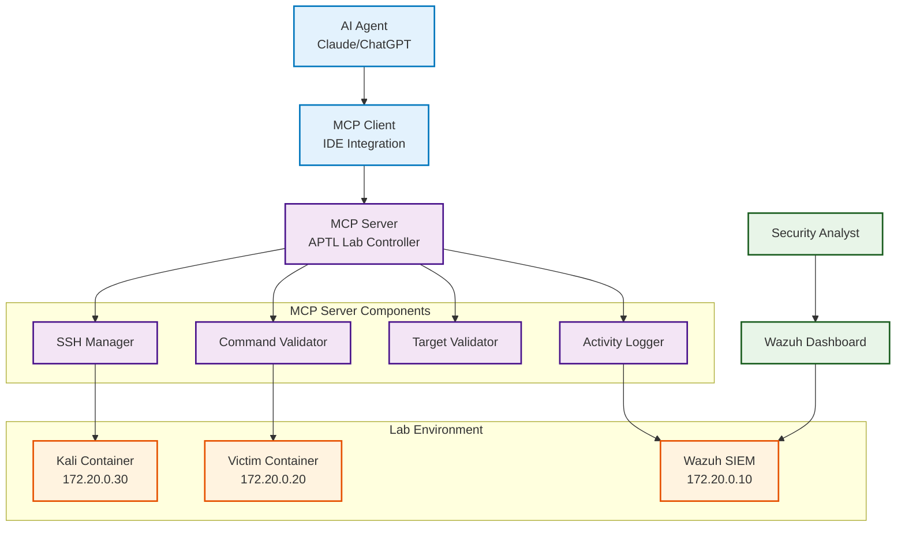

# MCP Integration

The Model Context Protocol (MCP) integration in APTL enables AI agents to autonomously conduct red team operations while maintaining safety controls and comprehensive logging. This integration transforms the lab from a manual testing environment into an AI-powered autonomous cyber operations demonstration platform.

## Overview

MCP (Model Context Protocol) is an open protocol that enables AI agents to securely interact with external tools and systems. In APTL, the MCP server provides AI agents with controlled access to the Kali Linux container and its penetration testing tools.

### Key Capabilities

- **Autonomous Red Team Operations**: AI agents can independently conduct reconnaissance, vulnerability assessment, and exploitation
- **Safety Controls**: Built-in safeguards prevent misuse and ensure operations stay within lab boundaries
- **Comprehensive Logging**: All AI actions are logged with detailed metadata for analysis
- **Real-time Adaptation**: AI agents can adapt attack strategies based on system responses
- **Purple Team Integration**: AI red team actions trigger blue team detection and response workflows

## Architecture



## MCP Server Implementation

### Server Configuration

The MCP server is implemented in TypeScript and runs locally:

```typescript
// src/index.ts - Main MCP server entry point
import { Server } from "@modelcontextprotocol/sdk/server/index.js";
import { StdioServerTransport } from "@modelcontextprotocol/sdk/server/stdio.js";

const server = new Server(
  {
    name: "aptl-lab",
    version: "1.0.0",
  },
  {
    capabilities: {
      tools: {},
    },
  }
);

// Register tools for AI agent access
server.setRequestHandler(ListToolsRequestSchema, async () => {
  return {
    tools: [
      {
        name: "kali_info",
        description: "Get information about the lab environment and available targets",
        inputSchema: {
          type: "object",
          properties: {
            query_type: {
              type: "string",
              enum: ["network", "services", "containers", "status"],
              description: "Type of information to retrieve"
            }
          }
        }
      },
      {
        name: "run_command",
        description: "Execute red team command on Kali container",
        inputSchema: {
          type: "object",
          properties: {
            command: {
              type: "string",
              description: "Command to execute (will be validated for safety)"
            },
            target: {
              type: "string", 
              description: "Target IP or hostname (must be within lab network)"
            },
            tool: {
              type: "string",
              description: "Tool being used (for logging purposes)"
            }
          },
          required: ["command"]
        }
      }
    ]
  };
});
```

### Tool Implementations

#### kali_info Tool

Provides AI agents with lab environment information:

```typescript
async function handleKaliInfo(query_type?: string) {
  const labInfo = {
    network: {
      lab_network: "172.20.0.0/16",
      containers: {
        "wazuh.manager": "172.20.0.10",
        "wazuh.dashboard": "172.20.0.11", 
        "wazuh.indexer": "172.20.0.12",
        "victim": "172.20.0.20",
        "kali": "172.20.0.30"
      }
    },
    services: {
      "172.20.0.20": ["SSH (22)", "HTTP (80)", "FTP (21)"],
      "172.20.0.10": ["Syslog (514)", "API (55000)"],
      "172.20.0.11": ["Dashboard (5601)"],
      "172.20.0.12": ["OpenSearch (9200)"]
    },
    status: await checkLabStatus()
  };
  
  return query_type ? labInfo[query_type] : labInfo;
}
```

#### run_command Tool

Executes validated commands on the Kali container:

```typescript
async function handleRunCommand(command: string, target?: string, tool?: string) {
  // Validate command safety
  const validationResult = await validateCommand(command);
  if (!validationResult.safe) {
    throw new Error(`Command validation failed: ${validationResult.reason}`);
  }
  
  // Validate target if specified
  if (target && !isValidLabTarget(target)) {
    throw new Error(`Invalid target: ${target}. Must be within lab network 172.20.0.0/16`);
  }
  
  // Log the activity
  await logRedTeamActivity({
    timestamp: new Date().toISOString(),
    agent: "ai-mcp",
    command: command,
    target: target,
    tool: tool || "unknown",
    validation: validationResult
  });
  
  // Execute command via SSH
  const result = await executeOnKali(command);
  
  // Log the result
  await logRedTeamResult({
    command: command,
    success: result.exitCode === 0,
    output: result.stdout,
    errors: result.stderr
  });
  
  return {
    success: result.exitCode === 0,
    output: result.stdout,
    errors: result.stderr,
    command: command,
    target: target
  };
}
```

### Safety Controls

#### Command Validation

All AI-submitted commands go through safety validation:

```typescript
interface ValidationResult {
  safe: boolean;
  reason?: string;
  modified_command?: string;
}

async function validateCommand(command: string): Promise<ValidationResult> {
  // Block dangerous commands
  const blockedPatterns = [
    /rm\s+-rf\s+\//, // Destructive file operations
    /dd\s+if=.*of=/, // Disk operations
    /mkfs/, // Filesystem operations
    /shutdown|reboot|halt/, // System control
    /iptables.*-F/, // Firewall manipulation
    /nc.*-e.*sh/, // Reverse shells to external
  ];
  
  for (const pattern of blockedPatterns) {
    if (pattern.test(command)) {
      return {
        safe: false,
        reason: `Command contains blocked pattern: ${pattern}`
      };
    }
  }
  
  // Validate target restrictions
  const targetPattern = /(\d{1,3}\.\d{1,3}\.\d{1,3}\.\d{1,3})/g;
  const targets = command.match(targetPattern);
  
  if (targets) {
    for (const target of targets) {
      if (!isValidLabTarget(target)) {
        return {
          safe: false,
          reason: `Command targets external IP: ${target}`
        };
      }
    }
  }
  
  return { safe: true };
}

function isValidLabTarget(target: string): boolean {
  // Only allow lab network ranges
  const labRanges = [
    '172.20.0.0/16',    // Primary lab network
    '127.0.0.1',        // Localhost
    'localhost'         // Localhost hostname
  ];
  
  return labRanges.some(range => {
    if (range.includes('/')) {
      return isInSubnet(target, range);
    }
    return target === range;
  });
}
```

#### Target Validation

Ensures AI agents can only target lab systems:

```typescript
const VALID_LAB_TARGETS = {
  '172.20.0.10': 'wazuh.manager',
  '172.20.0.11': 'wazuh.dashboard', 
  '172.20.0.12': 'wazuh.indexer',
  '172.20.0.20': 'victim',
  '172.20.0.30': 'kali',
  'localhost': 'host-system'
};

function validateTarget(target: string): boolean {
  // Resolve hostname to IP if needed
  const resolvedTarget = resolveTarget(target);
  
  // Check if target is in allowed list
  return Object.keys(VALID_LAB_TARGETS).includes(resolvedTarget);
}
```

## Client Configuration

### Cursor IDE Setup

Configure Cursor to connect to the APTL MCP server:

```json
// .cursor/mcp.json
{
  "mcpServers": {
    "aptl-lab": {
      "command": "node",
      "args": ["./mcp/dist/index.js"],
      "cwd": ".",
      "env": {
        "APTL_LAB_CONFIG": "./mcp/docker-lab-config.json"
      }
    }
  }
}
```

### Cline (VS Code) Setup

Add the APTL MCP server to Cline's configuration:

```json
// Cline MCP settings
{
  "aptl-lab": {
    "command": "node", 
    "args": ["./mcp/dist/index.js"],
    "cwd": "/path/to/aptl",
    "env": {
      "APTL_LAB_CONFIG": "./mcp/docker-lab-config.json"
    }
  }
}
```

### Configuration File

The MCP server uses a configuration file to define lab parameters:

```json
// mcp/docker-lab-config.json
{
  "lab": {
    "name": "APTL Docker Lab",
    "network": "172.20.0.0/16",
    "containers": {
      "kali": {
        "ip": "172.20.0.30",
        "ssh_port": 2023,
        "ssh_user": "kali",
        "ssh_key": "~/.ssh/aptl_lab_key"
      },
      "victim": {
        "ip": "172.20.0.20", 
        "ssh_port": 2022,
        "ssh_user": "labadmin",
        "services": ["ssh", "http", "ftp"]
      },
      "wazuh": {
        "manager_ip": "172.20.0.10",
        "dashboard_ip": "172.20.0.11",
        "indexer_ip": "172.20.0.12"
      }
    }
  },
  "safety": {
    "allowed_networks": ["172.20.0.0/16"],
    "blocked_commands": [
      "rm -rf /",
      "shutdown",
      "reboot",
      "mkfs",
      "dd if=",
      "iptables -F"
    ],
    "max_command_length": 1000,
    "rate_limit": {
      "commands_per_minute": 30,
      "commands_per_hour": 500
    }
  },
  "logging": {
    "level": "info",
    "destinations": ["console", "file", "siem"],
    "siem_endpoint": "172.20.0.10:514"
  }
}
```

## AI Agent Workflows

### Autonomous Reconnaissance

AI agents can perform comprehensive reconnaissance:

```typescript
// Example AI agent workflow
async function autonomousRecon(target: string) {
  const agent = new AIRedTeamAgent();
  
  // Get lab information
  const labInfo = await agent.kali_info("network");
  
  // Network discovery
  const nmapResult = await agent.run_command(
    `nmap -sn ${labInfo.lab_network}`,
    target,
    "nmap"
  );
  
  // Port scanning
  const portScan = await agent.run_command(
    `nmap -sV -sC ${target}`,
    target, 
    "nmap"
  );
  
  // Web enumeration if HTTP is detected
  if (portScan.output.includes("80/tcp open")) {
    const webEnum = await agent.run_command(
      `gobuster dir -u http://${target} -w /usr/share/wordlists/common.txt`,
      target,
      "gobuster" 
    );
  }
  
  return {
    network_scan: nmapResult,
    port_scan: portScan,
    web_enumeration: webEnum
  };
}
```

### Vulnerability Assessment

AI-driven vulnerability discovery:

```typescript
async function vulnerabilityAssessment(target: string) {
  const agent = new AIRedTeamAgent();
  
  // Web vulnerability scanning
  const niktoResult = await agent.run_command(
    `nikto -h http://${target}`,
    target,
    "nikto"
  );
  
  // SSL/TLS assessment if HTTPS is available
  const sslScan = await agent.run_command(
    `sslscan ${target}:443`,
    target,
    "sslscan"
  );
  
  // Service-specific checks
  const serviceChecks = await agent.run_command(
    `nmap -sV --script vuln ${target}`,
    target,
    "nmap"
  );
  
  return {
    web_vulnerabilities: niktoResult,
    ssl_assessment: sslScan,
    service_vulnerabilities: serviceChecks
  };
}
```

### Adaptive Exploitation

AI agents can adapt exploitation strategies based on discovered vulnerabilities:

```typescript
async function adaptiveExploitation(target: string, vulnerabilities: any[]) {
  const agent = new AIRedTeamAgent();
  
  for (const vuln of vulnerabilities) {
    if (vuln.type === "weak_credentials") {
      // Attempt credential attacks
      const bruteForce = await agent.run_command(
        `hydra -l admin -P /usr/share/wordlists/common.txt ssh://${target}`,
        target,
        "hydra"
      );
      
      if (bruteForce.success) {
        // Log successful compromise
        await logCompromise(target, "weak_credentials", bruteForce.output);
        return { success: true, method: "credential_attack" };
      }
    }
    
    if (vuln.type === "web_vulnerability") {
      // Attempt web exploitation
      const sqlMap = await agent.run_command(
        `sqlmap -u "http://${target}/search.php?q=test" --batch --dbs`,
        target,
        "sqlmap"
      );
      
      if (sqlMap.output.includes("available databases")) {
        await logCompromise(target, "sql_injection", sqlMap.output);
        return { success: true, method: "sql_injection" };
      }
    }
  }
  
  return { success: false, attempts: vulnerabilities.length };
}
```

## Activity Logging

### Comprehensive Logging

All MCP activities are logged with detailed metadata:

```typescript
interface MCPActivityLog {
  timestamp: string;
  agent_id: string;
  agent_type: "ai" | "human";
  tool_used: string;
  command: string;
  target?: string;
  validation_result: ValidationResult;
  execution_result: {
    success: boolean;
    output: string;
    errors?: string;
    duration_ms: number;
  };
  context: {
    session_id: string;
    conversation_id?: string;
    objective?: string;
  };
}

async function logMCPActivity(activity: MCPActivityLog) {
  // Log to local file
  await appendToFile('./logs/mcp-activity.log', JSON.stringify(activity));
  
  // Forward to SIEM
  await forwardToSIEM('172.20.0.10:514', {
    facility: 'local1',
    severity: 'info',
    tag: 'APTL-MCP',
    message: JSON.stringify(activity)
  });
  
  // Store in database (if configured)
  if (config.database.enabled) {
    await database.insertActivity(activity);
  }
}
```

### SIEM Integration

MCP logs are forwarded to Wazuh for blue team analysis:

```xml
<!-- Wazuh rule for MCP activity detection -->
<group name="aptl,mcp,ai_redteam">
  <rule id="100050" level="5">
    <decoded_as>json</decoded_as>
    <field name="tag">APTL-MCP</field>
    <description>AI red team activity via MCP detected</description>
  </rule>
  
  <rule id="100051" level="7">
    <if_sid>100050</if_sid>
    <field name="tool_used">hydra|sqlmap|metasploit</field>
    <description>AI red team exploitation tool usage detected</description>
  </rule>
  
  <rule id="100052" level="10">
    <if_sid>100050</if_sid>
    <field name="execution_result.success">true</field>
    <field name="tool_used">hydra</field>
    <description>AI red team successful credential attack</description>
  </rule>
</group>
```

## Purple Team Scenarios

### Scenario 1: AI-Driven Network Reconnaissance

**AI Agent Actions:**
```typescript
// AI agent discovers the network
const networkInfo = await mcp.kali_info("network");
const discovery = await mcp.run_command("nmap -sn 172.20.0.0/24", undefined, "nmap");
const portScan = await mcp.run_command("nmap -sV -sC 172.20.0.20", "172.20.0.20", "nmap");
```

**Blue Team Response:**
- Monitor for network scanning patterns
- Detect AI agent signatures in User-Agent strings
- Correlate MCP logs with network events

### Scenario 2: Autonomous Web Application Testing

**AI Agent Actions:**
```typescript
// AI agent performs web application testing
const dirEnum = await mcp.run_command(
  "gobuster dir -u http://172.20.0.20 -w /usr/share/wordlists/common.txt",
  "172.20.0.20", 
  "gobuster"
);
const vulnScan = await mcp.run_command("nikto -h http://172.20.0.20", "172.20.0.20", "nikto");
```

**Blue Team Response:**
- Detect directory brute forcing attempts
- Monitor for web vulnerability scanner signatures
- Track automated vs. manual attack patterns

### Scenario 3: AI Credential Attack Campaign

**AI Agent Actions:**
```typescript
// AI agent attempts credential attacks
const sshBrute = await mcp.run_command(
  "hydra -l admin -P /usr/share/wordlists/common.txt ssh://172.20.0.20",
  "172.20.0.20",
  "hydra"
);
```

**Blue Team Response:**
- Monitor authentication failure rates
- Detect brute force attack patterns
- Correlate AI decision-making with attack progression

## Performance and Monitoring

### MCP Server Monitoring

Monitor MCP server performance and health:

```typescript
// Performance metrics collection
const metrics = {
  commands_executed: commandCounter,
  average_response_time: calculateAverageResponseTime(),
  active_sessions: getActiveSessions(),
  validation_failures: validationFailureCounter,
  rate_limit_hits: rateLimitCounter
};

// Health check endpoint
async function healthCheck() {
  return {
    status: "healthy",
    version: "1.0.0",
    uptime: process.uptime(),
    lab_connectivity: await testLabConnectivity(),
    metrics: metrics
  };
}
```

### Resource Usage

Track resource consumption:

```bash
# Monitor MCP server resource usage
ps aux | grep "node.*mcp"
netstat -tlnp | grep :8080

# Monitor container resource usage during AI operations
docker stats aptl-kali aptl-victim

# Track log file sizes
du -h logs/mcp-activity.log
```

## Security Considerations

### MCP Server Security

- **Local Only**: Server binds only to localhost
- **No External Access**: Cannot be accessed from outside the host
- **Command Validation**: All commands validated before execution
- **Rate Limiting**: Prevents resource exhaustion attacks

### AI Agent Limitations

- **Network Boundaries**: Cannot target systems outside lab network
- **Command Restrictions**: Dangerous commands blocked at multiple levels
- **Session Limits**: Time and resource limits on AI sessions
- **Audit Trail**: All activities logged for forensic analysis

### Lab Environment Protection

- **Container Isolation**: AI actions contained within Docker network
- **Easy Reset**: Lab can be completely reset if compromised
- **No Persistence**: AI cannot establish persistence outside containers
- **Monitoring**: Comprehensive logging and SIEM integration

## Troubleshooting

### MCP Server Issues

1. **Server Won't Start**
   ```bash
   # Check Node.js version
   node --version  # Should be v18+
   
   # Check MCP server logs
   cd mcp && npm run build && node dist/index.js
   ```

2. **Connection Issues**
   ```bash
   # Test SSH connectivity to Kali container
   ssh -i ~/.ssh/aptl_lab_key kali@localhost -p 2023
   
   # Check container status
   docker compose ps kali
   ```

3. **Command Validation Errors**
   ```typescript
   // Check validation logs
   tail -f logs/mcp-activity.log | grep validation_result
   ```

### AI Agent Issues

1. **Tool Not Found**
   - Verify MCP server is running and accessible
   - Check IDE MCP configuration
   - Restart IDE if necessary

2. **Command Execution Failures**
   - Check target validation logs
   - Verify container connectivity
   - Review safety control violations

3. **Performance Issues**
   - Monitor resource usage on host system
   - Check container memory limits
   - Review rate limiting configuration

## Development and Extension

### Adding Custom Tools

Extend the MCP server with custom tools:

```typescript
// Add new tool definition
{
  name: "custom_exploit",
  description: "Execute custom exploit against target",
  inputSchema: {
    type: "object",
    properties: {
      exploit_type: { type: "string", enum: ["web", "network", "service"] },
      target: { type: "string" },
      payload: { type: "string" }
    }
  }
}

// Implement tool handler
async function handleCustomExploit(exploit_type: string, target: string, payload: string) {
  // Validate exploit parameters
  const validation = await validateExploit(exploit_type, target, payload);
  if (!validation.safe) {
    throw new Error(`Exploit validation failed: ${validation.reason}`);
  }
  
  // Execute custom exploit logic
  const result = await executeCustomExploit(exploit_type, target, payload);
  
  return result;
}
```

### Custom Validation Rules

Add scenario-specific validation:

```typescript
// Custom validation for specific scenarios
function validateScenarioCommand(command: string, scenario: string): ValidationResult {
  const scenarioRules = {
    "web_testing": {
      allowed_tools: ["gobuster", "nikto", "sqlmap"],
      required_targets: ["172.20.0.20"]
    },
    "network_recon": {
      allowed_tools: ["nmap", "masscan"],
      scan_limits: { ports: 1000, hosts: 5 }
    }
  };
  
  const rules = scenarioRules[scenario];
  if (!rules) {
    return { safe: false, reason: "Unknown scenario" };
  }
  
  // Apply scenario-specific validation
  return validateAgainstRules(command, rules);
}
```

## Best Practices

### AI Agent Development

1. **Start Simple**: Begin with basic reconnaissance before complex exploitation
2. **Validate Inputs**: Always validate AI-generated commands and parameters
3. **Log Everything**: Comprehensive logging is essential for learning and debugging
4. **Test Safely**: Use the isolated lab environment for all testing

### Purple Team Training

1. **Progressive Scenarios**: Start with simple attacks, increase complexity gradually
2. **Varied Approaches**: Mix AI-driven and manual attack techniques
3. **Blue Team Focus**: Ensure defensive teams can observe and respond to AI attacks
4. **Debrief Sessions**: Review AI decision-making and detection effectiveness

### Operational Security

1. **Regular Updates**: Keep MCP server and dependencies updated
2. **Monitor Resources**: Watch for resource exhaustion during AI operations
3. **Review Logs**: Regular review of MCP activity logs for anomalies
4. **Backup Configs**: Maintain backups of working MCP configurations

## Next Steps

- **[Usage Examples](../usage/ai-red-teaming.md)** - Practical AI red team scenarios
- **[Troubleshooting](../troubleshooting/)** - Common issues and solutions
- **[Architecture](../architecture/)** - Understanding the overall system design