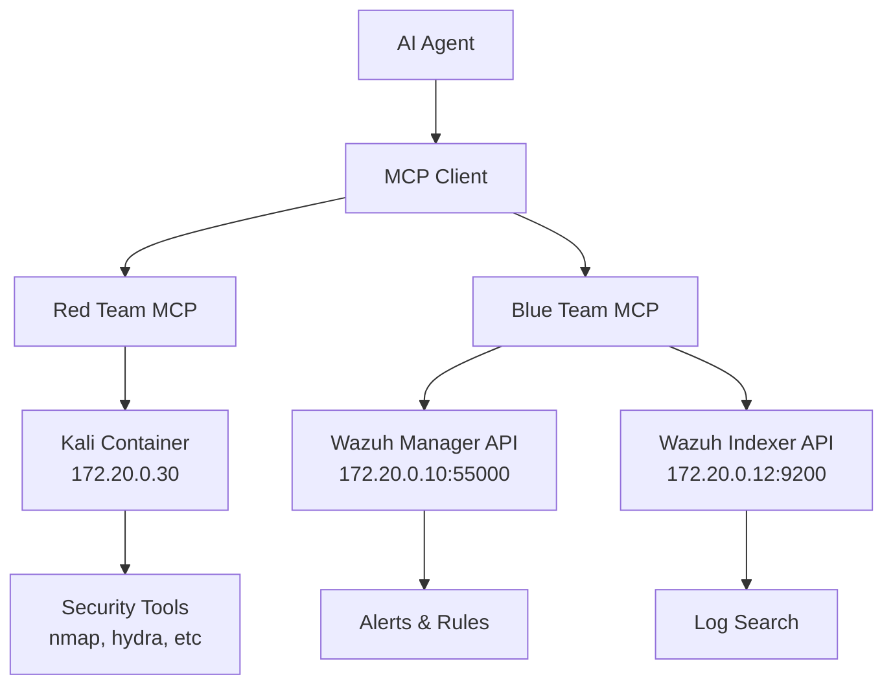

# MCP Integration

AI agents control lab containers via Model Context Protocol servers.

## Architecture

## MCP Servers

**Red Team MCP** (`/mcp-red`):
- SSH access to Kali container
- Tools: `kali_info`, `run_command`
- Target: 172.20.0.30

**Blue Team MCP** (`/mcp-blue`):
- Wazuh SIEM API access
- Tools: Alert queries, log search, rule creation
- APIs: Manager (55000), Indexer (9200)

## Setup

Build both MCP servers and configure your AI client to connect. 

See implementation details:
- [Red Team MCP](../../mcp-red/README.md)
- [Blue Team MCP](../../mcp-blue/README.md)

## Usage

**Red Team:**
- Display lab network information
- Execute commands on Kali container

**Blue Team:**
- Query security alerts
- Search historical logs  
- Create detection rules
- Get SIEM status