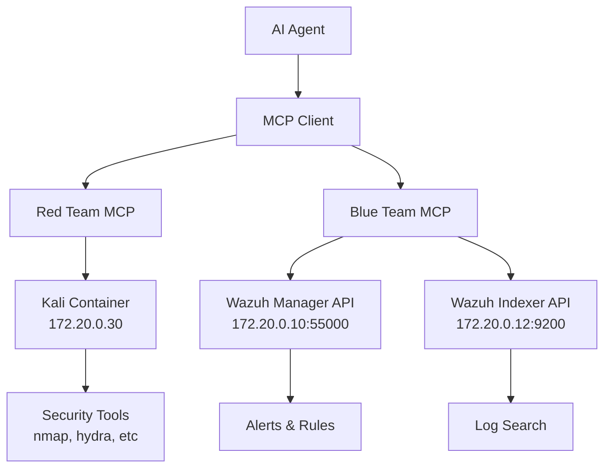

# MCP Integration

AI agents control lab containers via Model Context Protocol servers.

## Architecture


```mermaid
flowchart TD
    A[AI Agent] --> B[MCP Client]
    B --> C[Red Team MCP]
    B --> D[Blue Team MCP]

    C --> G[Kali Container<br/>172.20.0.30]
    D --> H[Wazuh Manager API<br/>172.20.0.10:55000]
    D --> I[Wazuh Indexer API<br/>172.20.0.12:9200]

    G --> L[Security Tools<br/>nmap, hydra, etc]
    H --> M[Alerts & Rules]
    I --> N[Log Search]
```

## Common Library

All SSH-based MCPs use `aptl-mcp-common` for session management, connection pooling, and configuration loading.

## MCP Servers

**Red Team MCP** (`/mcp-red`):

- SSH access to Kali container
- Tools: `kali_info`, `run_command`
- Target: 172.20.0.30

**Blue Team MCP** (`/mcp-wazuh`):

- Wazuh SIEM API access
- Tools: Alert queries, log search, rule creation
- APIs: Manager (55000), Indexer (9200)

## Structured Logging

All MCP servers use ECS-compliant structured logging compatible with Wazuh/Elasticsearch ingestion.

**Environment Variables:**

- `APTL_LOG_LEVEL`: Set log level (`debug`, `info`, `warn`, `error`). Default: `info`
- `APTL_LOG_FORMAT`: Set to `json` for ECS-compliant JSON logs. Default: plain text

**Examples:**

Plain text (default):
```bash
node mcp/mcp-red/build/index.js
# 2026-02-18 16:14:37 [INFO ] mcp.server: Initialized MCP server
```

JSON for SIEM ingestion:
```bash
APTL_LOG_FORMAT=json APTL_LOG_LEVEL=debug node mcp/mcp-red/build/index.js
# {"@timestamp":"2026-02-18T16:14:37.096Z","log.level":"INFO","log.logger":"mcp.server","message":"Initialized MCP server","service.name":"aptl-mcp","ecs.version":"8.11.0"}
```

## Setup

Build MCP servers and configure your AI client to connect.

See implementation details:

- [Red Team MCP](../../mcp/mcp-red/README.md)
- [Blue Team MCP](../../mcp/mcp-wazuh/README.md)

## Usage

**Red Team:**

- Display lab network information
- Execute commands on Kali container

**Blue Team:**

- Query security alerts
- Search historical logs
- Create detection rules
- Get SIEM status
