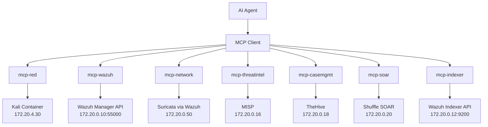

# MCP Integration

AI agents control lab containers via Model Context Protocol servers.

## Architecture


```mermaid
flowchart TD
    A[AI Agent] --> B[MCP Client]
    B --> C[mcp-red]
    B --> D[mcp-wazuh]
    B --> E[mcp-network]
    B --> F[mcp-threatintel]
    B --> G[mcp-casemgmt]
    B --> I[mcp-soar]
    B --> K[mcp-indexer]

    C --> L[Kali Container<br/>172.20.4.30]
    D --> M[Wazuh Manager API<br/>172.20.0.10:55000]
    K --> N[Wazuh Indexer API<br/>172.20.0.12:9200]
    E --> O[Suricata via Wazuh<br/>172.20.0.50]
    F --> P[MISP<br/>172.20.0.16]
    G --> Q[TheHive<br/>172.20.0.18]
    I --> R[Shuffle SOAR<br/>172.20.0.20]
```

The optional `mcp-reverse` server is built with the other artifacts but is not
written to the default client configuration because `techvault-operational`
does not realize a reverse-engineering node.

## Common Library

All SSH-based MCPs use `aptl-mcp-common` for session management, connection pooling, and configuration loading.

## MCP Servers

| Server | Target | Transport | Tools |
|--------|--------|-----------|-------|
| mcp-red | Kali (172.20.4.30) | SSH | `kali_info`, `run_command` |
| mcp-wazuh | Wazuh Manager API (55000) | HTTPS | Alert queries, rule creation |
| mcp-indexer | Wazuh Indexer API (9200) | HTTPS | Log search, index queries |
| mcp-network | Suricata via Wazuh | HTTPS | IDS alerts, DNS events, web attacks |
| mcp-threatintel | MISP (172.20.0.16) | HTTPS | IOC search, indicator submission |
| mcp-casemgmt | TheHive (172.20.0.18) | HTTPS | Case management, observables, analyzers |
| mcp-soar | Shuffle (172.20.0.20) | HTTPS | Workflow triggers, response actions |

## Setup

The normal participant path is automatic:

```bash
aptl lab start
```

Startup builds the MCP artifacts, creates `.mcp.json` from the shipped current
template when it is missing, and injects the generated MISP, TheHive, and
Shuffle keys. Existing MCP client entries are preserved. Start Claude Code,
Cursor, Cline, or another project-config-aware client from the project root.

To rebuild all artifacts without restarting the lab:

```bash
./mcp/build-all-mcps.sh
```

Or rebuild one server:

```bash
cd mcp/mcp-red && npm install && npm run build && cd ../..
```

The generated config points every enabled server at
`./mcp/<server>/build/index.js`.

## Usage

**Red Team:**
- Display lab network information
- Execute commands on Kali container

**Blue Team:**
- Query security alerts and historical logs
- Create detection rules
- Query network IDS alerts
- Search threat intelligence
- Manage incident cases
- Trigger SOAR playbooks
