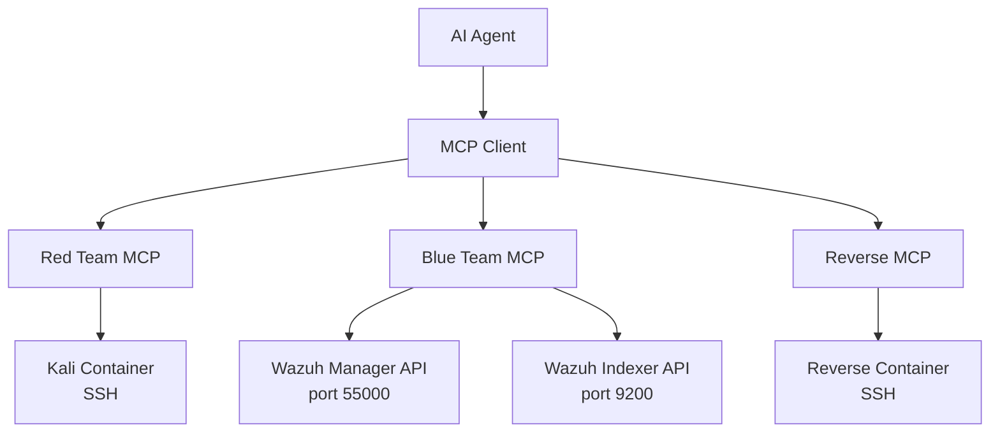

# MCP Integration

AI agents control lab containers and SIEM via [Model Context Protocol](https://modelcontextprotocol.io/) servers.

## Architecture


```mermaid
flowchart TD
    A[AI Agent] --> B[MCP Client]
    B --> C[Red Team MCP]
    B --> D[Blue Team MCP]
    B --> E[Reverse MCP]

    C --> G[Kali Container<br/>SSH]
    D --> H[Wazuh Manager API<br/>port 55000]
    D --> I[Wazuh Indexer API<br/>port 9200]
    E --> J[Reverse Container<br/>SSH]
```

## Common Library

All MCP servers use `aptl-mcp-common` for SSH session management, connection pooling, and tool generation. Tool names are auto-generated from a prefix defined in each server's `docker-lab-config.json`.

## MCP Servers

| Server | Directory | Tool Prefix | Connection |
|--------|-----------|-------------|------------|
| Red Team (Kali) | `mcp/mcp-red` | `kali_*` | SSH to Kali container |
| Blue Team (Wazuh) | `mcp/mcp-wazuh` | `wazuh_*` | Wazuh Manager + Indexer APIs |
| Reverse Engineering | `mcp/mcp-reverse` | `reverse_*` | SSH to reverse container |
| Threat Intel | `mcp/mcp-threatintel` | `threatintel_*` | MISP API |
| Case Management | `mcp/mcp-casemgmt` | `casemgmt_*` | TheHive API |
| SOAR | `mcp/mcp-soar` | `soar_*` | Shuffle API |
| Network IDS | `mcp/mcp-network` | `network_*` | Suricata |
| Windows RE | `mcp/mcp-windows-re` | `windowsre_*` | Windows RE container |

### SSH-Based Tool Pattern (Red, Reverse)

SSH-based servers auto-generate these tools from their prefix:

| Tool | Description |
|------|-------------|
| `{prefix}_info` | Container and network info |
| `{prefix}_run_command` | Execute a single command |
| `{prefix}_interactive_session` | Start an interactive session |
| `{prefix}_background_session` | Start a background session |
| `{prefix}_session_command` | Run command in existing session |
| `{prefix}_list_sessions` | List active sessions |
| `{prefix}_close_session` | Close a session |
| `{prefix}_get_session_output` | Get session output |
| `{prefix}_close_all_sessions` | Close all sessions |

### API-Based Tool Pattern (Wazuh)

| Tool | Description |
|------|-------------|
| `wazuh_api_call` | Generic API call to Wazuh |
| `wazuh_api_info` | API endpoint info |
| `wazuh_query_alerts` | Search processed alerts (Elasticsearch) |
| `wazuh_query_logs` | Search raw logs (Elasticsearch) |
| `wazuh_create_detection_rule` | Create custom detection rules |

## Build

MCP servers are built automatically by `aptl lab start`. To build manually:

```bash
./mcp/build-all-mcps.sh
```

Or build individually:

```bash
cd mcp/mcp-red && npm install && npm run build
```

## AI Client Configuration

Configure your MCP client to connect to built servers. Example for Cursor (`.cursor/mcp.json`):

```json
{
    "mcpServers": {
        "aptl-red": {
            "command": "node",
            "args": ["./mcp/mcp-red/build/index.js"],
            "cwd": "/path/to/aptl"
        },
        "aptl-wazuh": {
            "command": "node",
            "args": ["./mcp/mcp-wazuh/build/index.js"],
            "cwd": "/path/to/aptl"
        }
    }
}
```

Add additional servers (`mcp-reverse`, `mcp-threatintel`, etc.) as needed.

## Testing

```bash
cd mcp/mcp-red
npx @modelcontextprotocol/inspector build/index.js
```
