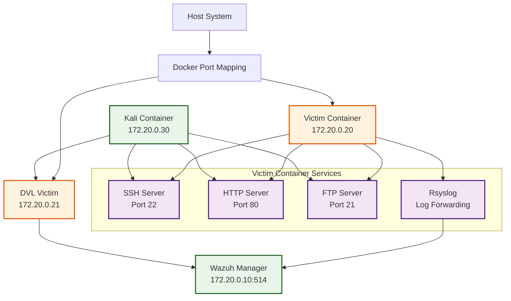

# Victim Containers

The victim containers in APTL serve as realistic target systems for red team activities and security testing. They provide vulnerable services and configurations that simulate real-world environments.

## Overview

The primary victim container is built on Rocky Linux 9 and includes multiple services commonly found in enterprise environments. It's designed to be realistic enough for meaningful security testing while maintaining educational focus.  
An optional second victim running **Damn Vulnerable Linux (DVL)** can also be deployed for additional training scenarios.

### Key Features

- **Multiple Services**: SSH, HTTP, FTP for diverse attack vectors
- **Realistic Configuration**: Enterprise-like system setup and user management
- **Comprehensive Logging**: All activities forwarded to Wazuh SIEM
- **Easy Reset**: Container can be destroyed and recreated quickly
- **Isolated Environment**: Contained within Docker network for safety

## Container Architecture



## Container Configuration

### Profiles

The DVL victim is disabled by default and uses the `dvl` profile. Launch it with:

```bash
COMPOSE_PROFILES=dvl docker compose up -d
```

This keeps resource usage low when the extra target is not needed.

### Base System

The victim container is built from Rocky Linux 9:

```dockerfile
FROM rockylinux:9

# Install base packages and services
RUN dnf update -y && \
    dnf install -y \
    openssh-server \
    httpd \
    vsftpd \
    rsyslog \
    net-tools \
    tcpdump \
    && dnf clean all
```

### Service Configuration

#### SSH Service

Configured for realistic but vulnerable SSH access:

```bash
# SSH configuration highlights
Port 22
PasswordAuthentication yes
PermitRootLogin no
MaxAuthTries 6
ClientAliveInterval 300
```

**Security Implications:**
- Password authentication enabled (allows brute force attacks)
- Standard port 22 (easily discoverable)
- Multiple authentication attempts allowed

#### HTTP Service

Apache HTTP server with basic configuration:

```apache
# Basic Apache configuration
ServerRoot /etc/httpd
Listen 80
DocumentRoot /var/www/html

# Vulnerable configurations for testing
ServerTokens Full
ServerSignature On
```

**Security Implications:**
- Full server information disclosure
- Default configurations may have vulnerabilities
- No SSL/TLS encryption

#### FTP Service

vsftpd configured with common misconfigurations:

```bash
# FTP configuration
anonymous_enable=YES
local_enable=YES
write_enable=YES
anon_upload_enable=YES
anon_mkdir_write_enable=YES
```

**Security Implications:**
- Anonymous FTP access enabled
- Write permissions for anonymous users
- Unencrypted file transfers

### User Configuration

The container includes several user accounts for testing:

```bash
# Administrative user (for lab access)
labadmin:x:1000:1000:Lab Administrator:/home/labadmin:/bin/bash

# Test users with varying security postures
testuser:x:1001:1001:Test User:/home/testuser:/bin/bash
admin:x:1002:1002:Admin User:/home/admin:/bin/bash
service:x:1003:1003:Service Account:/home/service:/bin/bash
```

**Password Policy:**
- Some accounts have weak passwords for testing
- Mixed password strength across accounts
- Service accounts may have default passwords

## Network Configuration

### IP Address Assignment

- **Internal IP**: 172.20.0.20 (static assignment)
- **Network**: aptl_aptl-network (Docker bridge)
- **Gateway**: 172.20.0.1

### Port Mappings

| Internal Port | External Port | Service | Purpose |
|---------------|---------------|---------|---------|
| 22 | 2022 | SSH | Remote access and administration |
| 80 | 8080 | HTTP | Web service testing |
| 21 | 2121 | FTP | File transfer testing |

### Firewall Configuration

The container has minimal firewall restrictions to allow testing:

```bash
# iptables rules (permissive for lab use)
iptables -P INPUT ACCEPT
iptables -P FORWARD ACCEPT
iptables -P OUTPUT ACCEPT
```

## Log Configuration

### Rsyslog Setup

Comprehensive logging forwarded to Wazuh SIEM:

```bash
# /etc/rsyslog.d/90-forward.conf
*.* @@172.20.0.10:514

# Local logging maintained for debugging
*.info;mail.none;authpriv.none;cron.none /var/log/messages
authpriv.* /var/log/secure
mail.* -/var/log/maillog
cron.* /var/log/cron
```

### Log Sources

The container forwards multiple log types:

- **Authentication**: SSH login attempts, sudo usage
- **System Events**: Service starts/stops, system errors
- **Network Activity**: Connection attempts, firewall logs
- **Application Logs**: HTTP access logs, FTP transfers
- **Security Events**: Failed authentications, privilege escalations

### Custom Log Fields

Additional fields added for purple team analysis:

```bash
# Example log entry with custom fields
{
  "timestamp": "2024-01-15T10:30:00Z",
  "host": "victim-host",
  "source_ip": "172.20.0.30",
  "event_type": "ssh_login_attempt",
  "username": "admin",
  "success": false,
  "victim_service": "ssh",
  "attack_vector": "brute_force"
}
```

## Access Methods

### SSH Access from Host

```bash
# SSH to victim container from host
ssh -i ~/.ssh/aptl_lab_key labadmin@localhost -p 2022

# Direct container access (debugging)
docker exec -it aptl-victim /bin/bash
```

### SSH Access from Kali

```bash
# SSH from Kali container to victim
ssh labadmin@172.20.0.20

# Test authentication with different users
ssh testuser@172.20.0.20
ssh admin@172.20.0.20
```

### Web Access

```bash
# HTTP access from host
curl http://localhost:8080

# HTTP access from Kali container
curl http://172.20.0.20

# With custom headers for testing
curl -H "User-Agent: APTL-Test-Agent" http://172.20.0.20
```

### FTP Access

```bash
# FTP access from host
ftp localhost 2121

# FTP access from Kali container  
ftp 172.20.0.20

# Anonymous FTP testing
ftp 172.20.0.20
# Username: anonymous
# Password: <any email address>
```

## Vulnerability Profile

### Intentional Vulnerabilities

The victim container includes intentional security weaknesses for educational purposes:

#### Authentication Vulnerabilities
- **Weak Passwords**: Some accounts use predictable passwords
- **Password Reuse**: Same passwords across different services
- **No Account Lockout**: No protection against brute force attacks

#### Service Vulnerabilities
- **Unencrypted Protocols**: HTTP and FTP without encryption
- **Information Disclosure**: Server version information exposed
- **Default Configurations**: Many services use insecure defaults

#### System Vulnerabilities
- **Outdated Software**: May include older package versions
- **Permissive Permissions**: Some files/directories have loose permissions
- **Unnecessary Services**: Services running that aren't required

### Exploitation Scenarios

Common attack vectors available for testing:

1. **SSH Brute Force**
   ```bash
   # Example Kali command
   hydra -l admin -P /usr/share/wordlists/rockyou.txt ssh://172.20.0.20
   ```

2. **Web Application Testing**
   ```bash
   # Directory enumeration
   gobuster dir -u http://172.20.0.20 -w /usr/share/wordlists/dirbuster/directory-list-2.3-medium.txt
   
   # Vulnerability scanning
   nikto -h http://172.20.0.20
   ```

3. **FTP Enumeration**
   ```bash
   # Anonymous access testing
   ftp 172.20.0.20
   # Login as: anonymous
   # Password: test@example.com
   ```

## Monitoring and Detection

### Log Analysis Points

Key events that should generate alerts in Wazuh:

#### Authentication Events
- Multiple failed SSH login attempts
- Successful login from unusual sources
- Privilege escalation attempts

#### Network Events
- Port scanning activities
- Unusual outbound connections
- Service enumeration attempts

#### File System Events
- Unauthorized file access
- Configuration file modifications
- Suspicious file uploads/downloads

### Sample Detection Rules

```xml
<!-- SSH Brute Force Detection -->
<rule id="100020" level="10" frequency="5" timeframe="300">
  <if_matched_sid>5716</if_matched_sid>
  <same_source_ip />
  <description>SSH brute force attack detected</description>
  <group>authentication_failures,pci_dss_10.2.4,pci_dss_10.2.5,</group>
</rule>

<!-- Web Vulnerability Scanner Detection -->
<rule id="100021" level="7">
  <if_sid>31100</if_sid>
  <match>nikto|gobuster|dirb|wpscan</match>
  <description>Web vulnerability scanner detected</description>
  <group>web,attack,recon,</group>
</rule>
```

## Container Management

### Lifecycle Commands

```bash
# Start victim container
docker compose up -d victim

# Stop victim container  
docker compose stop victim

# Restart victim container
docker compose restart victim

# View victim logs
docker compose logs -f victim
```

### Health Monitoring

```bash
# Check container status
docker compose ps victim

# Check service status inside container
docker exec aptl-victim systemctl status sshd
docker exec aptl-victim systemctl status httpd
docker exec aptl-victim systemctl status vsftpd

# Test service connectivity
docker exec aptl-kali nc -zv 172.20.0.20 22
docker exec aptl-kali nc -zv 172.20.0.20 80
docker exec aptl-kali nc -zv 172.20.0.20 21
```

### Data Persistence

```yaml
# Volume configuration in docker-compose.yml
volumes:
  - victim_logs:/var/log
  - /sys/fs/cgroup:/sys/fs/cgroup:rw
```

Log data persists across container restarts but can be cleaned for fresh scenarios.

## Customization

### Adding New Services

Extend the victim container with additional services:

```dockerfile
# Add database service
RUN dnf install -y mysql-server
COPY custom-mysql.conf /etc/my.cnf
RUN systemctl enable mysqld
```

### Custom Vulnerability Scenarios

Create specific scenarios for training:

```bash
# Add vulnerable web application
COPY vulnerable-app/ /var/www/html/app/

# Configure intentional misconfiguration
RUN chmod 777 /etc/passwd
RUN echo "admin:admin" > /home/admin/.ssh/authorized_keys
```

### User Account Variations

```bash
# Create scenario-specific users
RUN useradd -m -s /bin/bash developer
RUN echo "developer:password123" | chpasswd

RUN useradd -m -s /bin/bash marketing
RUN echo "marketing:company2024" | chpasswd
```

## Security Considerations

### Lab Safety

- **Network Isolation**: All activities contained within Docker network
- **No External Access**: Container cannot reach external networks
- **Easy Reset**: Complete environment reset removes any compromise
- **Monitored Environment**: All activities logged for analysis

### Educational Value

- **Realistic Scenarios**: Represents common enterprise misconfigurations
- **Progressive Difficulty**: Various attack vectors from simple to complex
- **Detection Training**: Provides clear indicators for SIEM analysis
- **Safe Learning**: No risk to production systems

## Troubleshooting

### Common Issues

1. **Services Not Starting**
   ```bash
   # Check service status
   docker exec aptl-victim systemctl status sshd httpd vsftpd
   
   # Check system logs
   docker exec aptl-victim journalctl -xe
   ```

2. **SSH Connection Issues**
   ```bash
   # Verify SSH key installation
   docker exec aptl-victim cat /home/labadmin/.ssh/authorized_keys
   
   # Check SSH configuration
   docker exec aptl-victim cat /etc/ssh/sshd_config | grep -E "(PasswordAuthentication|PermitRootLogin)"
   ```

3. **Log Forwarding Issues**
   ```bash
   # Test rsyslog configuration
   docker exec aptl-victim rsyslogd -N1
   
   # Check connectivity to SIEM
   docker exec aptl-victim telnet 172.20.0.10 514
   ```

### Performance Optimization

```bash
# Monitor resource usage
docker stats aptl-victim

# Adjust container resources if needed
# Edit docker-compose.yml to add resource limits
```

## Next Steps

- **[Kali Red Team](kali-redteam.md)** - Red team platform configuration
- **[MCP Integration](mcp-integration.md)** - AI agent integration
- **[Usage Examples](../usage/exercises.md)** - Practical attack scenarios