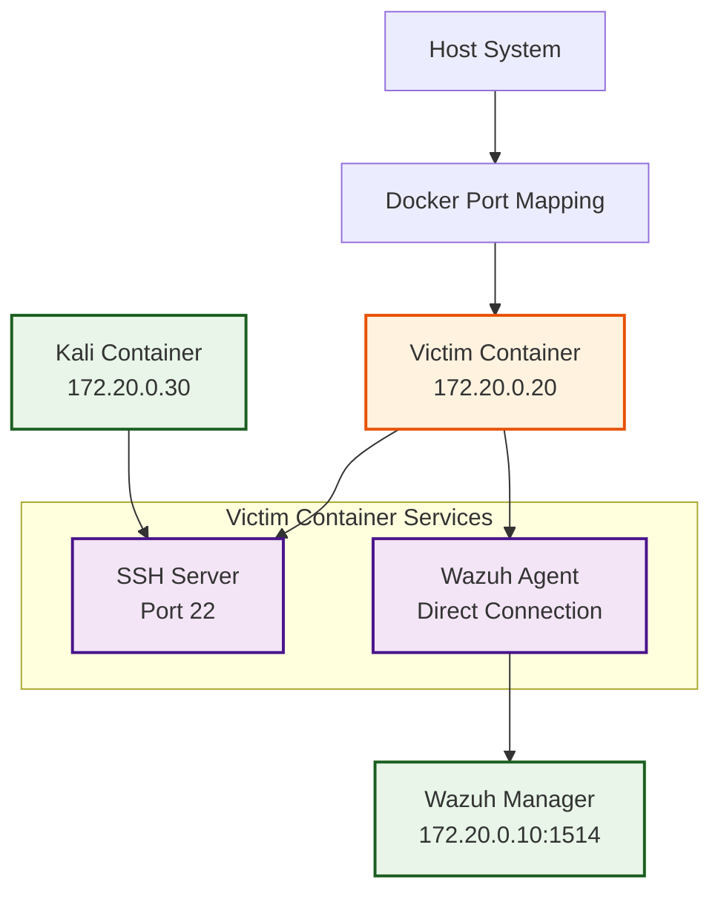

# Victim Containers

The victim container in APTL serves as a target system for red team activities and security testing. It provides a basic Rocky Linux 9 environment with SSH access and integrated Wazuh agent for comprehensive SIEM monitoring.

## Overview

The victim container is built on Rocky Linux 9 and provides SSH access for security testing. It includes an automatically configured Wazuh agent that connects directly to the Wazuh Manager for comprehensive security monitoring and log analysis.

### Key Features

- **SSH Service**: OpenSSH server for remote access testing
- **Wazuh Agent Integration**: Native Wazuh agent for comprehensive monitoring
- **Automatic Configuration**: Agent automatically configures and connects on first boot
- **Easy Reset**: Container can be destroyed and recreated quickly
- **Isolated Environment**: Contained within Docker network for safety

## Container Architecture



## Container Configuration

### Base System

The victim container is built from Rocky Linux 9:

```dockerfile
FROM rockylinux:9

# Install base packages and services
RUN dnf update -y && \
    dnf install -y \
    openssh-server \
    httpd \
    vsftpd \
    rsyslog \
    net-tools \
    tcpdump \
    && dnf clean all
```

### Service Configuration

#### SSH Service

Configured for realistic but vulnerable SSH access:

```bash
# SSH configuration highlights
Port 22
PasswordAuthentication yes
PermitRootLogin no
MaxAuthTries 6
ClientAliveInterval 300
```

**Security Implications:**
- Password authentication enabled (allows brute force attacks)
- Standard port 22 (easily discoverable)
- Multiple authentication attempts allowed

#### HTTP Service

Apache HTTP server with basic configuration:

```apache
# Basic Apache configuration
ServerRoot /etc/httpd
Listen 80
DocumentRoot /var/www/html

# Vulnerable configurations for testing
ServerTokens Full
ServerSignature On
```

**Security Implications:**
- Full server information disclosure
- Default configurations may have vulnerabilities
- No SSL/TLS encryption

#### FTP Service

vsftpd configured with common misconfigurations:

```bash
# FTP configuration
anonymous_enable=YES
local_enable=YES
write_enable=YES
anon_upload_enable=YES
anon_mkdir_write_enable=YES
```

**Security Implications:**
- Anonymous FTP access enabled
- Write permissions for anonymous users
- Unencrypted file transfers

### User Configuration

The container includes one user account for lab access:

```bash
# Administrative user (for lab access)
labadmin:x:1000:1000:Lab Administrator:/home/labadmin:/bin/bash
```

**Authentication:**
- SSH key-only authentication (no passwords)
- Key configured via volume mount or environment variable

## Network Configuration

### IP Address Assignment

- **Internal IP**: 172.20.0.20 (static assignment)
- **Network**: aptl_aptl-network (Docker bridge)
- **Gateway**: 172.20.0.1

### Port Mappings

| Internal Port | External Port | Service | Purpose |
|---------------|---------------|---------|---------|
| 22 | 2022 | SSH | Remote access and administration |

### Firewall Configuration

The victim container uses default Rocky Linux firewall settings with no additional restrictions configured, allowing unrestricted communication within the Docker bridge network for lab testing purposes.

## Wazuh Agent Configuration

### Automatic Installation

The Wazuh agent is automatically installed and configured on first boot via systemd oneshot service:

```bash
# /opt/purple-team/scripts/install-wazuh.sh
# Automatically installs and configures Wazuh agent
# Connects to Wazuh Manager at 172.20.0.10
```

### Agent Services

The Wazuh agent runs multiple services for comprehensive monitoring:

- **wazuh-agentd**: Main agent daemon for communication with manager
- **wazuh-execd**: Active response execution daemon  
- **wazuh-logcollector**: Log file monitoring and collection
- **wazuh-syscheckd**: File integrity monitoring daemon
- **wazuh-modulesd**: Additional monitoring modules

### Monitored Data

The agent monitors and sends comprehensive security data:

- **File Integrity**: Changes to system files and directories
- **Log Analysis**: Real-time analysis of system logs
- **Process Monitoring**: Process creation and termination events
- **Network Monitoring**: Network connections and activity
- **Authentication Events**: SSH logins, sudo usage, failed authentications
- **System Events**: Service changes, configuration modifications

## Access Methods

### SSH Access from Host

```bash
# SSH to victim container from host
ssh -i ~/.ssh/aptl_lab_key labadmin@localhost -p 2022

# Direct container access (debugging)
docker exec -it aptl-victim /bin/bash
```

### SSH Access from Kali

```bash
# SSH from Kali container to victim
ssh labadmin@172.20.0.20
```

## Services

The victim container runs essential services for security testing:

- **SSH Server**: OpenSSH for remote access testing
- **Wazuh Agent**: Native Wazuh agent for comprehensive monitoring
- **systemd**: Container initialization and service management

The container provides a basic Rocky Linux 9 environment suitable for security testing:

- **Operating System**: Rocky Linux 9 (RHEL-compatible)
- **SSH Access**: Key-based authentication only
- **Security Monitoring**: Native Wazuh agent with comprehensive coverage
- **User**: Single `labadmin` user with sudo privileges
- **Automatic Setup**: Wazuh agent installs and connects automatically

## Container Management

### Lifecycle Commands

```bash
# Start victim container
docker compose up -d victim

# Stop victim container  
docker compose stop victim

# Restart victim container
docker compose restart victim

# View victim logs
docker compose logs -f victim
```

### Health Monitoring

```bash
# Check container status
docker compose ps victim

# Check service status inside container
docker exec aptl-victim systemctl status sshd
docker exec aptl-victim /var/ossec/bin/wazuh-control status

# Test service connectivity
docker exec aptl-kali nc -zv 172.20.0.20 22

# Verify Wazuh agent connection
docker exec aptl-victim /var/ossec/bin/wazuh-control info
```

### Data Persistence

```yaml
# Volume configuration in docker-compose.yml
volumes:
  - victim_logs:/var/log
  - /sys/fs/cgroup:/sys/fs/cgroup:rw
```

Log data persists across container restarts but can be cleaned for fresh scenarios.

## Customization

### Adding New Services

Extend the victim container with additional services:

```dockerfile
# Add database service
RUN dnf install -y mysql-server
COPY custom-mysql.conf /etc/my.cnf
RUN systemctl enable mysqld
```

### Custom Vulnerability Scenarios

Create specific scenarios for training:

```bash
# Add vulnerable web application
COPY vulnerable-app/ /var/www/html/app/

# Configure intentional misconfiguration
RUN chmod 777 /etc/passwd
RUN echo "admin:admin" > /home/admin/.ssh/authorized_keys
```

### User Account Variations

```bash
# Create scenario-specific users
RUN useradd -m -s /bin/bash developer
RUN echo "developer:password123" | chpasswd

RUN useradd -m -s /bin/bash marketing
RUN echo "marketing:company2024" | chpasswd
```

## Security Considerations

### Lab Safety

- **Network Isolation**: All activities contained within Docker network
- **No External Access**: Container cannot reach external networks
- **Easy Reset**: Complete environment reset removes any compromise
- **Monitored Environment**: All activities logged for analysis

### Educational Value

- **Realistic Scenarios**: Represents common enterprise misconfigurations
- **Progressive Difficulty**: Various attack vectors from simple to complex
- **Detection Training**: Provides clear indicators for SIEM analysis
- **Safe Learning**: No risk to production systems

## Troubleshooting

### Common Issues

1. **Services Not Starting**
   ```bash
   # Check service status
   docker exec aptl-victim systemctl status sshd httpd vsftpd
   
   # Check system logs
   docker exec aptl-victim journalctl -xe
   ```

2. **SSH Connection Issues**
   ```bash
   # Verify SSH key installation
   docker exec aptl-victim cat /home/labadmin/.ssh/authorized_keys
   
   # Check SSH configuration
   docker exec aptl-victim cat /etc/ssh/sshd_config | grep -E "(PasswordAuthentication|PermitRootLogin)"
   ```

3. **Wazuh Agent Connection Issues**
   ```bash
   # Check agent status
   docker exec aptl-victim /var/ossec/bin/wazuh-control status
   
   # Check agent logs
   docker exec aptl-victim tail -f /var/ossec/logs/ossec.log
   
   # Test connectivity to manager
   docker exec aptl-victim nc -zv 172.20.0.10 1514
   
   # Restart agent services
   docker exec aptl-victim /var/ossec/bin/wazuh-control restart
   ```

### Performance Optimization

```bash
# Monitor resource usage
docker stats aptl-victim

# Adjust container resources if needed
# Edit docker-compose.yml to add resource limits
```

