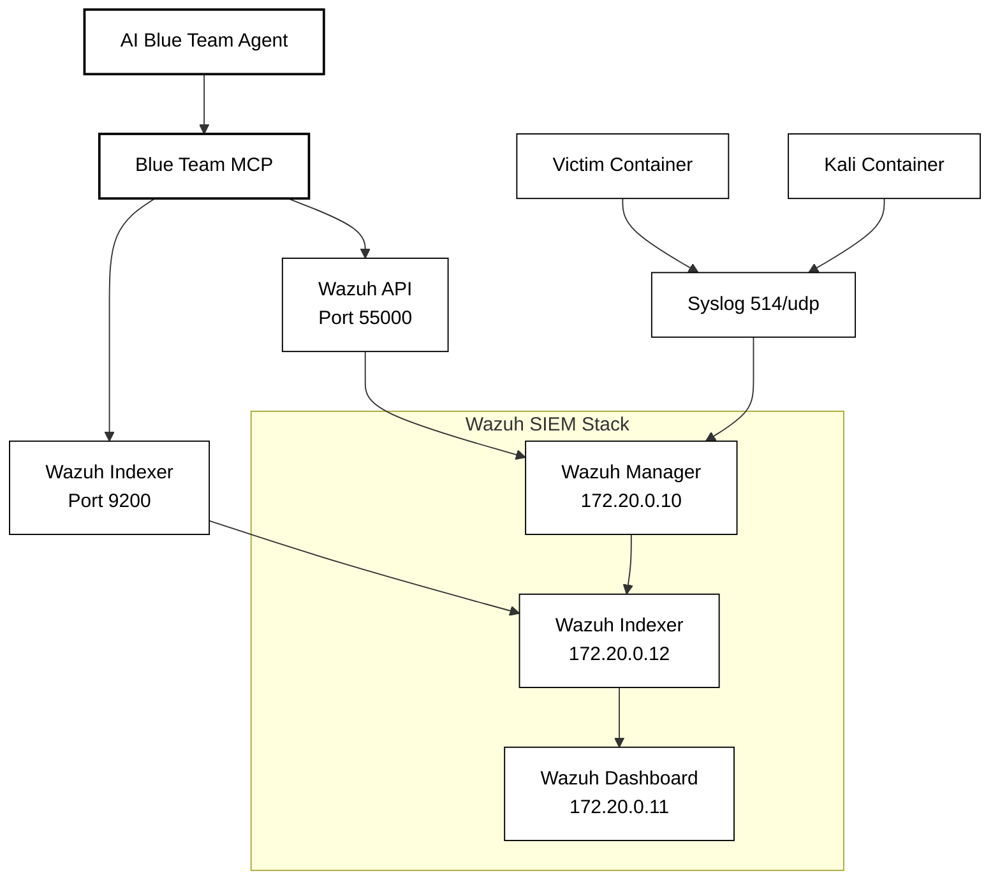

# Wazuh Blue Team Platform

The Wazuh SIEM stack in APTL provides blue team capabilities through REST API access. AI agents perform security analysis and investigation via MCP integration.

## Overview

The Wazuh integration consists of a three-component architecture (Manager, Indexer, Dashboard) that processes logs from lab containers. It's configured for purple team operations with MCP integration for AI-driven blue team activities.

### Key Features

- **Wazuh SIEM**: Three-component stack for log processing and alerting
- **AI Integration**: Model Context Protocol (MCP) server integration
- **Alert Analysis**: Search processed security alerts
- **Log Investigation**: Search raw log data before rule processing
- **Rule Creation**: Generate custom detection rules
- **API Access**: REST API for programmatic SIEM operations

## Container Architecture



## Container Configuration

### Wazuh Manager (172.20.0.10)

Central log processing and alert generation:

```yaml
wazuh.manager:
  image: wazuh/wazuh-manager:4.12.0
  hostname: wazuh.manager
  ports:
    - "514:514/udp"    # Syslog receiver
    - "55000:55000"    # REST API
  environment:
    - INDEXER_URL=https://wazuh.indexer:9200
    - API_USERNAME=wazuh-wui
    - API_PASSWORD=${API_PASSWORD}
  networks:
    aptl-network:
      ipv4_address: 172.20.0.10
```

### Wazuh Indexer (172.20.0.12)

OpenSearch-based data storage:

```yaml
wazuh.indexer:
  image: wazuh/wazuh-indexer:4.12.0
  hostname: wazuh.indexer
  ports:
    - "9200:9200"    # OpenSearch API
  environment:
    - "OPENSEARCH_JAVA_OPTS=-Xms1g -Xmx1g"
  networks:
    aptl-network:
      ipv4_address: 172.20.0.12
```

### Wazuh Dashboard (172.20.0.11)

Web interface for security monitoring:

```yaml
wazuh.dashboard:
  image: wazuh/wazuh-dashboard:4.12.0
  hostname: wazuh.dashboard
  ports:
    - "443:5601"     # HTTPS dashboard
  environment:
    - INDEXER_USERNAME=admin
    - INDEXER_PASSWORD=SecretPassword
    - API_USERNAME=wazuh-wui
    - API_PASSWORD=${API_PASSWORD}
  networks:
    aptl-network:
      ipv4_address: 172.20.0.11
```

## Log Integration

### Syslog Forwarding

Both lab containers forward logs via rsyslog, not agents:

```bash
# Victim container: /etc/rsyslog.d/90-forward.conf
*.* @@172.20.0.10:514

# Kali container: similar rsyslog configuration
*.* @@172.20.0.10:514
```

**Log Flow:**

- Victim Container (172.20.0.20): System logs, application logs, SSH activity
- Kali Container (172.20.0.30): Red team tool execution, command logs
- Processed by Wazuh rules into alerts
- Raw logs stored in `wazuh-archives-*` indices
- Alerts stored in `wazuh-alerts-*` indices

## API Access

### Authentication

JWT token-based authentication using credentials from docker-compose.yml:

```python
import requests
from urllib3 import disable_warnings
from urllib3.exceptions import InsecureRequestWarning

disable_warnings(InsecureRequestWarning)

def authenticate():
    # Credentials from docker-compose.yml wazuh.manager environment
    # API_USERNAME=wazuh-wui, API_PASSWORD=WazuhPass123!
    response = requests.post(
        "https://172.20.0.10:55000/security/user/authenticate",
        auth=(API_USERNAME, API_PASSWORD), 
        verify=False
    )
    return response.json()['data']['token']

token = authenticate()
headers = {'Authorization': f'Bearer {token}'}
```

### Alert Queries

Search processed alerts via Indexer:

```python
import base64

def query_alerts(time_range="1h", min_level=1, source_ip=None):
    query = {
        "query": {
            "bool": {
                "filter": [
                    {"range": {"timestamp": {"gte": f"now-{time_range}"}}},
                    {"range": {"rule.level": {"gte": min_level}}}
                ]
            }
        },
        "sort": [{"timestamp": {"order": "desc"}}],
        "size": 1000
    }
    
    if source_ip:
        query["query"]["bool"]["filter"].append({
            "term": {"data.srcip": source_ip}
        })
    
    # Indexer credentials from docker-compose.yml wazuh.dashboard environment  
    # INDEXER_USERNAME=admin, INDEXER_PASSWORD=SecretPassword
    auth = base64.b64encode(f"{INDEXER_USERNAME}:{INDEXER_PASSWORD}".encode()).decode()
    
    response = requests.post(
        "https://172.20.0.12:9200/wazuh-alerts-*/_search",
        headers={
            'Authorization': f'Basic {auth}',
            'Content-Type': 'application/json'
        },
        json=query,
        verify=False
    )
    
    return response.json()
```

### Raw Log Queries

Search all log data via Indexer:

```python
def query_logs(time_range="1h", search_term=None, source_ip=None):
    query = {
        "query": {
            "bool": {
                "filter": [
                    {"range": {"timestamp": {"gte": f"now-{time_range}"}}}
                ]
            }
        },
        "sort": [{"timestamp": {"order": "desc"}}],
        "size": 1000
    }
    
    if search_term:
        query["query"]["bool"]["must"] = [
            {"match": {"full_log": search_term}}
        ]
    
    if source_ip:
        query["query"]["bool"]["filter"].append({
            "term": {"agent.ip": source_ip}
        })
    
    # Same indexer credentials as alert queries
    auth = base64.b64encode(f"{INDEXER_USERNAME}:{INDEXER_PASSWORD}".encode()).decode()
    
    response = requests.post(
        "https://172.20.0.12:9200/wazuh-archives-*/_search",
        headers={
            'Authorization': f'Basic {auth}',
            'Content-Type': 'application/json'
        },
        json=query,
        verify=False
    )
    
    return response.json()
```

### Rule Creation

Create custom detection rules:

```python
def create_rule(rule_xml, rule_file="local_rules.xml"):
    response = requests.put(
        f"https://172.20.0.10:55000/rules/files/{rule_file}",
        headers={**headers, 'Content-Type': 'application/xml'},
        data=rule_xml,
        verify=False
    )
    return response.json()
```

## MCP Integration

### Blue Team Tools

```typescript
// Blue Team MCP tool definitions
const tools = [
  {
    name: "wazuh_info",
    description: "Get information about the Wazuh SIEM stack in the lab",
    inputSchema: {
      type: "object",
      properties: {}
    }
  },
  {
    name: "query_alerts",
    description: "Search processed Wazuh alerts with filters",
    inputSchema: {
      type: "object",
      properties: {
        time_range: { type: "string", enum: ["15m", "1h", "6h", "24h", "7d"] },
        min_level: { type: "number", minimum: 1, maximum: 15 },
        source_ip: { type: "string" },
        rule_id: { type: "string" }
      }
    }
  },
  {
    name: "query_logs",
    description: "Search raw log data before rule processing",
    inputSchema: {
      type: "object", 
      properties: {
        time_range: { type: "string", enum: ["15m", "1h", "6h", "24h", "7d"] },
        search_term: { type: "string" },
        source_ip: { type: "string" },
        log_level: { type: "string", enum: ["debug", "info", "warn", "error"] }
      }
    }
  },
  {
    name: "create_detection_rule",
    description: "Create custom Wazuh detection rule",
    inputSchema: {
      type: "object",
      properties: {
        rule_xml: { type: "string" },
        rule_description: { type: "string" },
        rule_level: { type: "number", minimum: 1, maximum: 15 }
      },
      required: ["rule_xml"]
    }
  }
];
```

### Tool Implementation

```typescript
// Wazuh info implementation
async function handleWazuhInfo() {
  const wazuhAPI = new WazuhAPIClient();
  await wazuhAPI.authenticate();
  
  const managerInfo = await wazuhAPI.getManagerInfo();
  const indexerHealth = await wazuhAPI.getIndexerHealth();
  
  return {
    manager: {
      version: managerInfo.data.version,
      status: managerInfo.data.status,
      api_port: 55000
    },
    indexer: {
      cluster_health: indexerHealth.status,
      indices: ["wazuh-alerts-*", "wazuh-archives-*"],
      api_port: 9200
    },
    dashboard: {
      url: "https://172.20.0.11:443",
      api_port: 5601
    },
    lab_network: "172.20.0.0/16"
  };
}

// Alert querying implementation
async function handleQueryAlerts(params: any) {
  const indexerClient = new WazuhIndexerClient();
  
  const query = buildAlertQuery(params);
  const results = await indexerClient.search("wazuh-alerts-*", query);
  
  return {
    alert_count: results.hits.total.value,
    alerts: results.hits.hits.map(hit => ({
      timestamp: hit._source.timestamp,
      rule_id: hit._source.rule.id,
      level: hit._source.rule.level,
      description: hit._source.rule.description,
      source_ip: hit._source.data?.srcip,
      agent_name: hit._source.agent?.name,
      full_log: hit._source.full_log
    }))
  };
}

// Raw log querying implementation
async function handleQueryLogs(params: any) {
  const indexerClient = new WazuhIndexerClient();
  
  const query = buildLogQuery(params);
  const results = await indexerClient.search("wazuh-archives-*", query);
  
  return {
    log_count: results.hits.total.value,
    logs: results.hits.hits.map(hit => ({
      timestamp: hit._source.timestamp,
      source_ip: hit._source.agent?.ip,
      log_level: hit._source.log_level,
      message: hit._source.full_log,
      location: hit._source.location
    }))
  };
}

// Rule creation implementation
async function handleCreateDetectionRule(params: any) {
  const wazuhAPI = new WazuhAPIClient();
  await wazuhAPI.authenticate();
  
  // Validate XML format
  if (!params.rule_xml.includes('<rule') || !params.rule_xml.includes('</rule>')) {
    throw new Error("Invalid rule XML format");
  }
  
  const result = await wazuhAPI.createRule(params.rule_xml, "aptl_custom_rules.xml");
  
  return {
    success: true,
    rule_file: "aptl_custom_rules.xml",
    restart_required: true,
    message: "Detection rule created. Manager restart needed to activate."
  };
}
```

## Network Configuration

### API Endpoints

| Component | IP Address | Port | Protocol | Authentication |
|-----------|------------|------|----------|----------------|
| Wazuh Manager API | 172.20.0.10 | 55000 | HTTPS | JWT Token |
| Wazuh Indexer API | 172.20.0.12 | 9200 | HTTPS | Basic Auth |
| Wazuh Dashboard | 172.20.0.11 | 5601 | HTTPS | Web Auth |

### Log Sources

| Source | IP Address | Log Types | Index Pattern |
|--------|------------|-----------|---------------|
| Victim Container | 172.20.0.20 | System, SSH, applications | wazuh-archives-* |
| Kali Container | 172.20.0.30 | Red team tools, commands | wazuh-archives-* |
| Processed Alerts | All sources | Rule-triggered events | wazuh-alerts-* |

## Blue Team Workflows

### Investigation Workflow

```typescript
// Example: "Why did player XYZ get banned?"
async function investigatePlayer(playerIP: string) {
  const blueTeam = new AIBlueTeamAgent();
  
  // Get SIEM info
  const siemInfo = await blueTeam.wazuh_info();
  
  // Check for alerts related to player
  const alerts = await blueTeam.query_alerts("24h", 1, playerIP);
  
  // Get raw logs for context
  const logs = await blueTeam.query_logs("24h", undefined, playerIP);
  
  return {
    player_ip: playerIP,
    alert_count: alerts.alert_count,
    high_level_alerts: alerts.alerts.filter(a => a.level >= 10),
    recent_activity: logs.logs.slice(0, 20),
    ban_triggers: alerts.alerts.filter(a => a.rule_id.includes("ban"))
  };
}
```

### Threat Hunting Workflow

```typescript
// Example: "Show me unusual admin activities"
async function huntAdminThreats(timeRange: string = "24h") {
  const blueTeam = new AIBlueTeamAgent();
  
  // Search for admin-related logs
  const adminLogs = await blueTeam.query_logs(timeRange, "sudo", undefined);
  
  // Check for admin-related alerts
  const adminAlerts = await blueTeam.query_alerts(timeRange, 5, undefined);
  
  // Filter for suspicious patterns
  const suspiciousActivity = adminLogs.logs.filter(log => 
    log.message.includes("sudo") && 
    (log.message.includes("passwd") || log.message.includes("useradd"))
  );
  
  return {
    total_admin_logs: adminLogs.log_count,
    admin_alerts: adminAlerts.alert_count,
    suspicious_commands: suspiciousActivity,
    recommendations: generateHuntingRecommendations(suspiciousActivity)
  };
}
```

### Rule Creation Workflow

```typescript
// Example: Create rule for detected attack pattern
async function createCustomRule(attackPattern: string) {
  const blueTeam = new AIBlueTeamAgent();
  
  const customRule = `
<rule id="100300" level="8">
  <if_group>attack</if_group>
  <match>${attackPattern}</match>
  <description>Custom detection for ${attackPattern}</description>
  <group>aptl,custom_detection</group>
</rule>`;
  
  const result = await blueTeam.create_detection_rule(customRule);
  
  return {
    rule_created: result.success,
    rule_file: result.rule_file,
    restart_required: result.restart_required
  };
}
```

## Activity Logging

All blue team operations are logged:

```typescript
interface BlueTeamLog {
  timestamp: string;
  agent_id: string;
  operation: string;
  parameters: Record<string, any>;
  results: {
    success: boolean;
    count?: number;
    error?: string;
  };
}

// Forward to SIEM
await syslog({
  facility: 'local2',
  tag: 'APTL-BlueTeam',
  message: JSON.stringify(activity)
});
```

## Access Methods

### MCP Client Access

```bash
# Blue team MCP server connection via IDE
# AI agents connect through MCP client configuration
```

### Direct API Access

```bash
# Get authentication token (using docker-compose.yml credentials)
TOKEN=$(curl -k -u ${API_USERNAME}:${API_PASSWORD} \
  "https://172.20.0.10:55000/security/user/authenticate?raw=true")

# Query alerts
curl -k -H "Authorization: Bearer $TOKEN" \
  "https://172.20.0.10:55000/"

# Search indexer (using docker-compose.yml indexer credentials)
curl -k -u ${INDEXER_USERNAME}:${INDEXER_PASSWORD} \
  "https://172.20.0.12:9200/wazuh-alerts-*/_search" \
  -d '{"size":10}'
```

### Dashboard Access

```bash
# Web interface
https://localhost:443

# Credentials: From docker-compose.yml API_USERNAME / API_PASSWORD
```

## Troubleshooting

### API Issues

```bash
# Test API authentication (using docker-compose.yml credentials)
curl -k -u ${API_USERNAME}:${API_PASSWORD} \
  "https://172.20.0.10:55000/security/user/authenticate"

# Check indexer connectivity (using docker-compose.yml indexer credentials)
curl -k -u ${INDEXER_USERNAME}:${INDEXER_PASSWORD} \
  "https://172.20.0.12:9200/_cluster/health"

# Test dashboard
curl -k "https://172.20.0.11:5601/api/status"
```

### MCP Server Issues

```bash
# Build and test MCP server
cd mcp-blue && npm run build && node build/index.js

# Check MCP logs
tail -f logs/blue-team-activity.log

# Test tools
npx @modelcontextprotocol/inspector build/index.js
```

### Log Flow Issues

```bash
# Test log forwarding
docker exec aptl-victim logger "Test message from victim"
docker exec aptl-kali logger "Test message from kali"

# Check manager logs
docker logs wazuh.manager | grep -i received

# Monitor indexer
docker logs wazuh.indexer | tail -20
```
