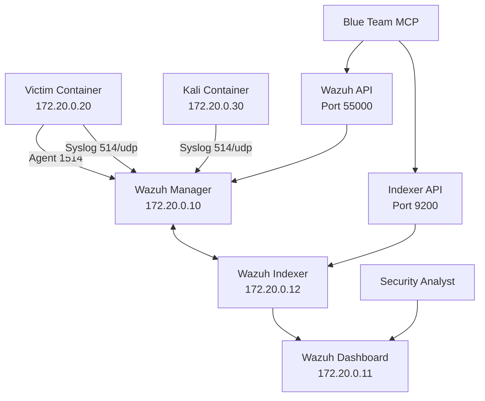

# Wazuh SIEM

The Wazuh SIEM stack provides security monitoring and analysis for the APTL lab environment.

## Components

- **Manager** (172.20.0.10): Log processing, rules, alerts
- **Indexer** (172.20.0.12): OpenSearch data storage  
- **Dashboard** (172.20.0.11): Web UI at https://localhost:443

## Data Flow



## Wazuh Manager

**Configuration:**
- **Container**: `wazuh.manager`
- **IP**: 172.20.0.10
- **Ports**: 1514 (agents), 514 (syslog), 55000 (API)

**Key Features:**
- Agent connections (TCP 1514)
- Syslog reception (UDP 514) 
- Event analysis and correlation
- Falco integration via custom rules (100600-100607)

**Management:**
```bash
# Check manager status
docker exec wazuh.manager /var/ossec/bin/wazuh-control status

# View real-time logs
docker exec wazuh.manager tail -f /var/ossec/logs/ossec.log

# API access
curl -k -u wazuh-wui:WazuhPass123! https://localhost:55000/
```

## Wazuh Indexer

**Configuration:**
- **Container**: `wazuh.indexer`
- **IP**: 172.20.0.12
- **Port**: 9200
- **Credentials**: admin/SecretPassword

**Key Features:**
- OpenSearch-based data storage
- Automatic index management (wazuh-alerts-*, wazuh-archives-*)
- RESTful API for queries

**Management:**
```bash
# Check indexer status
curl -k -u admin:SecretPassword https://localhost:9200/_cluster/health

# List indices
curl -k -u admin:SecretPassword https://localhost:9200/_cat/indices

# Query alerts
curl -k -u admin:SecretPassword https://localhost:9200/wazuh-alerts-*/_search
```

## Wazuh Dashboard

**Configuration:**
- **Container**: `wazuh.dashboard`
- **IP**: 172.20.0.11
- **URL**: https://localhost:443
- **Credentials**: admin/SecretPassword

**Key Features:**
- Security event visualization
- Real-time monitoring dashboards
- Alert management and investigation

## Falco Integration

**Architecture:**
- Falco runs in victim container with Modern eBPF
- Events written to `/var/log/falco_events.json` with `wazuh_integration` field
- Wazuh agent monitors file and forwards events
- Custom rules process alerts by priority level

**Rule Mapping:**
```
Falco Priority → Wazuh Rule → Alert Level
Debug/Info     → 100600     → Level 3
Notice         → 100601     → Level 5
Warning        → 100603     → Level 8
Error          → 100604     → Level 10
Critical       → 100605     → Level 12
Alert          → 100606     → Level 13
Emergency      → 100607     → Level 15
```

**Configuration Files:**
- [falco_rules.xml](../../config/wazuh_cluster/falco_rules.xml) - Custom Falco rules
- [wazuh_manager.conf](../../config/wazuh_cluster/wazuh_manager.conf) - Manager config

## MCP Integration

**Blue Team MCP Server:**
- Query alerts and logs via APIs
- Create custom detection rules
- Get SIEM status and configuration

See [Wazuh Blue Team](wazuh-blueteam.md) for MCP integration details.


## Troubleshooting

**Manager Issues:**
```bash
# Check agent connections
docker exec wazuh.manager /var/ossec/bin/wazuh-control info

# Check active agents
docker exec wazuh.manager /var/ossec/bin/agent_control -l
```

**Indexer Issues:**
```bash
# Check cluster health
curl -k -u admin:SecretPassword https://localhost:9200/_cluster/health

# Check index status
curl -k -u admin:SecretPassword https://localhost:9200/_cat/indices?v
```

**Dashboard Issues:**
```bash
# Check dashboard status
curl -k https://localhost:443/status

# Check connectivity to indexer
docker exec wazuh.dashboard curl -k https://wazuh.indexer:9200
```