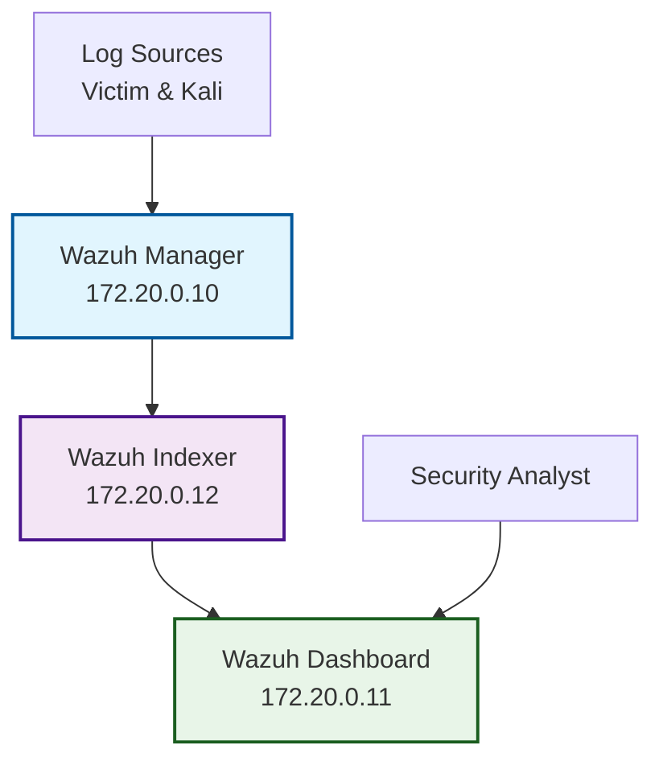

# Wazuh SIEM

## Components

- **Manager** (172.20.0.10): Log processing, rules, alerts
- **Indexer** (172.20.0.12): OpenSearch data storage
- **Dashboard** (172.20.0.11): Web UI at https://localhost:443

## Architecture



## Wazuh Manager

The Wazuh Manager is the central component that receives, processes, and analyzes security data.

### Key Features

- **Log Collection**: Receives logs via syslog (UDP 514)
- **Event Analysis**: Real-time analysis using detection rules
- **Correlation**: Multi-event correlation for complex attack detection
- **Active Response**: Automated response to security threats
- **API Access**: REST API for management and integration

### Configuration

The manager is configured via `/var/ossec/etc/ossec.conf`:

```xml
<!-- Example configuration for APTL lab -->
<ossec_config>
  <global>
    <logall>yes</logall>
    <logall_json>yes</logall_json>
  </global>
  
  <remote>
    <connection>syslog</connection>
    <port>514</port>
    <protocol>udp</protocol>
  </remote>
  
  <!-- Red team specific configuration -->
  <rules>
    <include>red_team_rules.xml</include>
  </rules>
</ossec_config>
```

### Custom Rules for Purple Team

APTL includes custom detection rules for purple team scenarios:

```xml
<!-- Red team activity detection -->
<group name="red_team,">
  <rule id="100001" level="5">
    <decoded_as>red-team-activity</decoded_as>
    <description>Red team activity detected</description>
  </rule>
  
  <rule id="100002" level="7">
    <if_sid>100001</if_sid>
    <field name="red_team_tool">nmap</field>
    <description>Red team network scanning detected</description>
  </rule>
</group>
```

### Access and Management

- **Container**: `wazuh.manager`
- **IP Address**: 172.20.0.10
- **API Port**: 55000
- **Syslog Port**: 514 (UDP)

```bash
# Access manager container
docker exec -it wazuh.manager bash

# Check manager status
docker exec wazuh.manager /var/ossec/bin/wazuh-control status

# View real-time logs
docker exec wazuh.manager tail -f /var/ossec/logs/ossec.log
```

## Wazuh Indexer

The Wazuh Indexer is based on OpenSearch and provides scalable data storage and search capabilities.

### Key Features

- **Data Storage**: Persistent storage for security events
- **Search Engine**: Full-text search across all security data
- **Indexing**: Automatic indexing and field extraction
- **Performance**: Optimized for security data workloads
- **API Access**: RESTful API for data queries

### Configuration

Memory allocation and performance settings:

```yaml
# docker-compose.yml configuration
environment:
  - "OPENSEARCH_JAVA_OPTS=-Xms1g -Xmx1g"
ulimits:
  memlock:
    soft: -1
    hard: -1
  nofile:
    soft: 65536
    hard: 65536
```

### Index Management

Wazuh automatically creates and manages indices:

- **wazuh-alerts-\***: Security alerts and detections
- **wazuh-archives-\***: Raw log archives  
- **wazuh-monitoring-\***: Agent and system monitoring

### Access and Queries

- **Container**: `wazuh.indexer`
- **IP Address**: 172.20.0.12
- **API Port**: 9200
- **Default Credentials**: admin / SecretPassword

```bash
# Check indexer health
curl -k -u admin:SecretPassword https://localhost:9200/_cluster/health

# List indices
curl -k -u admin:SecretPassword https://localhost:9200/_cat/indices

# Query recent alerts
curl -k -u admin:SecretPassword https://localhost:9200/wazuh-alerts-*/_search?q=*&size=10
```

## Wazuh Dashboard

The Wazuh Dashboard provides a comprehensive web-based security operations interface.

### Key Features

- **Security Overview**: High-level security posture dashboard
- **Event Analysis**: Detailed security event investigation
- **Threat Hunting**: Interactive queries and visualizations
- **Compliance**: Regulatory compliance reporting
- **Customization**: Custom dashboards and visualizations

### Main Interfaces

#### Security Events
Real-time security event monitoring and analysis.

- **Events Timeline**: Chronological view of security events
- **Event Details**: Detailed information for each security event
- **Filtering**: Advanced filtering by source, rule, level, etc.
- **Export**: Export events for offline analysis

#### Threat Hunting
Interactive threat hunting and investigation tools.

- **Search Queries**: Custom search across all security data
- **Visualizations**: Charts, graphs, and heatmaps
- **Saved Searches**: Reusable queries for common investigations
- **Alerting**: Custom alerts based on search criteria

#### Compliance Dashboard
Regulatory compliance monitoring and reporting.

- **PCI DSS**: Payment card industry compliance
- **GDPR**: General data protection regulation
- **HIPAA**: Healthcare information portability
- **Custom Standards**: Create custom compliance frameworks

### Purple Team Specific Dashboards

APTL includes custom dashboards for purple team operations:

#### Red Team Activity Dashboard
- **Attack Timeline**: Chronological view of red team activities
- **Tool Usage**: Breakdown of penetration testing tools used
- **Target Analysis**: Which systems were targeted and how
- **Success Rate**: Attack success vs. detection rate

#### Blue Team Response Dashboard
- **Detection Metrics**: How quickly threats were detected
- **Response Times**: Time from detection to response
- **Rule Effectiveness**: Which detection rules are most effective
- **False Positives**: Analysis of false positive rates

### Access and Configuration

- **URL**: https://localhost:443
- **Default Credentials**: admin / SecretPassword
- **Container**: `wazuh.dashboard`
- **IP Address**: 172.20.0.11

```bash
# Access dashboard container
docker exec -it wazuh.dashboard bash

# Check dashboard status
curl -k https://localhost:443/status

# View dashboard logs
docker compose logs wazuh.dashboard
```

## APTL-Specific Configuration

### Log Source Configuration

The lab is configured to receive logs from multiple sources:

```xml
<!-- Victim container logs -->
<remote>
  <connection>syslog</connection>
  <port>514</port>
  <protocol>udp</protocol>
  <allowed-ips>172.20.0.20</allowed-ips>
</remote>

<!-- Kali red team logs -->
<remote>
  <connection>syslog</connection> 
  <port>514</port>
  <protocol>udp</protocol>
  <allowed-ips>172.20.0.30</allowed-ips>
</remote>
```

### Custom Fields for Purple Team

APTL adds custom fields to track purple team activities:

- **red_team_activity**: Type of red team activity
- **red_team_tool**: Tool used for the activity
- **red_team_target**: Target of the activity
- **red_team_success**: Whether the activity was successful
- **blue_team_detected**: Whether blue team detected the activity

### Alert Prioritization

Custom alert levels for lab scenarios:

- **Level 0-3**: Informational events and normal activity
- **Level 4-6**: Suspicious activity requiring investigation  
- **Level 7-12**: High-priority security events
- **Level 13-15**: Critical security incidents

### Integration with MCP

The Wazuh SIEM integrates with the MCP server to provide AI agents with security context:

```typescript
// MCP server can query Wazuh for recent events
const recentAlerts = await queryWazuh('/wazuh-alerts-*/search', {
  query: { 
    range: { 
      timestamp: { gte: 'now-1h' } 
    } 
  }
});
```

## Performance Tuning

### Resource Optimization

For lab environments, Wazuh can be tuned for optimal performance:

```yaml
# Reduced memory for lab use
wazuh.indexer:
  environment:
    - "OPENSEARCH_JAVA_OPTS=-Xms512m -Xmx1g"

# Enable compression for network traffic
wazuh.manager:
  environment:
    - WAZUH_MANAGER_COMPRESSION=yes
```

### Index Lifecycle Management

Configure automatic index rotation and cleanup:

```json
{
  "policy": {
    "phases": {
      "delete": {
        "min_age": "7d"
      }
    }
  }
}
```

## Maintenance and Updates

### Backup and Restore

```bash
# Backup Wazuh configuration
docker exec wazuh.manager tar -czf /tmp/wazuh-backup.tar.gz /var/ossec/etc

# Backup Indexer data
docker exec wazuh.indexer curl -X POST "localhost:9200/_snapshot/backup/snapshot_1"
```

### Updates and Upgrades

```bash
# Update to newer Wazuh version
# Edit docker-compose.yml with new version
docker compose pull
docker compose up -d
```

## Troubleshooting

### Common Issues

1. **Indexer Won't Start**
   ```bash
   # Check memory settings
   docker compose logs wazuh.indexer | grep -i memory
   
   # Increase vm.max_map_count
   sudo sysctl -w vm.max_map_count=262144
   ```

2. **Dashboard Connection Issues**
   ```bash
   # Check SSL certificates
   docker exec wazuh.dashboard ls -la /usr/share/wazuh-dashboard/certs/
   
   # Verify indexer connectivity
   docker exec wazuh.dashboard curl -k https://wazuh.indexer:9200
   ```

3. **No Logs Received**
   ```bash
   # Check manager syslog configuration
   docker exec wazuh.manager netstat -ulnp | grep 514
   
   # Test log forwarding
   docker exec aptl-victim logger "Test message"
   ```

### Log Analysis

```bash
# Manager logs
docker exec wazuh.manager tail -f /var/ossec/logs/ossec.log

# Indexer logs  
docker compose logs wazuh.indexer

# Dashboard logs
docker compose logs wazuh.dashboard
```

## Integration Examples

### Custom Rule Development

Create rules specific to your lab scenarios:

```xml
<group name="aptl_lab,">
  <!-- Detect Kali Linux user agent -->
  <rule id="100010" level="5">
    <field name="user_agent">Kali</field>
    <description>Kali Linux user agent detected</description>
    <group>red_team,web,</group>
  </rule>
  
  <!-- Detect common penetration testing tools -->
  <rule id="100011" level="7">
    <match>nmap|nikto|sqlmap|gobuster</match>
    <description>Penetration testing tool detected</description>
    <group>red_team,attack,</group>
  </rule>
</group>
```

### API Integration

Use the Wazuh API for automation:

```python
import requests

# Get recent high-severity alerts
response = requests.get(
    'https://localhost:55000/alerts',
    params={'level': '>=7', 'limit': 100},
    auth=('wazuh-wui', 'MyS3cr37P450r.*-'),
    verify=False
)

alerts = response.json()
```

## Next Steps

- **[Victim Containers](victim-containers.md)** - Target systems configuration
- **[Kali Red Team](kali-redteam.md)** - Red team platform setup
- **[MCP Integration](mcp-integration.md)** - AI agent integration