# Deployment

## Quick Setup

```bash
git clone https://github.com/Brad-Edwards/aptl.git
cd aptl
./start-lab.sh
```

Script handles:
- SSH key generation
- SSL certificates
- Container startup
- Health checks

```
==========================================
🚀 Starting APTL Local Purple Team Lab
==========================================

📋 Step 1: Generating SSH keys...
✅ SSH keys generated

📋 Step 2: Checking system requirements...
✅ vm.max_map_count is adequate (262144)

📋 Step 3: Generating SSL certificates for Wazuh...
✅ Certificates already exist

📋 Step 4: Building and starting containers...
✅ All containers started successfully

📋 Step 5: Waiting for services to be ready...
✅ Wazuh Indexer is ready
✅ Wazuh Manager API is ready
✅ SSH to victim (labadmin@localhost:2022) is ready
✅ SSH to kali (kali@localhost:2023) is ready

🎉 APTL Local Lab Started Successfully!
```

## Manual Deployment

### Step-by-Step Process

For greater control or troubleshooting purposes, you can deploy manually:

#### 1. Clone Repository

```bash
git clone https://github.com/Brad-Edwards/aptl.git
cd aptl
```

#### 2. Generate SSH Keys

```bash
./scripts/generate-ssh-keys.sh
```

This creates SSH key pairs in `~/.ssh/aptl_lab_key` for container access.

#### 3. System Requirements Check

```bash
# Check Docker installation
docker --version
docker compose version

# Verify vm.max_map_count (Linux/WSL2)
sysctl vm.max_map_count
# Should be >= 262144, if not:
sudo sysctl -w vm.max_map_count=262144

# Check port availability
netstat -tlnp | grep -E "(443|2022|2023|9200|55000)"
```

#### 4. Generate SSL Certificates

```bash
# Generate certificates for Wazuh
docker compose -f generate-indexer-certs.yml run --rm generator
```

#### 5. Build MCP Server

```bash
cd mcp
npm install
npm run build
cd ..
```

#### 6. Deploy Containers

```bash
# Pull base images
docker pull wazuh/wazuh-manager:4.12.0
docker pull wazuh/wazuh-indexer:4.12.0
docker pull wazuh/wazuh-dashboard:4.12.0
docker pull kalilinux/kali-last-release:latest
docker pull rockylinux:9

# Build and start services
docker compose up --build -d
```

#### 7. Wait for Service Initialization

```bash
# Monitor service startup
docker compose logs -f wazuh.indexer wazuh.manager wazuh.dashboard

# Wait for services to be ready (automated by start-lab.sh)
# Wazuh Indexer: 2-5 minutes
# Wazuh Manager: 1-2 minutes  
# Dashboard: 30 seconds after Indexer is ready
```

## Deployment Timing

### Service Startup Order

```mermaid
gantt
    title APTL Service Startup Timeline
    dateFormat X
    axisFormat %M:%S
    
    section Infrastructure
    Docker Network Creation    :milestone, 0, 0
    SSL Certificate Generation :cert, 0, 30
    
    section Core Services
    Wazuh Indexer    :indexer, 30, 180
    Wazuh Manager    :manager, 60, 120
    Wazuh Dashboard  :dashboard, 180, 30
    
    section Lab Containers
    Victim Container :victim, 30, 60
    Kali Container   :kali, 30, 90
    
    section Verification
    Health Checks    :health, 210, 30
    SSH Connectivity :ssh, 240, 30
```



### Typical Deployment Times

| Component | Cold Start | Warm Start | Notes |
|-----------|------------|------------|-------|
| **Network Setup** | 10 seconds | 5 seconds | Docker network creation |
| **Certificate Generation** | 30 seconds | 0 seconds | Only if certificates missing |
| **Wazuh Indexer** | 2-5 minutes | 1-2 minutes | OpenSearch initialization |
| **Wazuh Manager** | 1-2 minutes | 30 seconds | Depends on Indexer |
| **Wazuh Dashboard** | 30 seconds | 15 seconds | After Indexer ready |
| **Victim Container** | 1 minute | 30 seconds | Service configuration |
| **Kali Container** | 1-2 minutes | 45 seconds | Tool availability |
| **Total Time** | **5-10 minutes** | **3-5 minutes** | Complete lab ready |

## Configuration Options

### Environment Variables

Customize deployment through environment variables:

```bash
# Custom configuration example
export WAZUH_VERSION=4.12.0
export VICTIM_SCENARIO=web-vulnerable
export KALI_TOOLS=full
export LAB_NETWORK=172.20.0.0/16

# Deploy with custom settings
./start-lab.sh
```

### Docker Compose Overrides

Create `docker-compose.override.yml` for custom configurations:

```yaml
# docker-compose.override.yml
version: '3.8'

services:
  wazuh.indexer:
    environment:
      - "OPENSEARCH_JAVA_OPTS=-Xms2g -Xmx2g"  # Increase memory
    
  victim:
    ports:
      - "3389:3389"  # Add RDP port
    environment:
      - ENABLE_RDP=true
    
  kali:
    volumes:
      - ./custom-tools:/home/kali/custom-tools:ro
```

### Network Configuration

Modify network settings in `docker-compose.yml`:

```yaml
networks:
  aptl-network:
    driver: bridge
    ipam:
      config:
        - subnet: 172.20.0.0/16  # Change subnet if needed
          gateway: 172.20.0.1
```

## Deployment Verification

### Health Check Commands

Verify successful deployment with these commands:

```bash
# Check container status
docker compose ps

# Verify network connectivity
docker network inspect aptl_aptl-network

# Test service endpoints
curl -k https://localhost:443          # Wazuh Dashboard
curl -k https://localhost:9200        # Wazuh Indexer
curl -k https://localhost:55000       # Wazuh API

# Test SSH connectivity
ssh -i ~/.ssh/aptl_lab_key labadmin@localhost -p 2022 "echo 'Victim OK'"
ssh -i ~/.ssh/aptl_lab_key kali@localhost -p 2023 "echo 'Kali OK'"
```

### Service Verification

```bash
# Wazuh services
docker exec wazuh.manager /var/ossec/bin/wazuh-control status
docker exec wazuh.indexer curl -s http://localhost:9200/_cluster/health

# Container services
docker exec aptl-victim systemctl status sshd httpd vsftpd
docker exec aptl-kali systemctl status ssh
```

### Log Integration Test

```bash
# Generate test log from victim
docker exec aptl-victim logger "APTL Test: Deployment verification $(date)"

# Verify log appears in Wazuh
# Check Wazuh Dashboard Events or query Indexer:
curl -k -u admin:SecretPassword \
  "https://localhost:9200/wazuh-alerts-*/_search?q=APTL+Test"
```

## Access and Connection

### Connection Information

After deployment, connection details are available:

```bash
# View connection information
cat lab_connections.txt

# Key access points:
# Wazuh Dashboard: https://localhost:443 (admin/SecretPassword)
# Victim SSH: ssh -i ~/.ssh/aptl_lab_key labadmin@localhost -p 2022
# Kali SSH: ssh -i ~/.ssh/aptl_lab_key kali@localhost -p 2023
```

### Service URLs

| Service | URL | Credentials |
|---------|-----|-------------|
| **Wazuh Dashboard** | https://localhost:443 | admin / SecretPassword |
| **Wazuh Indexer** | https://localhost:9200 | admin / SecretPassword |
| **Wazuh API** | https://localhost:55000 | wazuh-wui / MyS3cr37P450r.*- |

### Container Access

```bash
# SSH access (recommended)
ssh -i ~/.ssh/aptl_lab_key labadmin@localhost -p 2022  # Victim
ssh -i ~/.ssh/aptl_lab_key kali@localhost -p 2023      # Kali

# Direct container access (debugging)
docker exec -it aptl-victim /bin/bash
docker exec -it aptl-kali /bin/bash
```

## Management Operations

### Starting and Stopping

```bash
# Start lab
./start-lab.sh
# OR
docker compose up -d

# Stop lab
docker compose stop

# Restart lab
docker compose restart

# Stop and remove containers
docker compose down
```

### Individual Service Management

```bash
# Restart specific service
docker compose restart wazuh.manager

# View service logs
docker compose logs -f wazuh.indexer

# Scale services (if supported)
docker compose up -d --scale victim=2
```

### Data Management

```bash
# View persistent data
docker volume ls | grep aptl

# Backup data volumes
docker run --rm -v aptl_wazuh-indexer-data:/data -v $(pwd):/backup ubuntu \
  tar czf /backup/wazuh-data-backup.tar.gz -C /data .

# Clean up all data (destructive)
docker compose down -v
```

## Cleanup and Removal

### Complete Lab Removal

```bash
# Stop and remove containers with data
docker compose down -v

# Remove lab images (optional)
docker images | grep -E "(aptl|wazuh)" | awk '{print $3}' | xargs docker rmi

# Clean up Docker system
docker system prune -f

# Remove repository
cd .. && rm -rf aptl
```

### Selective Cleanup

```bash
# Remove only containers, keep images
docker compose down

# Remove specific volumes
docker volume rm aptl_wazuh-indexer-data

# Clean up unused images
docker image prune -f
```

## Advanced Deployment

### Multi-Host Deployment

Deploy across multiple hosts using Docker Swarm or external orchestration:

```yaml
# docker-compose.swarm.yml
version: '3.8'

services:
  wazuh.manager:
    deploy:
      replicas: 1
      placement:
        constraints: [node.role == manager]
  
  victim:
    deploy:
      replicas: 3
      placement:
        constraints: [node.labels.type == target]
```

### Resource Constraints

Set resource limits for controlled environments:

```yaml
# Resource-constrained deployment
services:
  wazuh.indexer:
    deploy:
      resources:
        limits:
          cpus: '2'
          memory: 4G
        reservations:
          cpus: '1'
          memory: 2G
```

### Custom Victim Scenarios

Deploy different victim configurations:

```bash
# Deploy specific victim scenario
VICTIM_SCENARIO=database docker compose -f docker-compose.yml -f scenarios/database.yml up -d

# Deploy multiple victim types
docker compose -f docker-compose.yml -f scenarios/multi-victim.yml up -d
```

## Troubleshooting Deployment

### Common Issues

1. **Port Conflicts**
   ```bash
   # Check port usage
   netstat -tlnp | grep -E "(443|2022|2023|9200|55000)"
   
   # Kill conflicting processes
   sudo lsof -t -i:443 | xargs kill
   ```

2. **Insufficient Resources**
   ```bash
   # Check available resources
   free -h
   df -h
   
   # Increase Docker memory limits (Docker Desktop)
   # Settings → Resources → Memory: 8GB+
   ```

3. **Certificate Issues**
   ```bash
   # Regenerate certificates
   rm -rf config/wazuh_indexer_ssl_certs
   docker compose -f generate-indexer-certs.yml run --rm generator
   ```

4. **Container Build Failures**
   ```bash
   # Clean build cache
   docker builder prune -f
   
   # Rebuild containers
   docker compose build --no-cache
   ```

### Deployment Logs

Monitor deployment progress through logs:

```bash
# View all container logs
docker compose logs -f

# View specific service startup
docker compose logs -f wazuh.indexer | grep -E "(started|ready|error)"

# Monitor resource usage during startup
docker stats
```

### Recovery Procedures

```bash
# Recover from failed deployment
docker compose down
docker system prune -f
./start-lab.sh

# Recover specific service
docker compose stop wazuh.indexer
docker compose rm -f wazuh.indexer
docker volume rm aptl_wazuh-indexer-data
docker compose up -d wazuh.indexer
```

## Best Practices

### Pre-Deployment

1. **System Requirements**: Verify all prerequisites before deployment
2. **Resource Planning**: Ensure adequate CPU, memory, and storage
3. **Network Planning**: Verify port availability and network configuration
4. **Backup Strategy**: Plan for data backup and recovery procedures

### During Deployment

1. **Monitor Progress**: Watch logs for errors or issues
2. **Verify Health**: Check service health at each stage
3. **Test Connectivity**: Verify network connectivity between components
4. **Document Changes**: Record any customizations or modifications

### Post-Deployment

1. **Security Hardening**: Change default passwords and update configurations
2. **Performance Tuning**: Optimize resource allocation based on usage
3. **Monitoring Setup**: Implement continuous monitoring and alerting
4. **Backup Implementation**: Set up regular data backup procedures

## Next Steps

- **[Getting Started](getting-started/)** - Basic lab usage and first steps
- **[Architecture](architecture/)** - Understanding system design
- **[Components](components/)** - Individual service configuration
- **[Troubleshooting](troubleshooting/)** - Common issues and solutions