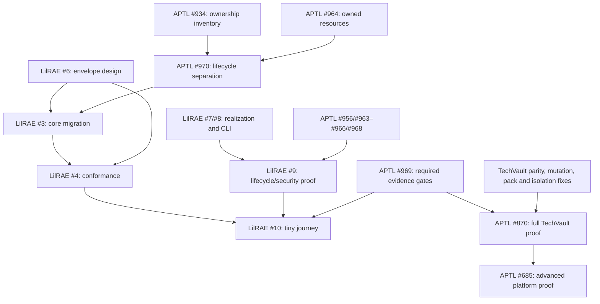

# Delivery Plan

The review created two milestones and eight remediation issues. It retained
existing useful issue owners and updated current scope notes where needed.
Implementation still uses the owning repository's requirement and workflow
rules; no requirement status or PR merge is implied by this plan.

TechVault already lives in
[OpenRAE/env-packs/packs/techvault](https://github.com/OpenRAE/env-packs/tree/main/packs/techvault)
for now. #880's remaining role in this graph is consumer integration and
residual APTL cleanup/parity, not an outstanding physical pack relocation.
Pack authoring belongs with the existing env-packs content; backend fixes and
qualification remain with APTL as it becomes LilRAE.

## Milestones

| Milestone | Exit gate | Principal work |
| --- | --- | --- |
| [Local Docker isolation hardening](https://github.com/Brad-Edwards/aptl/milestone/33) | Exact supported local profile has enforceable authority, owned state and tested failure behavior | #955–#958, #963–#968, #856, #939, #491, #455/#456 |
| [Quickstart from released artifacts](https://github.com/Brad-Edwards/aptl/milestone/32) | Existing packaged APTL path has truthful docs/catalog, bounded artifact availability and actionable failed-start recovery | #949, #952–#954; the tiny Hub journey remains LilRAE #10 |
| [LilRAE migration: core boundary](https://github.com/Brad-Edwards/aptl/milestone/34) | One scenario-independent backend with lineage, optional experience packages and an explicit migration path | #934, #970, #878–#880, #591/#592, with LilRAE #3/#6 |
| [LilRAE adoption: release qualification](https://github.com/Brad-Edwards/aptl/milestone/35) | Required evidence gates and exact released tiny/advanced journeys on claimed platforms | #969, #870/#685, #961, scoped user-doc work in #851; LilRAE #4/#9/#10 and Hub #3 |

The existing realization follow-up milestone owns #909/#910/#912/#915–#918 and
optional scenario slices. The Arsenal milestone retains workshop delivery.
Research, operator UI and broad capability milestones remain optional tracks;
the backlog ledger identifies items to narrow, route or supersede.

A milestone does not itself enforce ordering. The following diagram summarizes
actual GitHub dependency relationships; prerequisite points to dependent.

The full TechVault mutation backlog does not block #970 or the tiny core
migration. #915 remains a prerequisite for full TechVault qualification. Likewise
optional agent-control mechanisms and paired BigRAE research are not global
quickstart dependencies. An unsupported capability must be omitted/rejected
until its profile-specific evidence exists.

## Issue definitions

- [#963: fix: enforce participant process deadlines and descendant cleanup](https://github.com/Brad-Edwards/aptl/issues/963).
- [#964: fix: refuse foreign containers before reuse or replacement](https://github.com/Brad-Edwards/aptl/issues/964).
- [#965: fix: require operator grants for pack-to-container credential bindings](https://github.com/Brad-Edwards/aptl/issues/965).
- [#966: fix: write generated container env files without following links](https://github.com/Brad-Edwards/aptl/issues/966).
- [#967: fix: validate MCP tool arguments at the server boundary](https://github.com/Brad-Edwards/aptl/issues/967).
- [#968: feat: enforce and disclose egress for the ordinary local range](https://github.com/Brad-Edwards/aptl/issues/968).
- [#969: ci: gate adoption on platform security and declared conformance evidence](https://github.com/Brad-Edwards/aptl/issues/969).
- [#970: refactor: separate generic lab lifecycle from experience startup hooks](https://github.com/Brad-Edwards/aptl/issues/970).

## Dependency changes

**45 new blocking relationships were read back from GitHub.**
One obsolete relationship was removed: LilRAE #6 (envelope design) previously
waited for LilRAE #4 (conformance proof). Design now precedes migration and
conformance. Existing unrelated dependencies were retained. The inspected graph
passes a cycle check, and GitHub accepted every added relationship.

The exact delta and verified targets are recorded in
[dependency-changes.json](dependency-changes.json). Dependencies use GitHub's
native REST issue-dependency endpoints through `gh api`, not body text alone.
These relationships make prerequisites visible and queryable; GitHub does not
thereby prevent an authorized user from closing an issue or merging a PR. The
implementation/release workflow must check dependency completion as part of its
own gate. [GitHub issue dependency API](https://docs.github.com/en/rest/issues/issue-dependencies).

| Dependent issue | Blocks on |
| --- | --- |
| [Brad-Edwards/aptl#435](https://github.com/Brad-Edwards/aptl/issues/435) | [Brad-Edwards/aptl#952](https://github.com/Brad-Edwards/aptl/issues/952), [Brad-Edwards/aptl#964](https://github.com/Brad-Edwards/aptl/issues/964) |
| [Brad-Edwards/aptl#455](https://github.com/Brad-Edwards/aptl/issues/455) | [OpenRAE/lilrae#6](https://github.com/OpenRAE/lilrae/issues/6) |
| [Brad-Edwards/aptl#456](https://github.com/Brad-Edwards/aptl/issues/456) | [Brad-Edwards/aptl#967](https://github.com/Brad-Edwards/aptl/issues/967) |
| [Brad-Edwards/aptl#491](https://github.com/Brad-Edwards/aptl/issues/491) | [Brad-Edwards/aptl#856](https://github.com/Brad-Edwards/aptl/issues/856), [Brad-Edwards/aptl#963](https://github.com/Brad-Edwards/aptl/issues/963), [OpenRAE/lilrae#6](https://github.com/OpenRAE/lilrae/issues/6) |
| [Brad-Edwards/aptl#685](https://github.com/Brad-Edwards/aptl/issues/685) | [Brad-Edwards/aptl#870](https://github.com/Brad-Edwards/aptl/issues/870) |
| [Brad-Edwards/aptl#867](https://github.com/Brad-Edwards/aptl/issues/867) | [Brad-Edwards/aptl#870](https://github.com/Brad-Edwards/aptl/issues/870) |
| [Brad-Edwards/aptl#868](https://github.com/Brad-Edwards/aptl/issues/868) | [Brad-Edwards/aptl#870](https://github.com/Brad-Edwards/aptl/issues/870) |
| [Brad-Edwards/aptl#870](https://github.com/Brad-Edwards/aptl/issues/870) | [Brad-Edwards/aptl#878](https://github.com/Brad-Edwards/aptl/issues/878), [Brad-Edwards/aptl#879](https://github.com/Brad-Edwards/aptl/issues/879), [Brad-Edwards/aptl#880](https://github.com/Brad-Edwards/aptl/issues/880), [Brad-Edwards/aptl#909](https://github.com/Brad-Edwards/aptl/issues/909), [Brad-Edwards/aptl#915](https://github.com/Brad-Edwards/aptl/issues/915), [Brad-Edwards/aptl#917](https://github.com/Brad-Edwards/aptl/issues/917), [Brad-Edwards/aptl#918](https://github.com/Brad-Edwards/aptl/issues/918), [Brad-Edwards/aptl#939](https://github.com/Brad-Edwards/aptl/issues/939), [Brad-Edwards/aptl#952](https://github.com/Brad-Edwards/aptl/issues/952), [Brad-Edwards/aptl#955](https://github.com/Brad-Edwards/aptl/issues/955), [Brad-Edwards/aptl#956](https://github.com/Brad-Edwards/aptl/issues/956), [Brad-Edwards/aptl#957](https://github.com/Brad-Edwards/aptl/issues/957), [Brad-Edwards/aptl#965](https://github.com/Brad-Edwards/aptl/issues/965), [Brad-Edwards/aptl#966](https://github.com/Brad-Edwards/aptl/issues/966), [Brad-Edwards/aptl#967](https://github.com/Brad-Edwards/aptl/issues/967), [Brad-Edwards/aptl#968](https://github.com/Brad-Edwards/aptl/issues/968), [Brad-Edwards/aptl#969](https://github.com/Brad-Edwards/aptl/issues/969) |
| [Brad-Edwards/aptl#887](https://github.com/Brad-Edwards/aptl/issues/887) | [Brad-Edwards/aptl#880](https://github.com/Brad-Edwards/aptl/issues/880) |
| [Brad-Edwards/aptl#915](https://github.com/Brad-Edwards/aptl/issues/915) | [Brad-Edwards/aptl#910](https://github.com/Brad-Edwards/aptl/issues/910), [Brad-Edwards/aptl#912](https://github.com/Brad-Edwards/aptl/issues/912) |
| [Brad-Edwards/aptl#952](https://github.com/Brad-Edwards/aptl/issues/952) | [Brad-Edwards/aptl#964](https://github.com/Brad-Edwards/aptl/issues/964) |
| [Brad-Edwards/aptl#970](https://github.com/Brad-Edwards/aptl/issues/970) | [Brad-Edwards/aptl#934](https://github.com/Brad-Edwards/aptl/issues/934), [Brad-Edwards/aptl#964](https://github.com/Brad-Edwards/aptl/issues/964) |
| [OpenRAE/lilrae#10](https://github.com/OpenRAE/lilrae/issues/10) | [Brad-Edwards/aptl#969](https://github.com/Brad-Edwards/aptl/issues/969), [OpenRAE/lilrae#4](https://github.com/OpenRAE/lilrae/issues/4) |
| [OpenRAE/lilrae#3](https://github.com/OpenRAE/lilrae/issues/3) | [Brad-Edwards/aptl#934](https://github.com/Brad-Edwards/aptl/issues/934), [Brad-Edwards/aptl#970](https://github.com/Brad-Edwards/aptl/issues/970), [OpenRAE/lilrae#6](https://github.com/OpenRAE/lilrae/issues/6) |
| [OpenRAE/lilrae#4](https://github.com/OpenRAE/lilrae/issues/4) | [OpenRAE/lilrae#6](https://github.com/OpenRAE/lilrae/issues/6) |
| [OpenRAE/lilrae#9](https://github.com/OpenRAE/lilrae/issues/9) | [Brad-Edwards/aptl#956](https://github.com/Brad-Edwards/aptl/issues/956), [Brad-Edwards/aptl#963](https://github.com/Brad-Edwards/aptl/issues/963), [Brad-Edwards/aptl#964](https://github.com/Brad-Edwards/aptl/issues/964), [Brad-Edwards/aptl#965](https://github.com/Brad-Edwards/aptl/issues/965), [Brad-Edwards/aptl#966](https://github.com/Brad-Edwards/aptl/issues/966), [Brad-Edwards/aptl#968](https://github.com/Brad-Edwards/aptl/issues/968) |

## Work that can start now

- Fix the independently reproduced #963–#967 defects and #956 admission bypass.
- Decide the profile/ownership boundaries in LilRAE #6 and APTL #934 using the
  proposed ADRs and this baseline; prepare contract and negative tests.
- Build #969 gate infrastructure while fixes proceed; qualification cannot pass
  a profile whose required fixes and evidence remain incomplete.
- Prepare acquired-pack, clean-machine and failure-path test harnesses without
  treating preparation as proof of a successful live run.

No code fix, release, branch promotion, feature-PR closure or merge was performed
by the review. Existing issue supersession/closure remains a recommendation
until its replacement owner and acceptance evidence are reconciled.
