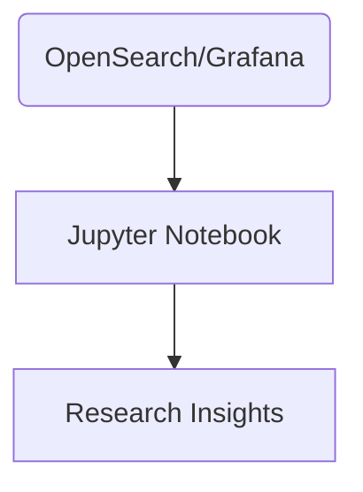

# Data Analysis Workflow

Querying and visualizing experiment data should be straightforward for a lone developer.

## Search and Dashboards

- Use the OpenSearch Dashboards interface for quick searches
- Build basic Grafana dashboards to track metrics over time
- Tag-based filters allow viewing data for a specific experiment

## Ad-Hoc Questions

For more complex analysis, export data from OpenSearch or PostgreSQL into a Jupyter notebook. Python libraries such as pandas can help answer specific research questions about attack frequency, detection times, or system performance.

## Diagram

