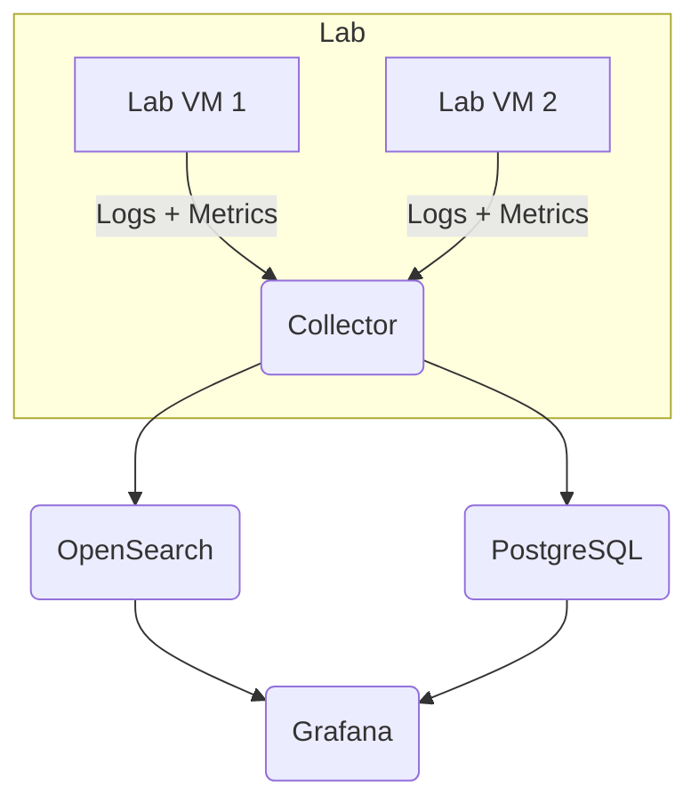

# Architecture

The experiment tracking layer runs on a dedicated data collector host with persistent storage.

Lab machines send their telemetry to this host using Filebeat and the OpenTelemetry Collector. Data is stored in an OpenSearch cluster for search and a PostgreSQL database for structured experiment metadata.

## Components

- **Data Collector Host**: Permanent instance with a large data volume
- **OpenTelemetry Collector**: Receives metrics and traces
- **Filebeat**: Ships system and application logs
- **OpenSearch**: Indexes logs and metrics for search
- **PostgreSQL**: Stores experiment definitions and metadata
- **Grafana**: Visualizes data from OpenSearch and PostgreSQL

## High-Level Diagram

The lab environment is ephemeral, but the data collector host persists across deployments. Only the lab machines inside the `Lab` subgraph are destroyed and recreated.
