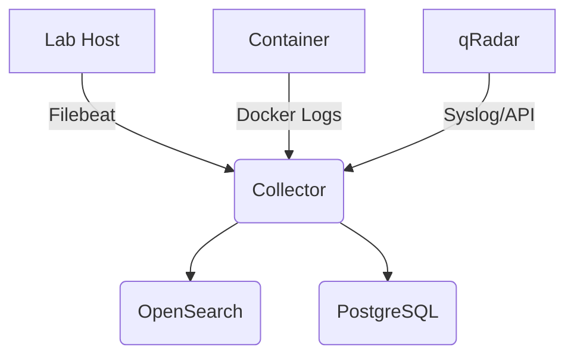

# Telemetry Collection

Telemetry comes from many sources in the lab. Each source forwards data to the collector host.

## Data Sources

- **qRadar SIEM**: Use syslog forwarding or the qRadar API to export events
- **Linux hosts**: Filebeat for log files, Metricbeat for system metrics
- **Containers**: Docker logging driver or Filebeat sidecar
- **Network flow**: Packet capture tools or VPC flow logs
- **Custom scripts**: Any experiment-specific data is written to a log file or sent via OpenTelemetry

## Tagging Experiments

Each lab run should have a unique identifier. Telemetry shippers include this ID as a field so that data for separate experiments can be filtered and queried later.

## Diagram

