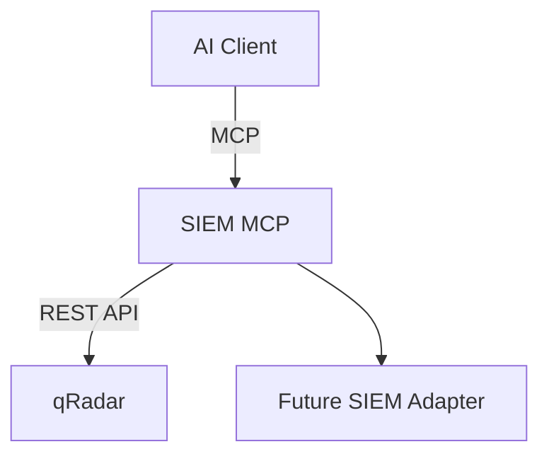
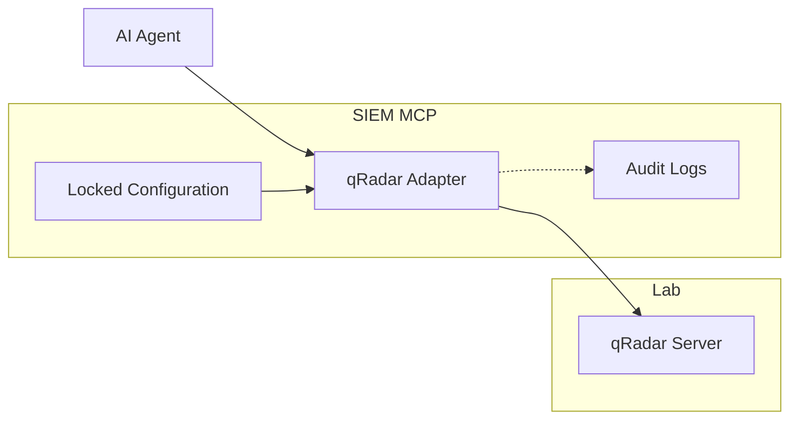

# SIEM MCP Architecture Plan

The SIEM Model Context Protocol (MCP) provides a stable interface for AI agents to interact with the lab's SIEM. Initially it targets IBM **qRadar** but is designed to support additional platforms.

## Goals

- Prevent fragile ad-hoc API calls generated by the agent
- Provide a consistent command set for common SIEM tasks
- Enforce safety boundaries so agents only interact with the lab SIEM
- Allow future adapters for other SIEM products

## Design Overview

The AI client communicates with the MCP using the Model Context Protocol. The MCP translates standardized commands to qRadar REST API calls. Additional adapters can be added to support other SIEMs.

## Components

### MCP Core

- Defines standard commands such as `searchLogs`, `getOffenses`, `createRule`
- Handles authentication and error handling
- Exposes a single interface regardless of underlying SIEM

### qRadar Adapter

- Implements command handlers using qRadar's REST API
- Parses responses into normalized output
- Enforces request limits and allowed actions

### Adapter Interface

- A simple interface that new SIEM adapters must implement
- Encourages modular expansion (e.g., Splunk, ELK)

## Configuration and Safety

- **Locked Endpoint**: MCP reads the qRadar hostname and token from a configuration file generated during lab deployment. These values cannot be overridden by agent input.
- **Command Whitelisting**: Only predefined commands are allowed. Arbitrary API calls are blocked.
- **Audit Logging**: All MCP requests and responses are logged to a file for later analysis.
- **Rate Limiting**: Prevents high frequency queries from overwhelming the SIEM.

## Extensibility Strategy

1. **Modular Adapters**: Each SIEM product gets its own adapter implementing the MCP command set.
2. **Capability Detection**: MCP can expose which features are supported based on the loaded adapter.
3. **Open Command Set**: New commands can be added while maintaining backward compatibility.
4. **Versioning**: The MCP API will be versioned to avoid breaking clients when adding features.

## Relationship to Kali MCP

The Kali MCP already provides controlled access to penetration testing tools. The SIEM MCP follows the same philosophy:

- Controlled interface to complex systems
- Safety features to prevent unintended actions
- Logging for purple team analysis

By centralizing SIEM interactions, the MCP reduces errors when agents attempt to craft API requests on the fly, resulting in more reliable automation and easier expansion to other SIEM platforms.

